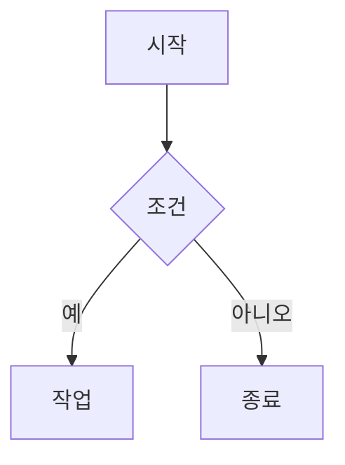
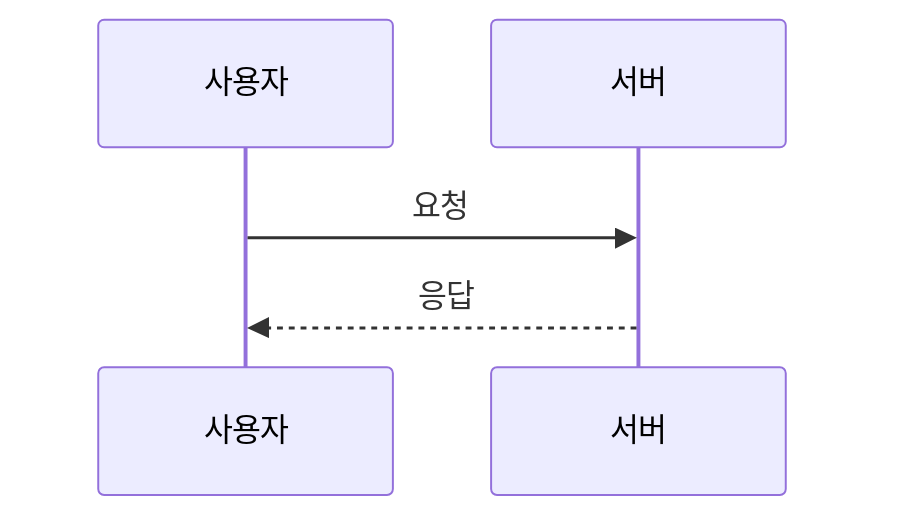
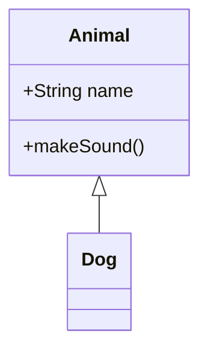

# Cllaude99 개발 블로그 (DevBlog)

Next.js 15, TypeScript, MDX로 구축된 개인 개발 블로그입니다.

## 🚀 주요 기능

### ✅ 구현 완료

- **📝 MDX 기반 블로그 시스템**: Markdown + JSX로 풍부한 콘텐츠 작성
- **🎨 다크모드**: light/dark/system 모드 지원 (next-themes)
- **🔍 실시간 검색**: 제목, 설명, 태그 검색 (⌘K / Ctrl+K)
- **📂 카테고리 필터링**: General, Tech, CS, Log 카테고리별 포스트 분류
- **🏷️ 태그 시스템**: 포스트별 태그 지원 (상세 페이지에 표시)
- **💬 댓글 시스템**: GitHub Discussions 기반 Giscus 댓글
- **🎯 코드 하이라이팅**: 다양한 언어 구문 강조 (rehype-highlight)
- **📊 Mermaid 다이어그램**: 플로우차트, 시퀀스, 클래스, ER 다이어그램 등
- **⏱️ 읽기 시간 표시**: 자동 계산된 예상 읽기 시간
- **📱 반응형 디자인**: 모바일 햄버거 메뉴, 태블릿/데스크톱 최적화
- **🔗 GitHub Flavored Markdown**: 표, 체크박스, 자동링크 지원
- **♿ 접근성**: SEO 최적화, 시맨틱 HTML, aria-label

### 🚧 향후 계획

- [ ] RSS 피드 생성
- [ ] 시리즈 글 관리
- [ ] 조회수 추적
- [x] 목차 (TOC) 자동 생성
- [ ] 소셜 공유 버튼
- [ ] 관련 포스트 추천

---

## 🛠️ 기술 스택

### Core

- **Next.js 15** - App Router, React Server Components
- **TypeScript** - 타입 안전성
- **React 18** - 최신 React 기능

### 콘텐츠 관리

- **MDX** - Markdown + JSX 하이브리드
- **Gray Matter** - Frontmatter 파싱
- **Reading Time** - 글 읽기 시간 추정

### 스타일링

- **Tailwind CSS** - 유틸리티 우선 CSS 프레임워크
- **next-themes** - 다크모드 테마 관리
- **Lucide React** - 모던 아이콘 라이브러리

### MDX 플러그인

- **react-markdown** - Markdown 렌더링 엔진
- **rehype-highlight** - 코드 구문 강조
- **remark-gfm** - GitHub Flavored Markdown (표, 체크박스 등)
- **Mermaid** - 다이어그램 렌더링

### 기타

- **Giscus** - GitHub Discussions 기반 댓글 시스템
- **date-fns** - 날짜 포맷팅

---

## 📦 설치 및 실행

### 의존성 설치

```bash
# 루트 디렉토리에서 (모노레포인 경우)
pnpm install

# 또는 devblog 디렉토리에서 직접
cd apps/devblog
pnpm install
```

### 개발 서버 실행

```bash
# devblog 디렉토리에서
pnpm dev

# 또는 루트에서
pnpm dev --filter devblog
```

개발 서버가 실행되면 **http://localhost:3001** 에서 확인할 수 있습니다.

### 프로덕션 빌드

```bash
# 빌드
pnpm build

# 빌드된 앱 실행
pnpm start
```

### 기타 명령어

```bash
pnpm lint         # ESLint 검사
pnpm type-check   # TypeScript 타입 검사
```

---

## 📝 블로그 포스트 작성 가이드

### 1. 새 포스트 작성

`content/posts/` 디렉토리에 `.mdx` 파일을 생성합니다.

**파일명 규칙:**

- 영문 소문자, 하이픈 사용 권장
- 예: `react-hooks-tutorial.mdx`, `binary-search-algorithm.mdx`

### 2. Frontmatter (메타데이터)

모든 포스트는 YAML 형식의 Frontmatter로 시작합니다:

```yaml
---
title: '포스트 제목'
description: '포스트 설명 (SEO 메타 태그, 목록에 표시)'
date: '2025-01-15'
published: true
category: 'Tech'
tags: ['Next.js', 'React', 'TypeScript']
author: 'Cllaude99'
---
```

#### 메타데이터 필드 설명

| 필드          | 필수 | 타입     | 설명                                               |
| ------------- | ---- | -------- | -------------------------------------------------- |
| `title`       | ✅   | string   | 포스트 제목 (목록 및 상세 페이지에 표시)           |
| `description` | ✅   | string   | 포스트 설명 (SEO 메타 태그, 검색 결과)             |
| `date`        | ✅   | string   | 작성일 (YYYY-MM-DD 형식)                           |
| `published`   |      | boolean  | 발행 여부 (기본값: `true`, `false`로 설정 시 숨김) |
| `category`    |      | string   | 카테고리 (`General`, `Tech`, `CS`, `Log` 중 선택)  |
| `tags`        |      | string[] | 태그 배열 (상세 페이지에 표시, 검색 가능)          |
| `author`      |      | string   | 작성자 이름 (기본값: `Cllaude99`)                  |

### 3. 카테고리 가이드

#### 🖥️ Tech - 기술 실무

**주제:** 프레임워크/라이브러리 사용법, 개발 도구, 튜토리얼

**권장 구조:**

1. 문제 상황 소개
2. 해결 방법 (단계별)
3. 코드 예제
4. 결과 및 팁

**예시:**

```yaml
category: 'Tech'
tags: ['React', 'TypeScript', 'Hooks']
```

#### 💻 CS - 컴퓨터 과학

**주제:** 알고리즘, 자료구조, 운영체제, 네트워크, 컴퓨터 이론

**권장 구조:**

1. 개념 설명
2. 원리 분석 (복잡도)
3. 구현 예제
4. 활용 사례

**예시:**

```yaml
category: 'CS'
tags: ['Algorithm', 'Data Structure', 'Binary Search']
```

#### 📝 Log - 개발 일지

**주제:** 트러블슈팅, 프로젝트 회고, 학습 기록, 버그 해결

**권장 구조:**

1. 상황 설명
2. 문제 발생
3. 해결 과정
4. 배운 점

**예시:**

```yaml
category: 'Log'
tags: ['Troubleshooting', 'Next.js', 'Debugging']
```

### 4. 마크다운 작성 예시

```markdown
# 제목

도입부를 작성합니다.

## 주요 개념

**굵게**, _기울임_, ~~취소선~~, `인라인 코드`

### 코드 블록

\`\`\`typescript
interface User {
id: number;
name: string;
}

const user: User = { id: 1, name: 'John' };
\`\`\`

### 리스트

- 항목 1
- 항목 2
  - 하위 항목

### 표

| 항목  | 설명  | 상태 |
| ----- | ----- | ---- |
| 기능1 | 설명1 | ✅   |

### 체크박스

- [x] 완료된 작업
- [ ] 진행 중인 작업

### 링크와 이미지

[Next.js 공식 문서](https://nextjs.org)


```

### 5. 이미지 추가하기

**파일 구조:**

```
public/
├── images/
│   ├── tech/      # Tech 카테고리 이미지
│   ├── cs/        # CS 카테고리 이미지
│   └── log/       # Log 카테고리 이미지
└── favicon.png
```

**사용 예시:**

```markdown


```

**경로 규칙:**

- `public` 폴더의 파일은 `/`로 시작
- `public/testimg.svg` → `/testimg.svg`
- `public/images/tech/photo.png` → `/images/tech/photo.png`

### 6. Mermaid 다이어그램

**플로우차트:**

````markdown

````

**시퀀스 다이어그램:**

````markdown

````

**클래스 다이어그램:**

````markdown

````

**지원 다이어그램:**

- 플로우차트 (Flowchart)
- 시퀀스 (Sequence)
- 클래스 (Class)
- 상태 (State)
- 간트 차트 (Gantt)
- 파이 차트 (Pie)
- ER 다이어그램 (Entity Relationship)

---

## 📁 프로젝트 구조

```
apps/devblog/
├── content/
│   └── posts/              # 블로그 포스트 (MDX)
│       ├── _template.mdx   # 포스트 작성 템플릿 (예시 포함)
│       ├── welcome.mdx     # 환영 포스트
│       └── ...             # 기타 포스트
├── public/                 # 정적 파일
│   ├── images/             # 이미지 파일
│   └── favicon.png         # 파비콘
├── src/
│   ├── app/                # Next.js App Router
│   │   ├── layout.tsx      # 루트 레이아웃 (ThemeProvider)
│   │   ├── page.tsx        # 홈 페이지 (포스트 목록)
│   │   ├── about/          # About 페이지
│   │   └── post/
│   │       └── [slug]/     # 포스트 상세 페이지 (동적 라우팅)
│   ├── components/         # 리액트 컴포넌트
│   │   ├── Header.tsx      # 헤더 (네비게이션, 검색, 테마 토글)
│   │   ├── Sidebar.tsx     # 사이드바 (카테고리, 포스트 목록)
│   │   ├── SearchModal.tsx # 검색 모달 (⌘K)
│   │   ├── Comments.tsx    # Giscus 댓글
│   │   ├── ThemeToggle.tsx # 다크모드 토글
│   │   ├── MarkdownContent.tsx  # MDX 렌더러
│   │   └── MermaidDiagram.tsx   # Mermaid 다이어그램 렌더러
│   ├── lib/                # 유틸리티 함수
│   │   └── posts.ts        # 포스트 읽기/파싱 함수
│   ├── types/              # TypeScript 타입
│   │   └── post.ts         # Post, PostFrontMatter 타입 정의
│   └── styles/             # 전역 스타일
│       └── globals.css     # Tailwind + 코드 하이라이팅 스타일
├── next.config.mjs
├── tailwind.config.ts
├── tsconfig.json
└── package.json
```

---

## 🎨 스타일 커스터마이징

### 다크모드 색상 변경

`src/styles/globals.css`:

```css
body.dark {
  background-color: #171717; /* 배경색 */
}

.dark pre[class*='language-'] {
  background-color: #2d2d2d !important; /* 코드 블록 배경 */
}
```

### Tailwind 테마 색상

`tailwind.config.ts`:

```typescript
theme: {
  extend: {
    colors: {
      primary: {
        500: '#0ea5e9', // 메인 색상
        600: '#0284c7',
      },
    },
  },
}
```

---

## 💡 글 작성 팁

### 1. 명확하고 구체적인 제목

**나쁜 예:**

- "React 사용법"
- "알고리즘 공부"

**좋은 예:**

- "React useEffect로 API 데이터 패칭 구현하기"
- "이진 탐색 알고리즘의 시간 복잡도 분석"

### 2. 코드 가독성

- 언어 명시로 syntax highlighting 활성화
- 주석으로 핵심 로직 설명
- 동작하는 완전한 예제 제공

### 3. 구조화

- 헤딩으로 계층 구분 (H1 > H2 > H3)
- 단락은 3~4줄 이내로 유지
- 리스트와 표로 정보 정리

### 4. 시각 자료 활용

- Mermaid 다이어그램으로 흐름 설명
- 스크린샷/GIF로 결과 시연
- 표로 비교 정보 제공

---

## 🚀 배포

### Vercel 배포 (권장)

```bash
# Vercel CLI 설치
npm i -g vercel

# 프로젝트 배포
vercel

# 프로덕션 배포
vercel --prod
```

### 환경 변수 (선택사항)

배포 시 다음 환경 변수를 설정할 수 있습니다:

```env
# .env.local
NEXT_PUBLIC_SITE_URL=https://yourdomain.com
```

---

## 📄 라이선스

MIT License

---

## 🙋‍♂️ 문의 및 기여

이슈나 PR은 언제든 환영합니다!

- **GitHub**: [Cllaude99/claude_code](https://github.com/Cllaude99/claude_code)
- **템플릿**: `content/posts/_template.mdx` 참고
- **이메일**: cllaude1025@gmail.com

---

## 📚 참고 자료

- [Next.js 공식 문서](https://nextjs.org/docs)
- [Tailwind CSS 문서](https://tailwindcss.com/docs)
- [MDX 문서](https://mdxjs.com/)
- [Mermaid 문서](https://mermaid.js.org/)
- [GitHub Flavored Markdown 스펙](https://github.github.com/gfm/)
