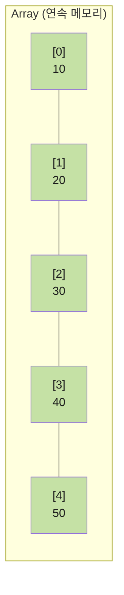
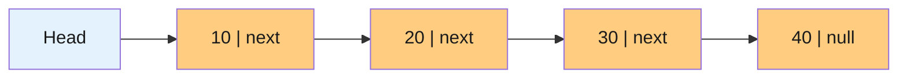
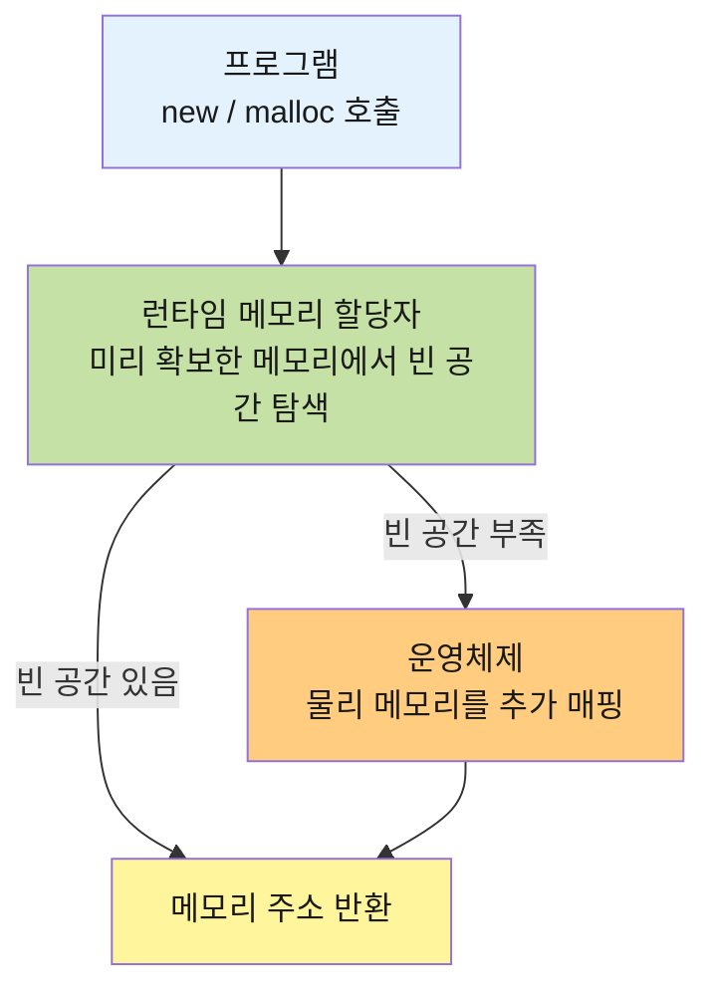
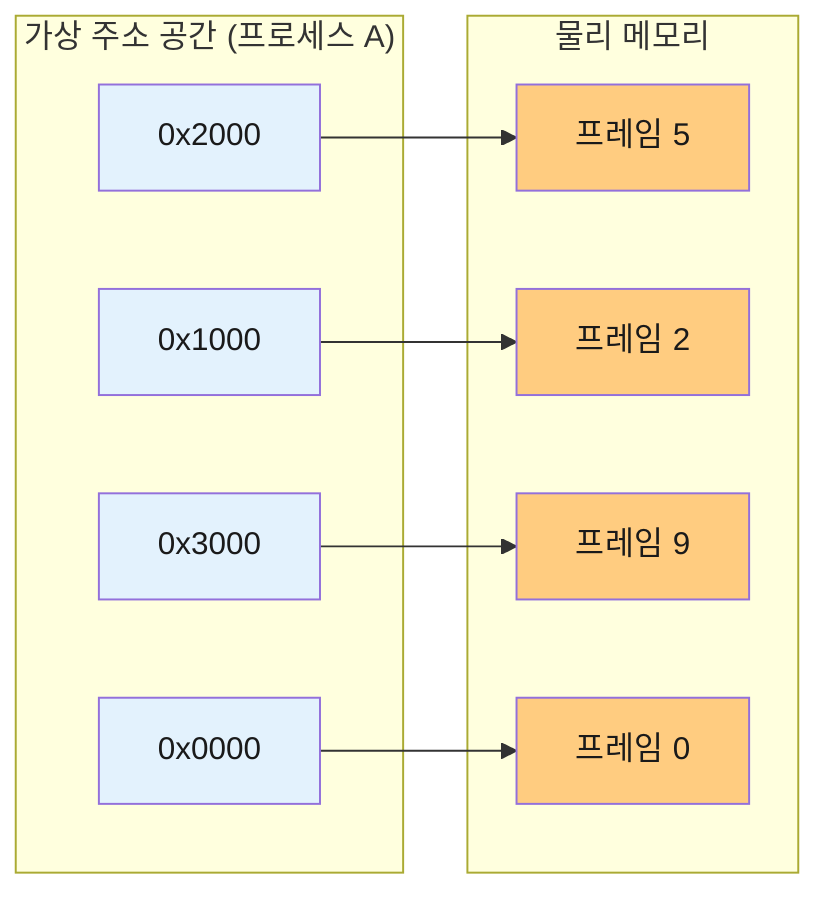
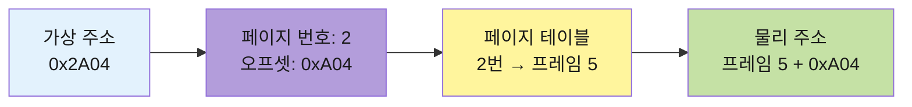
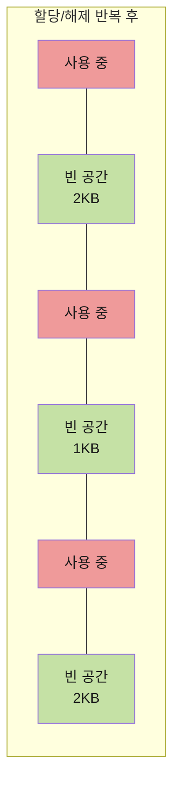
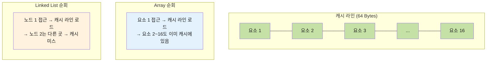
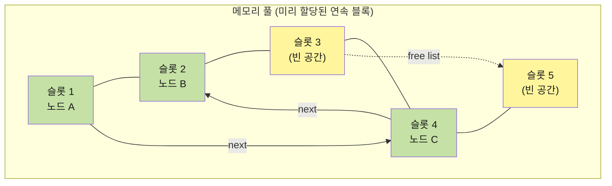

이번 글에서는 Array와 Linked List에 대해 알아보려고 해요.

## Array

배열은 연속된 메모리 공간에 요소를 나란히 저장하는 자료구조에요.

시작 주소와 인덱스만으로 위치를 바로 계산할 수 있어 인덱스 접근이 O(1)이에요.
예를 들어 시작 주소가 `0x100`이고 각 요소가 4바이트라면, 인덱스 3의 주소는 `0x100 + 3 × 4 = 0x10C`로 바로 구할 수 있어요.

반면 물리적 순서가 곧 논리적 순서이므로, 중간에 삽입하거나 삭제하면 뒤의 요소를 전부 밀거나 당겨야 해요.
이 때문에 삽입/삭제는 O(n)이에요. 또한 정적 배열은 크기가 고정되어, 공간이 부족하면 더 큰 배열을 할당하고 기존 데이터를 복사하는 재할당이 필요해요.

이러한 Array는 인덱스 접근이 자주 일어나거나, 전체 순회가 잦을 때, 데이터 크기가 예측 가능할 때, 이진 탐색이 필요할 때 적합해요.

## Linked List

연결 리스트는 각 노드가 데이터와 다음 노드의 포인터를 가지며, 논리적 순서를 포인터가 결정해요.

삽입/삭제 위치를 알고 있다면 포인터만 변경하면 되므로 O(1)이지만,
특정 위치를 찾으려면 head부터 따라가야 하므로 접근과 검색이 O(n)이에요.

Linked List는 크기 제한 없이 자유롭게 확장/축소가 가능하지만, 포인터 저장으로 인한 메모리 오버헤드가 있고 캐시 성능이 불리해요.

이러한 Linked List는 맨 앞에서의 삽입/삭제가 빈번할 때, 크기를 예측할 수 없을 때, 삽입/삭제 위치를 이미 알고 있을 때 적합해요.

## 노드가 흩어지는 이유 — 메모리 할당과 운영체제

> 그렇다면, Linked List의 노드는 Array와 다르게 왜 메모리 곳곳에 흩어지는 걸까요?

앞에서 배열은 연속 메모리에 저장된다고 했는데요.
그렇다면 연결 리스트의 노드도 연속적으로 할당하면 되지 않을까요?

이 질문에 답하려면 운영체제가 메모리를 어떻게 관리하는지 이해해야 해요.

### 메모리 할당의 두 단계

`new`나 `malloc`을 호출하면 곧바로 운영체제가 동작하는 것이 아니에요.

메모리 할당은 아래 두 단계로 나뉘어져요.

1단계 - **런타임 메모리 할당자**가 운영체제로부터 미리 받아둔 메모리 안에서 빈 공간을 찾아 배정해요.
2단계 - 할당자의 메모리가 부족하면 **운영체제의 가상 메모리 시스템**이 물리 메모리를 추가로 매핑해줘요.

여기서 1단계의 할당자는 "빈 공간"을 찾아야 하는데, 이전에 할당했다가 해제된 공간이 곳곳에 흩어져 있으면 새 노드가 이전 노드와 멀리 떨어진 곳에 배치될 수밖에 없어요.
이러한 이유로 Linked List의 노드는 메모리 곳곳에 흩어지게 돼요.

### 가상 메모리

운영체제는 각 프로세스에게 **독립적이고 연속된 가상 주소 공간**을 제공해요.
즉, 프로그램은 마치 자신만의 메모리를 통째로 사용하는 것처럼 동작하지만 실제 물리 메모리에서는 데이터가 여기저기 흩어져 있을 수 있어요.

프로그램 입장에서는 `0x0000`, `0x1000`, `0x2000`처럼 연속된 주소를 사용하지만, 물리적으로는 완전히 다른 위치에 있을 수 있는데요.
이러한 변환을 가능하게 하는 것이 **페이징**이에요.

### 페이징

페이징은 가상 메모리를 고정 크기(보통 4KB)의 **페이지**로 나누고, 물리 메모리를 같은 크기의 **프레임**에 매핑하는 기법이에요.
( 가상 주소를 물리 주소로 변환할 때에는 **페이지 테이블**을 참조해요. )

여기서 Array와 Linked List의 차이가 드러나는데요.

배열도 가상 주소로는 연속이지만 다른 프레임에 위치할 수 있어요.
그러나 **같은 페이지(4KB) 안에서는 물리적으로도 연속**이므로, 배열의 요소들이 하나의 페이지 안에 들어 있다면 물리적으로도 나란히 위치하게 돼요.

( 이러한 이유는 뒤에서 다룰 캐시 성능의 핵심 근거가 돼요. )

### 메모리 할당 전략

런타임 할당자가 빈 공간을 찾을 때는 아래와 같은 전략을 사용해요.

| 전략          | 방식                     | 장점              | 단점                       |
| ------------- | ------------------------ | ----------------- | -------------------------- |
| **First Fit** | 첫 번째 적합한 공간 사용 | 탐색이 빠름       | 앞쪽에 단편화 집중         |
| **Best Fit**  | 가장 딱 맞는 공간 사용   | 큰 공간 보존      | 작은 잔여 공간이 많이 생김 |
| **Worst Fit** | 가장 큰 공간 사용        | 큰 잔여 공간 유지 | 큰 블록이 빠르게 소진됨    |

어떤 전략을 사용하든 할당과 해제가 반복되면 빈 공간이 조각나는 **단편화**가 발생해요.

### 단편화

단편화는 메모리를 할당하고 해제하는 과정에서 빈 공간이 쪼개지는 현상이에요.

외부 단편화는 전체 빈 공간은 충분하지만, 연속된 공간이 없어 할당하지 못하는 경우에요.

위 상태에서 총 빈 공간은 5KB이지만, 4KB짜리 노드를 할당할 연속 공간은 없어요.
이를 외부 단편화라고 해요.

내부 단편화는 할당 단위보다 작은 요청 시, 할당된 블록 안에 남는 공간이 낭비되는 경우에요.
예를 들어 할당 단위가 8바이트인데 5바이트만 필요하면, 3바이트가 낭비되는 경우에요.

결국 Linked List의 노드가 흩어지는 이유는 다음과 같이 정리할 수 있어요.

> 할당과 해제가 반복됨 → 빈 공간이 조각남(단편화) → 새 노드가 먼 곳의 빈 공간에 할당됨

## 캐시 성능

이제 노드가 메모리 곳곳에 흩어진다는 것을 알았는데요.

그렇다면 흩어지면 구체적으로 어떤 문제가 생기는 걸까요?

### CPU 캐시 라인

CPU는 메모리에서 데이터를 읽을 때 요청한 바이트만 가져오는 것이 아니라, 캐시 라인(보통 64바이트) 단위로 주변 데이터를 함께 가져와요.
( 참고로 이 크기는 운영체제가 아닌 CPU 하드웨어가 결정해요. )

### 배열 vs 연결 리스트의 캐시 동작

배열의 경우, 요소들이 연속 메모리에 있으므로 한 요소를 읽으면 캐시 라인에 다음 요소들도 함께 올라오고 다음 요소에 접근할 때 이미 캐시에 있으므로 캐시 히트가 발생해요.

반면 연결 리스트의 경우, 노드가 메모리 곳곳에 흩어져 있으므로 다음 노드에 접근할 때 캐시에 없을 확률이 높아요.
이로 인해 매번 메인 메모리까지 가야 하는 **캐시 미스**가 발생할 수 있어요.

## 메모리 풀

그렇다면 연결 리스트의 캐시 문제를 해결할 수 없을까요?

이는 메모리 풀을 사용하면 어느정도 보완할 수 있어요.

**메모리 풀**은 큰 메모리 블록을 미리 할당해두고, 그 안에서 노드를 꺼내 쓰는 기법이에요.
노드들이 하나의 연속 블록 안에 위치하게 되므로 캐시 성능이 개선될 수 있어요.

### 배열과의 핵심 차이

배열과 메모리 풀 위의 연결 리스트는 모두 물리적으로 연속된 메모리에 있다는 점에서 비슷해 보이지만 결정적인 차이가 있어요.

배열의 경우, 순서를 바꾸려면 데이터를 실제로 옮겨야 해요.
반면 메모리 풀 위의 연결 리스트의 경우, 데이터는 제자리에 두고 포인터만 변경하면 돼요.

즉 메모리 풀을 통해 배열의 캐시 성능과 연결 리스트의 삽입/삭제 효율성을 동시에 얻을 수 있어요.

### 메모리 풀의 한계

그렇다면 배열 대신 메모리 풀을 사용하면 되지 않을까요?

하지만 메모리 풀에도 단점이 있어요.
메모리 풀은 크기를 미리 정해두고 사용하기 때문에, 풀이 가득 찼을 때의 확장 처리나 사용률이 낮을 때의 메모리 낭비 등 관리 복잡성이 추가돼요.

특히 중간 노드가 삭제되면 빈 슬롯이 생기는데, 이를 그대로 방치하면 메모리 낭비로 이어져요.
그래서 일반적으로 **프리 리스트**를 함께 사용해요.
이는 삭제된 슬롯을 별도의 연결 리스트로 엮어두고, 새 노드가 필요하면 프리 리스트에서 먼저 꺼내 재활용하는 방식이에요.

결국 메모리 풀은 같은 크기의 객체를 빈번하게 생성/삭제하는 특정 상황에서 효과적인 기법이라고 할 수 있어요.
