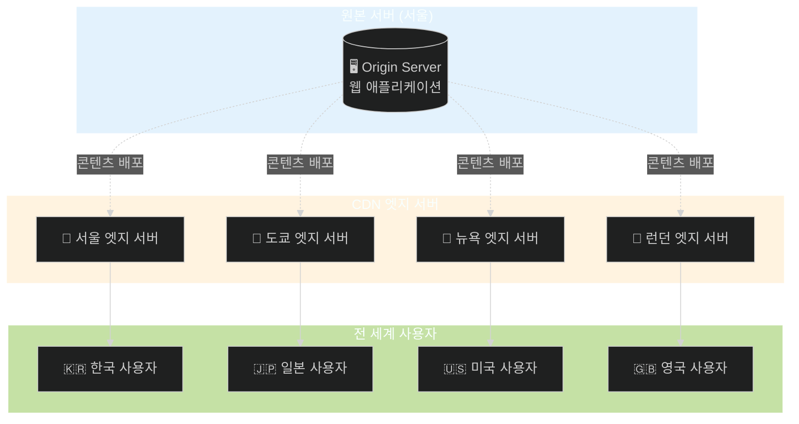
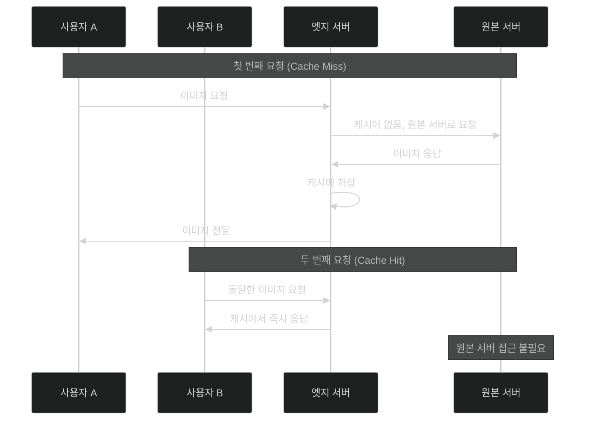
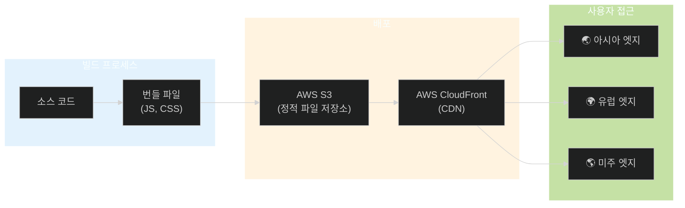

## CDN이란 무엇일까?

CDN은 Content Delivery Network의 약자로, 콘텐츠 전송 네트워크라고 부릅니다.
쉽게 말해 전 세계 여러 지역에 분산된 서버들의 네트워크라고 생각하면 됩니다.

일반적으로 웹사이트를 운영할 때는 원본 서버(Origin Server) 한 곳에서 모든 요청을 처리합니다.
그런데 만약 원본 서버가 서울에 있고, 미국 뉴욕에 있는 사용자가 이 웹사이트에 접속한다면 어떻게 될까요?
데이터가 서울에서 뉴욕까지 물리적으로 이동해야 하기 때문에 지연 시간이 발생하게 됩니다.

CDN은 이러한 물리적 거리로 인한 지연을 해결합니다.
전 세계 주요 도시에 엣지 서버(Edge Server)를 배치하고, 사용자의 요청이 들어오면 가장 가까운 엣지 서버에서 콘텐츠를 제공합니다.
뉴욕 사용자는 뉴욕 근처의 엣지 서버에서, 서울 사용자는 서울의 엣지 서버에서 콘텐츠를 받아볼 수 있게 되는 것입니다.



## CDN은 어떻게 동작할까?

CDN의 동작 원리를 이해하기 위해서는 캐싱이라는 개념을 먼저 알아야 합니다.

사용자가 웹사이트에 처음 접속하면 CDN은 원본 서버에서 콘텐츠를 가져옵니다.
이때 가져온 콘텐츠를 엣지 서버에 캐시로 저장해 둡니다.
이후 같은 지역의 다른 사용자가 동일한 콘텐츠를 요청하면, 원본 서버까지 갈 필요 없이 엣지 서버에 저장된 캐시에서 바로 응답할 수 있습니다.



이러한 캐싱 방식 덕분에 원본 서버의 부하가 크게 줄어들고, 사용자는 훨씬 빠른 응답을 받을 수 있습니다.

CDN이 캐시를 관리하는 방식은 TTL(Time To Live) 설정을 통해 조절됩니다.
TTL은 캐시된 콘텐츠가 얼마나 오래 유효한지를 나타내는 시간입니다.
TTL이 만료되면 CDN은 원본 서버에 콘텐츠가 변경되었는지 확인하고, 변경되었다면 새로운 콘텐츠를 가져와서 캐시를 갱신합니다.

## CDN을 사용하면 어떤 점이 좋을까?

### 로딩 속도 향상

CDN을 사용하면 가장 체감하기 쉬운 변화가 바로 로딩 속도입니다.
물리적으로 가까운 서버에서 콘텐츠를 받기 때문에 네트워크 지연 시간(Latency)이 크게 줄어듭니다.
결과적으로 사용자 입장에서는 페이지가 빠르게 로드되어 서비스 만족도가 높아지고, 이탈률도 낮아지는 효과를 볼 수 있습니다.

### 원본 서버 부하 분산

모든 요청이 원본 서버로 집중되면 트래픽이 많아질수록 서버에 부담이 가해집니다.
서버가 처리할 수 있는 용량을 초과하면 응답 속도가 느려지거나, 최악의 경우 서버가 다운될 수도 있습니다.
하지만, CDN을 사용하면 정적 콘텐츠에 대한 요청은 엣지 서버가 처리하기 때문에 원본 서버로 가는 트래픽이 크게 줄어듭니다.

> 갑작스러운 트래픽 급증 상황에서는 어떻게 될까요?

유명 인플루언서가 여러분의 서비스를 소개해서 접속자가 갑자기 10배로 늘어난 상황을 생각해 보겠습니다.
CDN이 없다면 원본 서버가 이 모든 트래픽을 감당해야 하지만, CDN이 있다면 전 세계에 분산된 엣지 서버들이 트래픽을 나누어 처리합니다.
이처럼 CDN은 예상치 못한 트래픽 폭주에도 서비스 안정성을 유지하는 데 도움이 됩니다.

### 실제 배포 환경에서 확인해보기

> 그렇다면 CDN이 실제로 동작하고 있는지는 어떻게 알 수 있을까요?

Vercel에 배포된 사이트에서 Chrome DevTools의 Network 탭을 열어 확인해보았습니다.

정적 파일 요청의 응답 헤더를 살펴보면 `x-vercel-cache`라는 헤더가 있는데, 여기에 `HIT`가 표시되어 있었습니다.
CDN은 캐시에서 응답할 때 이러한 헤더를 통해 캐시 상태를 알려주기 때문에, `HIT`가 표시된다면 원본 서버가 아닌 엣지 서버의 캐시에서 응답했다는 것을 의미합니다.
실제로 배포 직후 첫 요청에서는 `MISS`가 뜨고, 동일한 리소스를 다시 요청하면 `HIT`로 바뀌는 것을 확인할 수 있었습니다.

또한 응답 헤더에서 `age` 값도 확인할 수 있었습니다.
이 헤더는 해당 리소스가 캐시에 저장된 후 경과한 시간을 초 단위로 나타내는데, 원본 서버에서 직접 응답하는 경우에는 이 헤더가 존재하지 않습니다.
따라서 `age` 헤더가 있다는 것을 통해 CDN 캐시에서 응답했다는 것을 확인할 수 있었습니다.

또한, Timing 섹션의 Waiting for server response 값을 보니 대부분의 정적 파일이 20~50ms 내로 응답하는 것을 확인할 수 있었습니다.

## 프론트엔드에서 CDN 활용하기

> 이러한 CDN을 어디에 활용할 수 있을까요?

### 정적 자산을 CDN에 배포하기

프로덕션 환경에서는 자체 빌드한 JavaScript 번들, CSS 파일, 이미지 등을 CDN을 통해 제공하는 것이 일반적입니다.

Next.js나 Vite 같은 프레임워크를 사용한다면 빌드 결과물을 Vercel, Netlify, AWS CloudFront 같은 CDN 서비스에 배포할 수 있습니다.
이렇게 하면 전 세계 사용자에게 빠른 로딩 속도를 제공할 수 있습니다.

```javascript
// next.config.js 예시
module.exports = {
  // 정적 자산을 CDN에서 제공하도록 설정
  assetPrefix: 'https://cdn.example.com',
};
```

AWS S3와 CloudFront를 조합해서 사용하는 것도 대표적인 패턴입니다.
S3에 정적 파일을 업로드하고, CloudFront를 통해 전 세계에 배포하는 방식입니다.



### 이미지 최적화 CDN 활용하기

최근에는 단순히 이미지를 캐싱하는 것을 넘어서, 이미지를 실시간으로 최적화해주는 CDN 서비스도 많이 사용됩니다.
Cloudinary, imgix, Cloudflare Images 같은 서비스가 대표적입니다.

이런 서비스들은 이미지 URL에 파라미터를 추가하는 것만으로 리사이징, 포맷 변환, 품질 조정 등을 할 수 있습니다.

```html
<!-- Cloudinary 예시 -->
<!-- 원본 이미지를 가로 300px로 리사이징하고 WebP 포맷으로 변환 -->


<!-- imgix 예시 -->
<!-- 원본 이미지를 가로 400px로 리사이징하고 품질 80%로 설정 -->

```

특히 `auto=format` 옵션을 사용하면 사용자의 브라우저가 지원하는 가장 효율적인 포맷(WebP, AVIF 등)으로 자동 변환해서 제공되며
이를 통해 별도의 이미지 변환 작업 없이도 최적화된 이미지를 제공할 수 있습니다.

## 참고 자료

- [Cloudflare - What is a CDN?](https://www.cloudflare.com/learning/cdn/what-is-a-cdn/)
- [AWS CloudFront Documentation](https://docs.aws.amazon.com/cloudfront/)
- [MDN - HTTP caching](https://developer.mozilla.org/en-US/docs/Web/HTTP/Caching)
- [web.dev - Content delivery networks](https://web.dev/articles/content-delivery-networks)
