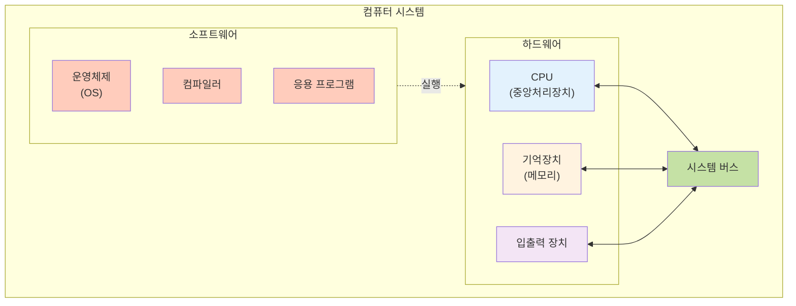
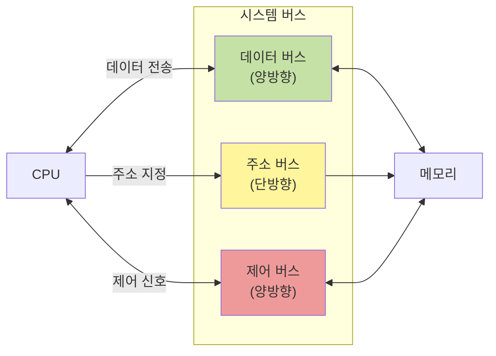
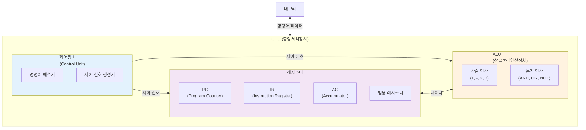
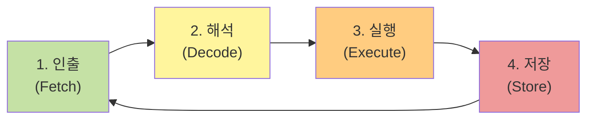
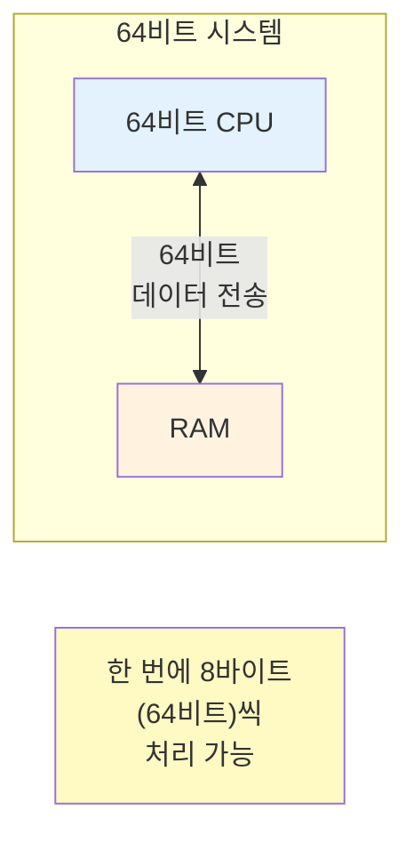
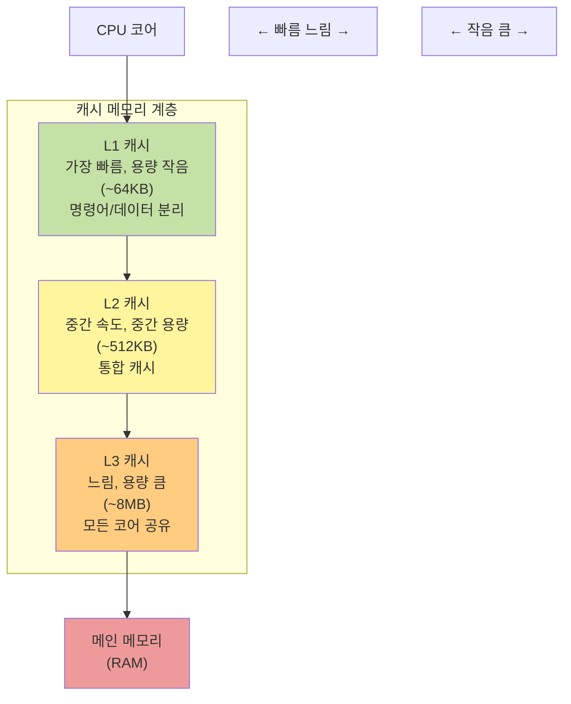
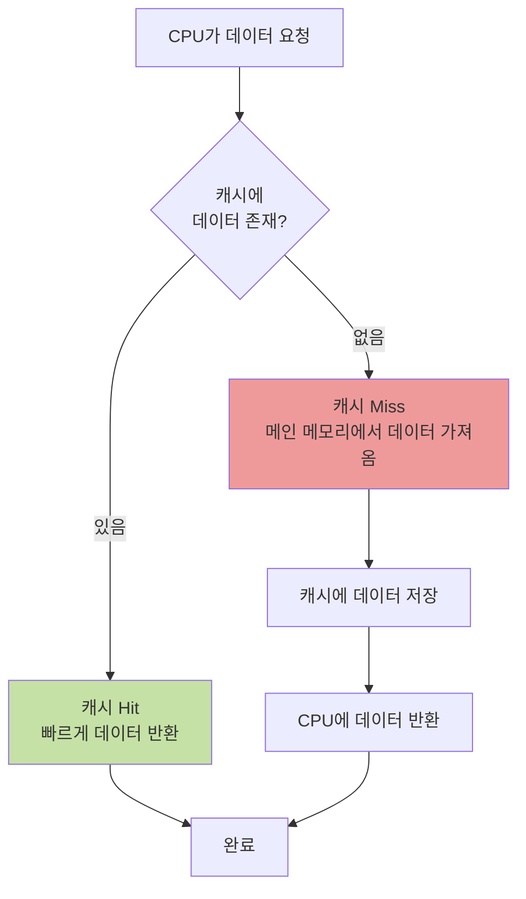
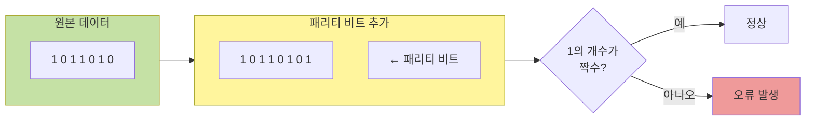
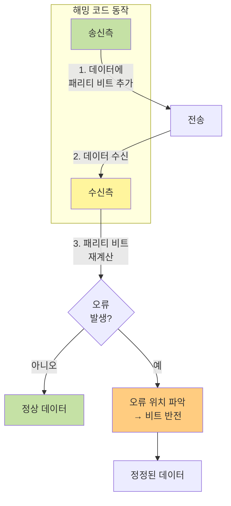

이번 글에서는 컴퓨터의 하드웨어 구조와 동작 원리를 체계적으로 정리해보겠습니다. CPU의 구성 요소부터 메모리 계층, 데이터 표현 방식, 그리고 오류 처리 메커니즘까지 살펴보면서 컴퓨터 하드웨어의 구성과 동작원리를 알아보겠습니다.

## 컴퓨터 시스템의 구성

컴퓨터 시스템은 크게 **하드웨어**와 **소프트웨어**로 나뉩니다.



### 하드웨어의 구성

하드웨어는 CPU, 기억장치, 입출력 장치로 이루어져 있으며, 이들은 **시스템 버스**를 통해 데이터를 주고받습니다.

#### 시스템 버스

시스템 버스는 CPU, 메모리, I/O 장치들을 연결하는 중심 통로입니다. 세 가지 종류의 버스로 구성됩니다.



**데이터 버스 (Data Bus)**

양방향 통신으로 실제 데이터를 전송합니다. 어느 장치에서나 데이터를 발생시킬 수 있습니다.

**주소 버스 (Address Bus)**

단방향 통신으로 메모리 주소를 전달합니다. 주소 버스의 폭은 시스템이 주소 지정할 수 있는 메모리 양을 결정합니다. 예를 들어 32비트 주소 버스는 최대 2³² = 4GB의 메모리를 지정할 수 있습니다.

**제어 버스 (Control Bus)**

양방향 통신으로 읽기/쓰기 같은 제어 신호를 전송합니다. 데이터 버스와 주소 버스를 제어하는 역할을 합니다.

> 참고: [위키백과 - 시스템 버스](https://ko.wikipedia.org/wiki/시스템_버스)

### 소프트웨어의 종류

소프트웨어는 하드웨어를 제어하고 특정 작업을 수행하도록 만드는 명령어 집합입니다. 대표적으로 운영체제(OS)와 컴파일러, 응용 프로그램 등이 있습니다.

운영체제는 하드웨어와 응용 프로그램 사이에서 자원을 관리하고, 컴파일러는 고수준 언어를 기계어로 변환하여 CPU가 이해할 수 있게 만듭니다. ( 해당 글에서는 운영체제에 대해서는 자세하게 다루지 않겠습니다. )

## CPU의 구조와 동작

CPU는 컴퓨터의 두뇌라고 할 수 있습니다. 명령어를 해석하고 실행하는 핵심 장치로, 크게 **ALU**, **레지스터**, **제어장치**로 구성됩니다.



### ALU (Arithmetic Logic Unit)

ALU는 **산술논리연산장치**로, 각종 산술연산(덧셈, 뺄셈, 곱셈, 나눗셈)과 논리연산(AND, OR, NOT, XOR 등)을 수행하는 회로들로 이루어진 장치입니다.

ALU는 연산에 필요한 데이터를 레지스터에서 가져오고, 연산 결과를 다시 레지스터로 보냅니다. 예를 들어 두 수를 더하는 연산이 필요하면, 먼저 제어장치가 레지스터에서 두 개의 값을 ALU로 전달합니다. 그러면 ALU가 덧셈 연산을 수행하고, 결과값을 다시 레지스터에 저장합니다.

### 레지스터

레지스터는 CPU 내부의 가장 빠른 임시 저장 장치로 프로그램을 실행하는 데 필요한 값들을 임시로 저장합니다.

레지스터는 용도에 따라 크게 두 종류로 나뉩니다

**1. 범용 레지스터 (General Purpose Registers)**

프로그래머가 자유롭게 사용할 수 있는 레지스터로 연산에 필요한 데이터나 중간 결과를 저장합니다.

**2. 특수목적 레지스터 (Special Purpose Registers)**

특수목적 레지스터는 CPU 내부에서 특정한 역할을 수행하는 레지스터입니다. PC (Program Counter)는 다음에 실행할 명령어의 주소를 저장하고, IR (Instruction Register)는 현재 실행 중인 명령어를 저장합니다. AC (Accumulator)는 연산 결과를 임시로 저장하며, MAR (Memory Address Register)는 메모리 주소를, MBR (Memory Buffer Register)는 메모리에서 읽어온 데이터나 메모리에 쓸 데이터를 저장합니다.

### 제어장치 (Control Unit)

제어장치는 명령어를 해석하고, CPU의 각 부분에 **제어 신호**를 보내 명령어가 순서대로 실행되도록 제어하는 장치입니다.

제어장치는 먼저 메모리에서 명령어를 가져와 해석합니다. 그런 다음 명령어 실행에 필요한 제어 신호를 생성하여 ALU에게 어떤 연산을 수행할지 지시하고, 데이터를 레지스터 간에 이동시키도록 제어합니다.

## 컴퓨터의 기본 동작 원리

컴퓨터는 기본적으로 **"읽고 → 처리하고 → 저장하는"** 과정을 반복합니다. 이를 인출-실행 사이클(Fetch-Execute Cycle)이라고 부릅니다.



**각 단계의 동작**

먼저 **인출 (Fetch)** 단계에서 메모리에서 명령어를 가져와 IR에 저장합니다. 그 다음 **해석 (Decode)** 단계에서 제어장치가 명령어를 해석하고, **실행 (Execute)** 단계에서 ALU가 연산을 수행하거나 데이터를 이동합니다. 마지막으로 **저장 (Store)** 단계에서 결과를 레지스터나 메모리에 저장합니다.

### CPU와 RAM의 관계

운영체제가 64bit라는 것은, CPU가 RAM으로부터 데이터를 한 번에 **64비트씩** 읽어온다는 의미입니다.



32비트 시스템은 한 번에 32비트(4바이트)를 처리하고, 64비트 시스템은 한 번에 64비트(8바이트)를 처리합니다.

이는 곧 처리할 수 있는 메모리 주소 공간의 크기와도 연결됩니다. 32비트 시스템은 최대 4GB(2³²바이트)의 메모리를 사용할 수 있고, 64비트 시스템은 이론상 16EB(2⁶⁴바이트)까지 사용 가능합니다.

## 캐시 메모리

CPU와 RAM 사이의 속도 차이를 해결하기 위해 **캐시 메모리**가 존재합니다. 캐시는 자주 사용하는 데이터를 미리 저장해두어 빠르게 접근할 수 있게 해주는 고속 메모리입니다.

### 캐시 메모리의 계층 구조 (L1, L2, L3)

캐시는 레벨 숫자가 낮을수록 CPU 코어와 가까워서 속도가 빠르지만 용량이 적습니다.



**L1 캐시 (Level 1 Cache)**

L1 캐시는 CPU 코어와 가장 가까운 캐시로, 명령어 캐시(I-Cache)와 데이터 캐시(D-Cache)로 분리되어 있습니다.

**L2 캐시 (Level 2 Cache)**

L2 캐시는 L1보다 크지만 속도는 조금 느린 통합 캐시입니다.

**L3 캐시 (Level 3 Cache)**

L3 캐시는 멀티 코어 시스템에서 모든 코어가 공유하는 캐시로, 가장 크지만 가장 느립니다.

### 캐시 메모리의 작동 원리: 지역성 (Locality)

캐시 메모리는 **지역성의 원리**를 이용합니다. 프로그램은 특정 패턴으로 메모리에 접근하는 경향이 있기 때문입니다.

**시간 지역성 (Temporal Locality)**

최근에 접근한 데이터에 다시 접근하는 경향으로 반복문에서 같은 변수를 여러 번 참조하는 것을 예로 들 수 있습니다.

```javascript
// 시간 지역성 예시
for (let i = 0; i < 1000; i++) {
  sum += array[i]; // sum 변수를 반복적으로 참조
}
```

**공간 지역성 (Spatial Locality)**

최근에 접근한 데이터의 주변 데이터에 접근하는 경향으로 배열의 연속된 요소에 순차적으로 접근하는 것을 예로 들 수 있습니다.

```javascript
// 공간 지역성 예시
const numbers = [1, 2, 3, 4, 5];
for (let i = 0; i < numbers.length; i++) {
  console.log(numbers[i]); // 연속된 메모리 위치에 순차 접근
}
```

캐시 메모리는 공간 지역성을 활용하기 위해 데이터를 가져올 때 해당 데이터뿐만 아니라 **주변 데이터도 함께** 가져와 캐시 라인에 저장합니다.

### 캐시 Hit와 Cache Miss



**캐시 Hit**는 필요한 데이터가 캐시에 있는 경우로, 빠르게 데이터에 접근할 수 있습니다. 반대로 **캐시 Miss**는 필요한 데이터가 캐시에 없는 경우로, 메인 메모리에서 데이터를 가져와야 합니다.

캐시의 성능은 Hit Rate(적중률)로 측정합니다. 일반적으로 Hit Rate가 높을수록 성능이 좋다고 표현합니다.

## 고정 소수점과 부동 소수점

컴퓨터는 실수를 표현하기 위해 **고정 소수점**과 **부동 소수점** 방식을 사용합니다.

### 고정 소수점 (Fixed Point)

고정 소수점은 정수를 표현하는 비트 수와 소수를 표현하는 비트 수를 **미리 정해놓고** 사용하는 방식입니다. 예를 들어 32비트 시스템에서는 부호에 1비트, 정수부에 15비트, 소수부에 16비트를 할당할 수 있습니다.

이 방식은 구현이 간단하고 연산 속도가 빠르다는 장점이 있지만, 표현할 수 있는 범위가 매우 제한적이라는 단점이 있습니다.

### 부동 소수점 (Floating Point)

부동 소수점은 소수점의 위치를 **고정하지 않고** 지수를 사용하여 표현하는 방식입니다. IEEE 754 표준에 따라 단정밀도(32비트)와 배정밀도(64비트) 두 가지 형식이 있습니다.

단정밀도는 부호 1비트, 지수부 8비트, 가수부 23비트로 구성되며, 배정밀도는 부호 1비트, 지수부 11비트, 가수부 52비트로 구성됩니다. 실제 값은 `(-1)^부호 × (1.가수부) × 2^(지수부-127)` 공식으로 계산됩니다.

이 방식은 매우 큰 수부터 매우 작은 수까지 넓은 범위를 표현할 수 있다는 장점이 있습니다. 하지만 모든 실수를 정확히 표현할 수 없어 근삿값으로 저장되기 때문에 정밀도 손실이 발생합니다.

```javascript
// JavaScript에서 부동 소수점 오차 예시
console.log(0.1 + 0.2); // 0.30000000000000004
console.log(0.1 + 0.2 === 0.3); // false
```

이러한 오차는 부동 소수점 방식의 근본적인 특성으로, 10진수 소수를 2진수로 정확히 표현할 수 없기 때문에 발생합니다.

> 참고: [위키백과 - 부동소수점](https://ko.wikipedia.org/wiki/부동소수점), [Codetorial - 부동소수점 방식](https://codetorial.net/articles/floating_point.html)

## 패리티 비트와 해밍 코드

데이터 전송 과정에서 오류가 발생할 수 있습니다. 이를 감지하고 수정하기 위한 방법으로 **패리티 비트**와 **해밍 코드**가 있습니다.

### 패리티 비트 (Parity Bit)

패리티 비트는 데이터 전송 시 오류 **검출**을 위해 추가되는 1비트입니다.



**짝수 패리티와 홀수 패리티**

짝수 패리티는 전체 비트에서 1의 개수가 짝수가 되도록 패리티 비트를 설정합니다. 예를 들어 1011010이라는 데이터는 10110101로 변환되며, 이때 1이 4개로 짝수가 됩니다. 반대로 홀수 패리티는 전체 비트에서 1의 개수가 홀수가 되도록 설정합니다.

**패리티 비트의 한계**

패리티 비트는 오류가 발생했다는 사실만 확인할 수 있을 뿐, 어느 비트에서 오류가 발생했는지 알 수 없습니다. 또한 짝수 개의 오류가 발생하면 검출할 수 없다는 한계가 있습니다.

### 해밍 코드 (Hamming Code)

해밍 코드는 오류를 **검출**하고 **정정**까지 가능한 방법입니다.



**해밍 코드의 원리**

해밍 코드는 데이터 비트 사이사이에 패리티 비트를 배치합니다(위치 1, 2, 4, 8, 16, ...). 각 패리티 비트는 특정 위치의 비트들을 검사하며, 수신 측에서 패리티 비트를 재계산하여 오류가 발생한 위치를 계산합니다. 그런 다음 해당 비트를 반전시켜 오류를 정정합니다.

예를 들어 4비트 데이터 `1011`을 전송할 때, 위치 1, 2, 4에 패리티 비트를 배치합니다. P1은 1, 3, 5, 7번 비트를 검사하고, P2는 2, 3, 6, 7번 비트를, P4는 4, 5, 6, 7번 비트를 검사합니다. 이렇게 패리티 비트를 여러 개 사용하여 오류 위치를 정확히 찾아내고 수정할 수 있습니다.

## 마치며

이번 글에서는 컴퓨터 하드웨어의 기본 구조와 동작 원리를 살펴보았습니다.
학습 과정에서 레지스터의 개수가 제한적이고, 캐시 메모리의 크기가 한정적이기 때문에 불필요한 변수 선언은 메모리 효율을 떨어뜨릴 수 있다는 것을 알게 되었습니다.
또한 배열을 순회할 때 순차적으로 접근하는 것이 왜 빠른지(공간 지역성), 반복문에서 같은 변수를 재사용하는 것이 왜 효율적인지(시간 지역성)도 이해하게 되었습니다.
