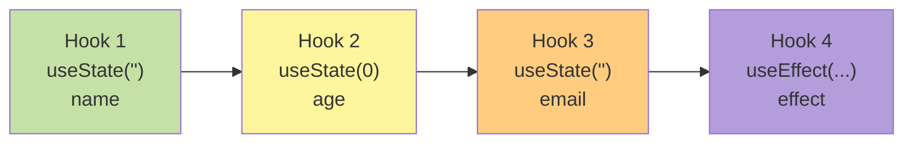
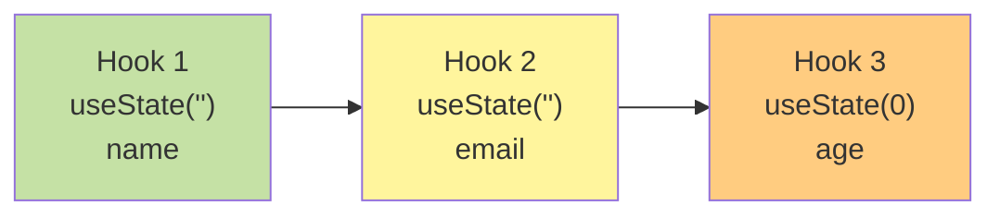
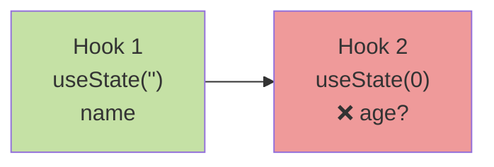

React 컴포넌트를 작성할때 조건문안에 훅을 사용하면 왜 안되는 걸까요?
실제로 아래 코드를 통해 조건문 안에서 Hook을 사용했을 때 어떤 에러가 발생하는지 확인해 보겠습니다.

```javascript
import { useState } from 'react';

export default function BadHookExample() {
  const [flag, setFlag] = useState(false); // 1번째 훅
  const [count, setCount] = useState(0); // 2번째 훅

  // 훅을 조건문 안에 사용한 올바르지 않은 예제
  if (flag) {
    const [extra, setExtra] = useState(0); // flag가 true일 때만 3번째 훅
  }

  return (
    <div>
      <p>flag: {String(flag)}</p>
      <p>count: {count}</p>
      <button onClick={() => setFlag((prev) => !prev)}>
        toggle flag (hook error 보기)
      </button>
      <button onClick={() => setCount((c) => c + 1)}>increase count</button>
    </div>
  );
}
```

위 코드를 실행하고 "toggle flag" 버튼을 클릭하면 콘솔창에 아래와 같은 에러가 발생하는 것을 확인해볼 수 있습니다.


에러 메시지를 자세히 살펴보면 첫 번째 렌더링에서는 flag값이 false였기에 2개의 Hook만 호출되었지만,
두 번째 렌더링에서는 flag이 true가 되어 3개의 Hook이 호출되면서 순서가 변경되었다는 것을 알 수 있습니다.
그리고 결과적으로 React는 이를 감지하고 에러를 발생시킨다는 것도 확인해볼 수 있습니다.

그렇다면 "왜 조건문안에서 훅을 사용할 수 없는걸까요?"
또, "React는 어떻게 여러 개의 `useState`를 구분하고, 각각의 상태를 기억할 수 있는 걸까요?"

이번 글에서는 React Hooks의 동작 원리를 알아보고, 왜 특정 규칙들이 존재하는지, 알아보겠습니다.

## React Hooks의 규칙

먼저 React 공식 문서에서 제시하는 Hooks의 규칙을 살펴보겠습니다.

> **Rules of Hooks**
>
> 1. 최상위(at the top level)에서만 Hook을 호출해야 합니다.
> 2. React 함수 컴포넌트 내에서만 Hook을 호출해야 합니다.

출처: [React 공식 문서 - Rules of Hooks](https://react.dev/reference/rules/rules-of-hooks)

첫 번째 규칙을 보면 리액트의 훅은 최상위에서만 호출되어야 함을 알 수 있습니다.
이를 통해 반복문, 조건문, 중첩된 함수 내에서 Hook을 호출하면 안 된다는 것을 확인할 수 있습니다.

```javascript
// 나쁜 예 - 조건문 안에서 Hook 호출
function Profile({ userId }) {
  if (userId) {
    const [user, setUser] = useState(null); // 에러 발생!
  }
  // ...
}

// 나쁜 예 - 반복문 안에서 Hook 호출
function UserList({ userIds }) {
  const users = [];
  for (let i = 0; i < userIds.length; i++) {
    const [user, setUser] = useState(null); // 에러 발생!
    users.push(user);
  }
  // ...
}

// 좋은 예 - 최상위에서 Hook 호출
function Profile({ userId }) {
  const [user, setUser] = useState(null);

  if (userId) {
    // Hook 호출 후 조건문 사용
  }
  // ...
}
```

그렇다면 왜 이런 규칙이 존재하는 걸까요?

## React는 Hook의 상태를 어떻게 관리할까?

React는 컴포넌트 내에서 호출되는 Hook들을 연결 리스트(Linked List) 구조로 관리합니다.
각 Hook은 순서대로 저장되며, React는 이 순서를 통해 각 Hook의 상태를 식별합니다.

코드로 예를 들어 보겠습니다.

```javascript
function Component() {
  const [name, setName] = useState(''); // Hook 1
  const [age, setAge] = useState(0); // Hook 2
  const [email, setEmail] = useState(''); // Hook 3

  useEffect(() => {
    // ...
  }, []); // Hook 4

  return <div>...</div>;
}
```

위 컴포넌트가 처음 렌더링될 때, React는 내부적으로 다음과 같은 Hook 체인을 생성합니다.



여기서 중요한 점은 React가 Hook을 식별할 때 변수 이름(`name`, `age`, `email`)을 사용하지 않고 Hook이 호출된 순서만을 사용한다는 것입니다.
이러한 이유로 리렌더링 시에도 동일한 순서로 Hook이 호출되어야 React가 올바른 상태를 반환할 수 있습니다.

그렇다면 왜 조건문 안에서 Hook을 사용하면 안 되는 걸까요?
위 코드에서 바라본 예를 아래의 렌더링 과정을 통해 다시 한 번 확인해보겠습니다.

```javascript
function Form({ shouldShowEmail }) {
  const [name, setName] = useState(''); // Hook 1

  if (shouldShowEmail) {
    const [email, setEmail] = useState(''); // Hook 2 (조건부)
  }

  const [age, setAge] = useState(0); // Hook 3
}
```

### 첫 번째 렌더링 (shouldShowEmail = true)



### 두 번째 렌더링 (shouldShowEmail = false)



위 코드의 두 번째 렌더링에서 `shouldShowEmail`이 `false`가 되면서 두 번째 `useState`가 호출되지 않게 됩니다.
이로인해 React는 Hook 2의 위치에서 `age`의 상태를 가져와야 하는데, Hook 체인이 변경되어 버렸습니다.
결과적으로 위와 같이 조건문안에 훅을 사용하면 React는 Hook 2의 위치에 있던 `email` 상태를 `age`에 할당하려고 시도하게 되고, 이는 타입 불일치와 예상치 못한 동작을 일으키게 되는 것이죠.

## 조건부로 Hook을 사용하려면?

그렇다면 조건에 따라 다른 동작을 해야 할 때는 어떻게 해야 할까요?

먼저 Hook은 항상 호출하되, 내부 로직을 조건부로 처리하여 해결하는 방법이 있습니다.
즉, 아래 코드와 같이 email의 상태에 대한 useState를 호출하되, shouldShowEmail에 따라 동작을 다르게 해줄 수 있습니다.

```javascript
function Form({ shouldShowEmail }) {
  const [name, setName] = useState('');
  const [email, setEmail] = useState(''); // 항상 호출
  const [age, setAge] = useState(0);

  return (
    <form>
      <input value={name} onChange={(e) => setName(e.target.value)} />

      {shouldShowEmail && (
        <input value={email} onChange={(e) => setEmail(e.target.value)} />
      )}

      <input
        type="number"
        value={age}
        onChange={(e) => setAge(Number(e.target.value))}
      />
    </form>
  );
}
```

또는 `useEffect`의 경우 조건을 내부에서 처리할 수도 있습니다.

```javascript
// 나쁜 예
if (shouldLog) {
  useEffect(() => {
    console.log('logged');
  }, []);
}

// 좋은 예
useEffect(() => {
  if (shouldLog) {
    console.log('logged');
  }
}, [shouldLog]);
```

## React Hooks를 효과적으로 활용하기

지금까지 React Hooks의 동작 원리와 규칙을 알아보았습니다. Hook이 순서에 의존한다는 것과 조건문 안에서 Hook을 사용하면 안 되는 이유에 대해서 살펴보았습니다.

> 그렇다면 "Hook의 규칙을 지키면서도, 복잡한 로직을 효과적으로 관리할 수 있는 방법은 없을까요?"

실제 프로젝트를 진행하다 보면 컴포넌트 안에 상태 관리, 데이터 fetching, 폼 검증 등 다양한 로직이 섞이게 됩니다.
이렇게 되면 컴포넌트가 점점 복잡해지고, 재사용하기도 어려워집니다.

```javascript
function UserProfile({ userId }) {
  // 10개 이상의 useState, useEffect가 섞여있는 복잡한 컴포넌트
  const [user, setUser] = useState(null);
  const [loading, setLoading] = useState(true);
  const [error, setError] = useState(null);
  // ... 더 많은 상태들

  useEffect(() => {
    // 복잡한 데이터 fetching 로직
  }, [userId]);

  useEffect(() => {
    // 또 다른 부수 효과
  }, []);

  // 이 컴포넌트는 무엇을 하는 컴포넌트일까요?
  // UI를 그리는 건지, 데이터를 가져오는 건지 명확하지 않습니다.

  return <div>...</div>;
}
```

이러한 문제를 해결하기 위해 커스텀 Hook을 사용해볼 수 있습니다.
커스텀 Hook을 사용하면 Hook의 규칙을 지키면서도 로직을 효과적으로 분리하고 재사용할 수 있습니다.

## 커스텀 Hook으로 로직 분리하기

React의 철학 중 하나는 "UI = f(state)" 입니다. 즉, 컴포넌트는 상태를 받아서 UI를 그리는 순수한 함수여야 한다는 것이죠.
여기서 커스텀 Hook을 사용하면 비즈니스 로직을 컴포넌트에서 분리할 수 있습니다.

### 커스텀 Hook 없이 작성한 코드

```javascript
function UserProfile({ userId }) {
  const [user, setUser] = useState(null);
  const [loading, setLoading] = useState(true);
  const [error, setError] = useState(null);

  useEffect(() => {
    let cancelled = false;

    const fetchUser = async () => {
      try {
        setLoading(true);
        const response = await fetch(`/api/users/${userId}`);
        const data = await response.json();

        if (!cancelled) {
          setUser(data);
          setError(null);
        }
      } catch (err) {
        if (!cancelled) {
          setError(err.message);
        }
      } finally {
        if (!cancelled) {
          setLoading(false);
        }
      }
    };

    fetchUser();

    return () => {
      cancelled = true;
    };
  }, [userId]);

  if (loading) return <div>Loading...</div>;
  if (error) return <div>Error: {error}</div>;
  if (!user) return null;

  return (
    <div>
      <h1>{user.name}</h1>
      <p>{user.email}</p>
    </div>
  );
}
```

위 코드에서 컴포넌트는 데이터 fetching 로직과 UI 렌더링 로직이 섞여 있어 복잡합니다.
이를 커스텀 훅을 통해서 아래와 같이 개선할 수 있습니다.

### 커스텀 Hook으로 개선한 코드

```javascript
// 커스텀 Hook: 데이터 fetching 로직 분리
function useUser(userId) {
  const [user, setUser] = useState(null);
  const [loading, setLoading] = useState(true);
  const [error, setError] = useState(null);

  useEffect(() => {
    let cancelled = false;

    const fetchUser = async () => {
      try {
        setLoading(true);
        const response = await fetch(`/api/users/${userId}`);
        const data = await response.json();

        if (!cancelled) {
          setUser(data);
          setError(null);
        }
      } catch (err) {
        if (!cancelled) {
          setError(err.message);
        }
      } finally {
        if (!cancelled) {
          setLoading(false);
        }
      }
    };

    fetchUser();

    return () => {
      cancelled = true;
    };
  }, [userId]);

  return { user, loading, error };
}

// 컴포넌트: UI 렌더링에만 집중
function UserProfile({ userId }) {
  const { user, loading, error } = useUser(userId);

  if (loading) return <div>Loading...</div>;
  if (error) return <div>Error: {error}</div>;
  if (!user) return null;

  return (
    <div>
      <h1>{user.name}</h1>
      <p>{user.email}</p>
    </div>
  );
}
```

이제 `UserProfile` 컴포넌트는 UI 렌더링에만 집중할 수 있게 되었습니다.
데이터를 어떻게 가져오는지는 `useUser` 훅이 책임지고 있게되는 것이죠.

이렇게 커스텀 훅을 사용하면 비즈니스 로직을 추상화하여 훅으로 분리하는 것을 통해 UI 컴포넌트를 순수하게 관리할 수 있다는 장점이 있습니다.
또, 저의 경우 3번 이상 나타나는 경우를 중복된 로직이라고 보는데,
이때 해당 부분을 훅으로 추상화하게 되면 공통 로직을 여러곳에서 깔끔하게 사용할 수 있어 코드를 수정하고 파악하는 것이 효율적이었던 경헙이 있습니다.

## 참고 자료

- [React 공식 문서 - Rules of Hooks](https://react.dev/reference/rules/rules-of-hooks)
- [React 공식 문서 - Reusing Logic with Custom Hooks](https://react.dev/learn/reusing-logic-with-custom-hooks)
- [React Hooks 심화 - 내부 동작 원리](https://www.netlify.com/blog/2019/03/11/deep-dive-how-do-react-hooks-really-work/)
- [React 공식 블로그 - React Hooks 소개](https://react.dev/blog/2019/02/06/react-v16.8.0)
- [Overreacted - Why Do React Hooks Rely on Call Order?](https://overreacted.io/why-do-hooks-rely-on-call-order/)
