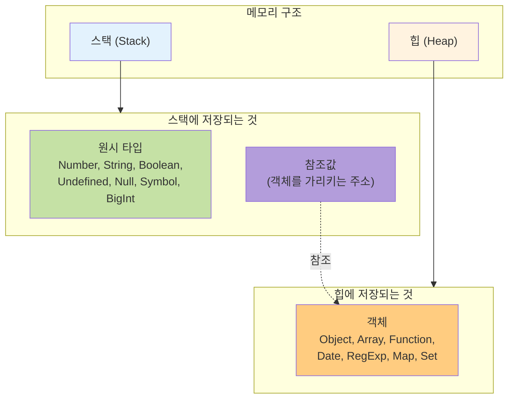
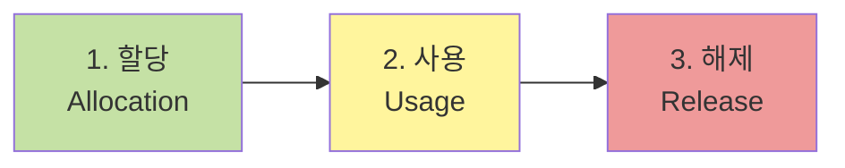
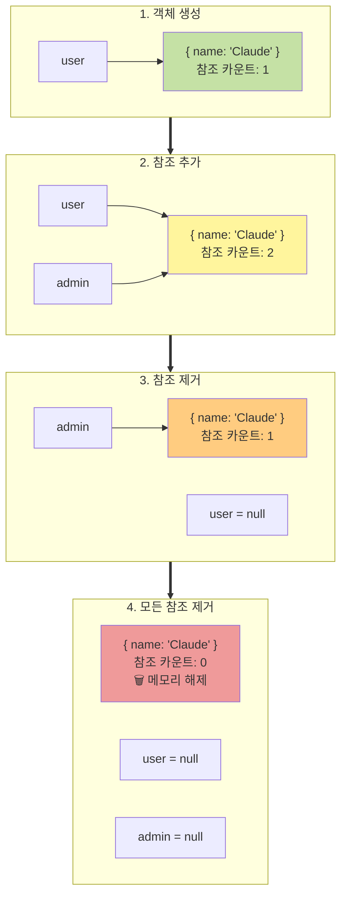
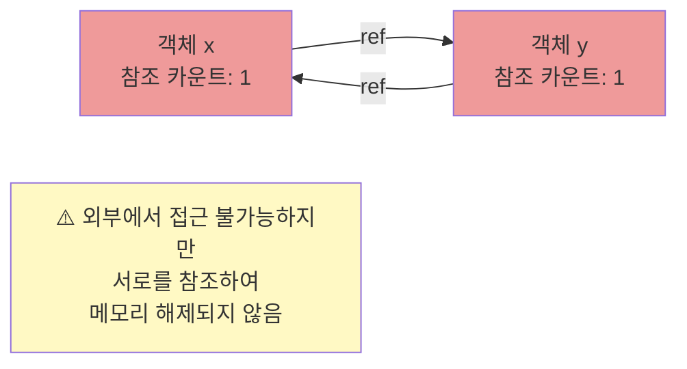
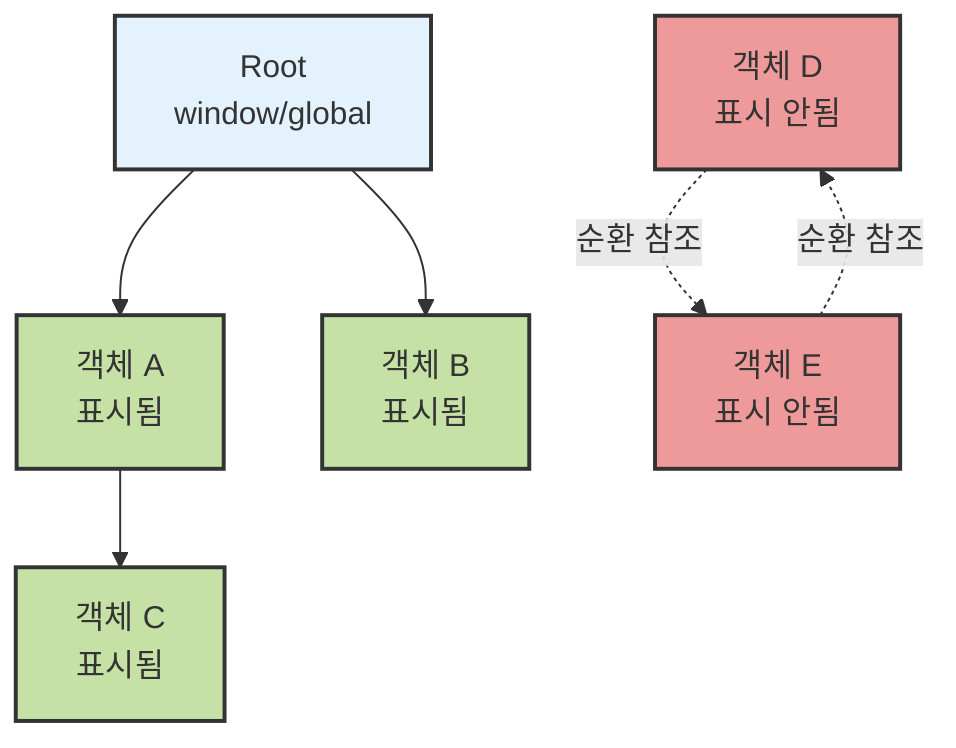
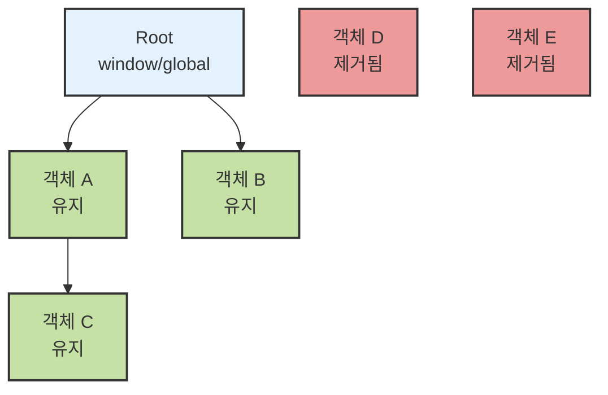
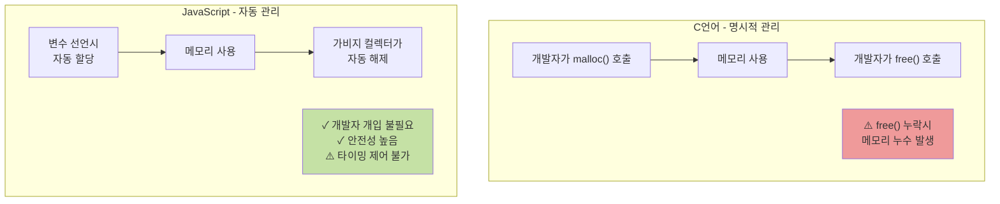

React 컴포넌트를 작성하던 중 이런 고민이 생겼습니다.

> 상수를 컴포넌트 내부에 선언해야할까?, 아니면 외부에 선언해야할까?

```javascript
// 상수를 컴포넌트 내부에 선언한 예

const Component = () => {
  const DELAY_MS = 1000;

  return <>...</>;
};
```

```javascript
// 상수를 컴포넌트 외부에 선언한 예

const DELAY_MS = 1000;

const Component = () => {
  return <>...</>;
};
```

상수를 컴포넌트 내부에 선언하면 렌더링할 때마다 메모리에 다시 할당되는 것은 아닐까? 그렇다면 외부에 선언하는 것이 성능상 더 유리한 것일까?
이러한 궁금증은 "메모리는 언제 할당되고, 언제 해제되는가?", "JavaScript는 C언어처럼 `malloc`이나 `free`를 명시적으로 호출하지 않는데, 메모리 관리는 어떻게 이루어지는 걸까?" 라는 궁금증을 생기게 하였습니다.
따라서 이번 글에서는 JavaScript의 메모리 구조와 가비지 컬렉션에 대해 자세히 알아보고 정리해보겠습니다.

## JavaScript의 메모리 구조

JavaScript 엔진은 크게 두 가지 영역에 메모리를 할당합니다.



### 스택 (Stack)

스택은 정적 메모리 할당을 위한 공간입니다. 컴파일 타임에 크기를 알 수 있는 데이터가 이곳에 저장되는데, 대표적으로 Number, String, Boolean, Undefined, Null, Symbol, BigInt와 같은 원시 타입 값들이 여기에 해당됩니다.

흥미로운 점은 객체 자체는 스택에 저장되지 않지만, 객체를 가리키는 참조값은 스택에 저장된다는 것입니다. 실제 객체 데이터는 힙에 저장되고, 변수는 그 객체가 어디에 있는지를 가리키는 주소만 갖고 있는 것이지요. 함수 호출 컨텍스트 역시 스택에 저장됩니다.

또한, 스택은 LIFO(Last In First Out) 구조로 동작하며, 이러한 구조 덕분에 접근 속도가 매우 빠릅니다.

```javascript
const name = 'Cllaude'; // 스택에 문자열 'Cllaude' 저장
const age = 27; // 스택에 숫자 27 저장
```

### 힙 (Heap)

힙은 동적 메모리 할당을 위한 공간입니다. 스택과 달리 런타임에 크기가 결정되는 데이터가 저장됩니다.

크기를 미리 알 수 없는 데이터들이 힙에 저장되는데, Object, Array, Function과 같은 기본적인 참조 타입부터 Date, RegExp, Map, WeakMap, Set, WeakSet 등 복잡한 자료구조들이 모두 여기에 포함됩니다. 이들은 생성 시점에 정확히 얼마나 많은 메모리가 필요할지 알 수 없기 때문에, 필요에 따라 동적으로 메모리를 할당받게 됩니다.

```javascript
const user = { name: 'Cllaude', age: 27 }; // 객체는 힙에 저장, user 변수는 스택에서 힙을 참조
const numbers = [1, 2, 3, 4, 5]; // 배열은 힙에 저장, numbers 변수는 스택에서 힙을 참조
```

### 왜 스택과 힙을 분리할까?

그렇다면 왜 JavaScript 엔진은 스택에는 크기를 알 수 있는 데이터를, 힙에는 크기를 알 수 없는 데이터를 저장하는 걸까요? 스택에 크기를 알 수 없는 값을 저장하면 안 되는 걸까요? 또는 힙에 크기를 미리 알 수 있는 값을 저장하면 안 되는 걸까요?

이러한 구조적 분리는 성능 최적화 때문입니다. 스택은 LIFO 구조로 메모리 할당과 해제가 매우 빠릅니다. 많은 아키텍처에서 스택 메모리 할당은 단순히 스택 포인터를 이동시키는 것만으로 완료되며, 이는 단 하나의 CPU 명령어로 처리됩니다. 원시 타입은 고정된 크기를 가지므로 스택에서 이렇게 효율적으로 관리할 수 있습니다.

반면 힙 메모리 할당은 훨씬 복잡합니다. 적절한 크기의 메모리 블록을 찾고, 필요하다면 블록을 분할하며, 할당과 해제를 추적하기 위한 북키핑(book-keeping) 작업이 필요합니다. 또한 힙은 여러 스레드에서 동시에 접근할 수 있어 동기화 오버헤드도 발생합니다. 하지만 이러한 복잡성 덕분에 힙은 동적으로 크기가 변하는 데이터를 유연하게 처리할 수 있습니다.

메모리 관리 전략 측면에서도 차이가 있습니다. 스택 메모리는 함수 실행이 끝나면 자동으로 해제됩니다. 함수가 호출되면 스택 프레임이 생성되고, 함수가 종료되면 그 프레임이 제거되면서 안에 있던 모든 지역 변수가 함께 사라지는 것이지요. 반면 힙 메모리는 가비지 컬렉터가 주기적으로 정리합니다. 이렇게 각 영역에 최적화된 메모리 관리 전략을 적용할 수 있습니다.

참조 타입을 효율적으로 처리할 수 있다는 점도 중요합니다.

```javascript
const obj1 = { value: 100 };
const obj2 = obj1; // 스택에서 같은 힙 주소를 참조

obj2.value = 200;
console.log(obj1.value); // 200 (같은 객체를 참조)
```

위 코드를 보면 `obj2`에 `obj1`을 할당했을 때, 객체 전체가 복사되는 것이 아니라 같은 힙 주소를 참조하게 됩니다. 이를 통해 큰 객체를 복사하지 않고도 여러 변수에서 공유할 수 있어 메모리를 효율적으로 사용할 수 있습니다.

#### 참고자료

> - [Why Is Stack Memory Faster Than Heap Memory?](https://medium.com/nerd-for-tech/why-is-stack-memory-faster-than-heap-memory-heres-what-you-need-to-know-a03b63649c35)
> - [Stack vs Heap Memory Allocation - GeeksforGeeks](https://www.geeksforgeeks.org/dsa/stack-vs-heap-memory-allocation/)

## 메모리 생명주기

JavaScript의 메모리 관리는 세 단계로 이루어집니다.



### 1. 메모리 할당 (Allocation)

JavaScript는 값을 선언할 때 자동으로 메모리를 할당합니다.

```javascript
// 원시 타입 할당
const n = 123; // 숫자를 위한 메모리 할당
const s = 'string'; // 문자열을 위한 메모리 할당

// 객체 할당
const o = { a: 1, b: 2 }; // 객체와 프로퍼티를 위한 메모리 할당
const a = [1, null, 'text']; // 배열과 요소를 위한 메모리 할당

// 함수 호출을 통한 할당
const d = new Date(); // Date 객체 생성
const e = document.createElement('div'); // DOM 요소 생성
```

C언어의 경우 `malloc()`을 명시적으로 호출해야 하지만, JavaScript는 이 과정이 자동으로 처리됩니다.

### 2. 메모리 사용 (Usage)

할당된 메모리를 읽거나 쓰는 단계입니다.

```javascript
const user = { name: 'Claude' };
console.log(user.name); // 메모리 읽기
user.name = 'New Name'; // 메모리 쓰기
```

### 3. 메모리 해제 (Release)

더 이상 필요하지 않은 메모리를 해제하는 단계입니다. 그런데 스택 메모리와 힙 메모리는 해제되는 방식이 다릅니다.

스택 메모리는 함수 실행이 끝나면 자동으로 해제됩니다.

```javascript
function calculate() {
  const x = 10;
  const y = 20;
  return x + y;
}

calculate(); // 함수 실행 종료 후 x, y는 자동으로 스택에서 제거됨
```

함수 실행이 끝나면 스택 프레임이 제거되면서 지역 변수들도 함께 해제됩니다. 이는 알아서 필요 없는 메모리 공간을 지워주는 스택의 특징입니다.

반면 힙 메모리는 스택처럼 알아서 메모리 공간이 지워지지 않습니다. 대신 가비지 컬렉터가 주기적으로 검사하여 더 이상 참조되지 않는 객체를 자동으로 해제합니다. JavaScript는 명시적인 타이밍 없이 백그라운드에서 주기적으로 메모리를 검사하고 가비지 컬렉션을 수행하는데, 이것이 바로 힙과 스택의 중요한 차이점입니다.

## 가비지 컬렉션 알고리즘

가비지 컬렉터는 "어떤 메모리가 더 이상 필요 없는가?"를 판단해야 합니다. 이를 위해 여러 알고리즘이 개발되었습니다.

### Reference Counting

Reference Counting은 가장 단순한 가비지 컬렉션 알고리즘입니다.

이 알고리즘은 각 객체마다 참조 카운터를 유지하는 방식으로 동작합니다. 객체가 참조될 때마다 카운터를 증가시키고, 참조가 제거되면 카운터를 감소시킵니다. 그리고 카운터가 0이 되면 해당 객체를 가비지로 판단하여 메모리를 해제합니다

```javascript
let user = { name: 'Claude' }; // 참조 카운트: 1

let admin = user; // 참조 카운트: 2

user = null; // 참조 카운트: 1
admin = null; // 참조 카운트: 0 → 메모리 해제
```



**Reference Counting의 치명적인 문제인 순환 참조**

그런데 Reference Counting에는 치명적인 단점이 있습니다. 바로 순환 참조 문제입니다. 순환 참조가 발생하면 참조 카운트가 0이 되지 않아 메모리 누수가 발생합니다.

```javascript
function createCircularReference() {
  const x = {};
  const y = {};

  x.ref = y; // x가 y를 참조
  y.ref = x; // y가 x를 참조 (순환 참조 발생)

  return 'done';
}

createCircularReference();
// 함수 실행 후 x, y는 더 이상 접근할 수 없지만
// 서로를 참조하고 있어 참조 카운트가 1로 유지됨
// Reference Counting 방식에서는 메모리 누수 발생!
```



이러한 문제로 인해 현대 JavaScript 엔진들은 Reference Counting을 주요 가비지 컬렉션 알고리즘으로 사용하지 않습니다.

### Mark-and-Sweep

Mark-and-Sweep은 현대 JavaScript 엔진이 사용하는 가비지 컬렉션 알고리즘입니다.

이 알고리즘은 크게 두 단계로 동작합니다. 첫 번째 Mark단계에서는 루트(Root) 객체부터 시작하여 도달 가능한 모든 객체를 표시합니다. 두 번째 Sweep 단계에서는 표시되지 않은 모든 객체를 메모리에서 제거합니다.

여기서 루트 객체란 전역 객체(브라우저의 `window`, Node.js의 `global`), 현재 실행 중인 함수의 지역 변수와 매개변수, 그리고 콜 스택의 모든 변수를 의미합니다.

아래 다이어그램은 Mark-and-Sweep 알고리즘의 동작 과정을 시각화한 것입니다. Mark 단계에서는 루트에서 도달 가능한 객체들을 표시하고, Sweep 단계에서는 표시되지 않은 객체들을 제거합니다.

**1. Mark 단계: 루트부터 도달 가능한 객체 표시**



**2. Sweep 단계: 표시되지 않은 객체 제거**



이를 코드로 살펴보겠습니다.

```javascript
let globalUser = { name: 'Global' }; // 루트에서 접근 가능 → Mark

function processUser() {
  let localUser = { name: 'Local' }; // 함수 실행 중 루트에서 접근 가능 → Mark

  let tempData = { data: 'temp' }; // 함수 실행 중 루트에서 접근 가능 → Mark

  return localUser;
}

let result = processUser();
// 함수 종료 후
// - globalUser: 여전히 루트에서 접근 가능 → 유지
// - localUser: processUser함수에서 localUser가 반환되어 루트에서 접근 가능 → 유지
// - tempData: 어디에서도 참조하지 않음 → Sweep 단계에서 제거
```

**순환 참조 문제 해결**

Mark-and-Sweep의 가장 큰 장점은 Reference Counting의 순환 참조 문제를 완벽하게 해결한다는 것입니다.

```javascript
function createCircularReference() {
  const x = {};
  const y = {};

  x.ref = y;
  y.ref = x; // 순환 참조

  return 'done';
}

createCircularReference();
// Mark-and-Sweep 방식:
// 1. 루트에서 x, y로 가는 경로가 없음
// 2. Mark 단계에서 x, y는 표시되지 않음
// 3. Sweep 단계에서 x, y 모두 제거됨 ✓
```

**현대 브라우저의 구현**

찾아보니, 2012년 이후 모든 현대 브라우저는 Mark-and-Sweep 알고리즘을 사용한다고 합니다. 그 이전에는 Reference Counting 방식을 사용했지만, 순환 참조 문제로 인해 모든 주요 브라우저가 Mark-and-Sweep으로 전환했다고 합니다.

Mark-and-Sweep의 성능을 더욱 향상시키기 위해 다양한 최적화 기법들이 추가되었다고 합니다. 대표적으로 V8 엔진의 Orinoco 프로젝트가 있습니다. 이와 관련해서는 아래를 참고하였습니다.

> 참고: [MDN - Memory Management](https://developer.mozilla.org/en-US/docs/Web/JavaScript/Memory_management), [V8 - Trash talk: the Orinoco garbage collector](https://v8.dev/blog/trash-talk)

### Mark-and-Sweep의 성능 이슈

Mark-and-Sweep 알고리즘도 완벽하지 않습니다. 주요 문제점으로는 세 가지가 있습니다.

첫 번째는 Stop-the-World 현상입니다. 표준 Mark-and-Sweep 알고리즘은 객체 그래프를 마킹하는 동안 전체 객체 그래프가 변경되지 않아야 한다고 가정합니다. 만약 마커(marker)와 뮤테이터(mutator, 즉 프로그램)가 동시에 실행된다면, 이미 마킹된 셀을 뮤테이터가 변경할 수 있고, 새로운 내용은 마킹되지 않은 채로 남아 살아있는 값이 수집될 수 있습니다. 이러한 문제를 방지하기 위해 가비지 컬렉션 중에는 전체 시스템이 일시 중지되어야 합니다.

두 번째는 예측 불가능한 실행 시간입니다. 언제 실행될지 개발자가 제어할 수 없으며, 프로그램이 수 초에서 수 분 동안 멈춘 것처럼 보일 수 있습니다.

세 번째는 성능 영향입니다. 복잡한 애플리케이션에서는 눈에 띄는 성능 저하가 발생할 수 있습니다. 가벼운 애플리케이션이라면 문제가 없을 수 있지만, 게임과 같이 속도감이 빨라야 하는 애플리케이션의 경우 이러한 성능 저하는 치명적일 수 있습니다. 이는 일부 실시간 및 시간 중요 애플리케이션을 불가능하게 만들 수 있습니다.

이와 관련해서 찾아본 결과 실제로 초기 안드로이드 폰에서 가비지 컬렉션으로 인한 성능 저하 문제가 있었다고 합니다. 당시 Android는 Dalvik VM을 사용했는데, 가비지 컬렉션이 실행될 때마다 애플리케이션이 100-200ms 정도 멈추는 현상이 발생했다고 합니다.

이를 개선하기 위해 Android 5.0부터는 ART를 도입하고, Concurrent Copying GC를 통해 일시 정지 시간을 2-3ms로 단축했으며, 백그라운드에서 대부분의 가비지 컬렉션 작업을 수행하도록 개선했다고 합니다.

> 참고: [Android Developers - Manage your app's memory](https://developer.android.com/topic/performance/memory)

## React 컴포넌트와 메모리 관리

이제 처음 질문으로 돌아가 봅시다. 컴포넌트 내부와 외부에 선언된 변수의 메모리는 어떻게 다를까요?

### 컴포넌트 외부 변수

```javascript
const DELAY_MS = 1000;

const Component = () => {
  return <>...</>;
};
```

컴포넌트 외부에 선언된 변수는 모듈이 로드될 때 한 번만 메모리에 할당됩니다. 컴포넌트가 리렌더링되어도 재할당되지 않습니다. 이 변수는 애플리케이션이 종료되거나 모듈이 언로드될 때까지 메모리에 유지되며, 전역 스코프에서 접근 가능하므로 루트에서 도달 가능합니다.

### 컴포넌트 내부 변수

```javascript
const Component = () => {
  const DELAY_MS = 1000;

  return <>...</>;
};
```

컴포넌트 내부에 선언된 변수는 컴포넌트가 렌더링될 때마다 새로 할당됩니다. 렌더링이 끝나면 더 이상 참조되지 않으며, 다음 가비지 컬렉션 사이클에서 제거될 수 있습니다.

### 고민

그렇다면 컴포넌트에서 사용되는 상수를 어디에 선언하면 좋을까요?

컴포넌트 외부에는 상수 값(변하지 않는 설정값), 정규표현식, 스타일 객체(변하지 않는 경우), 유틸리티 함수 등을 선언하는 것이 좋을 것 같습니다.

```javascript
const EMAIL_REGEX = /^[A-Z0-9._%+-]+@[A-Z0-9.-]+\.[A-Z]{2,}$/i;
const ANIMATION_CONFIG = { duration: 300, easing: 'ease-in-out' };

const Component = () => {
  // ...
};
```

반면 컴포넌트 내부에는 props나 state에 의존하는 값, 렌더링마다 달라져야 하는 값을 선언하되, `useMemo`나 `useCallback`을 활용하여 최적화할 수 있을 것 같습니다.

```javascript
const Component = ({ userId }) => {
  const config = useMemo(
    () => ({
      userId,
      timestamp: Date.now(),
    }),
    [userId],
  ); // userId가 변경될 때만 새로 생성

  return <>...</>;
};
```

## 메모리 누수 방지하기

그렇다면 Mark-and-sweep에서는 메모리 누수 문제가 발생하지 않을까요?

> 가비지 컬렉터가 자동으로 메모리를 관리하지만, 여전히 메모리 누수는 발생할 수 있습니다.

더 이상 필요하지 않은 메모리가 해제되지 않고 계속 점유되어 있는 상태를 메모리 누수라고 하는데 Mark-and-Sweep 알고리즘에서도 루트에서 접근 가능한 객체는 필요하지 않더라도 메모리에서 해제되지 않습니다.

### 일반적인 메모리 누수 패턴

**1. 전역 변수 남용**

```javascript
// 나쁜 예
function processData() {
  // 'use strict' 없이 var 없이 선언하면 전역 변수가 됨
  leakedData = new Array(1000000);
}
```

```javascript
// 좋은 예
function processData() {
  'use strict';
  const data = new Array(1000000);
  // 함수 종료 후 data는 가비지 컬렉션 대상
}
```

**2. 이벤트 리스너 미제거**

```javascript
// 나쁜 예
useEffect(() => {
  const handleResize = () => console.log('resized');
  window.addEventListener('resize', handleResize);
  // cleanup 함수 없음 → 메모리 누수!
}, []);
```

```javascript
// 좋은 예
useEffect(() => {
  const handleResize = () => console.log('resized');
  window.addEventListener('resize', handleResize);

  return () => {
    window.removeEventListener('resize', handleResize); // cleanup
  };
}, []);
```

**3. 타이머 미정리**

```javascript
// 나쁜 예
useEffect(() => {
  const timer = setInterval(() => {
    console.log('tick');
  }, 1000);
  // cleanup 없음 → 컴포넌트 언마운트 후에도 타이머 실행
}, []);
```

```javascript
// 좋은 예
useEffect(() => {
  const timer = setInterval(() => {
    console.log('tick');
  }, 1000);

  return () => {
    clearInterval(timer); // cleanup
  };
}, []);
```

**4. 클로저로 인한 의도치 않은 참조 유지**

```javascript
// 주의가 필요한 예
function createHeavyDataProcessor() {
  const heavyData = new Array(1000000).fill('data'); // 큰 배열

  return {
    process: () => {
      // heavyData의 일부만 사용
      console.log(heavyData[0]);
    },
  };
}

const processor = createHeavyDataProcessor();
// processor.process만 사용하지만 heavyData 전체가 메모리에 유지됨
```

```javascript
// 개선된 예
function createHeavyDataProcessor() {
  const heavyData = new Array(1000000).fill('data');
  const firstItem = heavyData[0]; // 필요한 데이터만 추출

  return {
    process: () => {
      console.log(firstItem); // 작은 데이터만 참조
    },
  };
}
// heavyData는 함수 실행 후 가비지 컬렉션 대상
```

**5. DOM 참조 유지**

```javascript
// 나쁜 예
const elements = [];

function addElement() {
  const div = document.createElement('div');
  document.body.appendChild(div);
  elements.push(div); // DOM 요소 참조 저장
}

function removeElement() {
  const div = elements.pop();
  document.body.removeChild(div);
  // elements 배열에서 제거했지만 여전히 참조가 남아있음
}
```

```javascript
// 좋은 예
const elementIds = [];

function addElement() {
  const div = document.createElement('div');
  const id = 'element-' + Date.now();
  div.id = id;
  document.body.appendChild(div);
  elementIds.push(id); // ID만 저장
}

function removeElement() {
  const id = elementIds.pop();
  const div = document.getElementById(id);
  if (div) {
    document.body.removeChild(div);
  }
  // DOM 요소 제거 후 자동으로 가비지 컬렉션 대상
}
```

## JavaScript와 C언어의 메모리 관리 비교

앞서 설명했던 C언어와의 차이점도 간단하게나마 알아보겠습니다.



C언어의 경우를 먼저 살펴보겠습니다.

```c
#include <stdlib.h>

void processData() {
    int* data = (int*)malloc(sizeof(int) * 1000);  // 명시적 할당

    // data 사용

    free(data);  // 명시적 해제 - 개발자가 직접 호출해야 함!
}
```

C언어의 경우에는 `malloc`, `free` 등을 통해 할당과 해제를 명시적으로 표현해야 합니다. 개발자가 직접 메모리를 관리해야 하는 것입니다.

반면 JavaScript는 다릅니다.

```javascript
function processData() {
  const data = new Array(1000); // 자동 할당

  // data 사용

  // 자동 해제 - 가비지 컬렉터가 백그라운드에서 처리
}
```

JavaScript는 명시적인 타이밍 없이 백그라운드에서 주기적으로 메모리를 검사하고 가비지 컬렉션을 수행합니다. 개발자가 직접 메모리를 관리할 필요가 없습니다.

## 마치며

React 컴포넌트를 작성하면서 상수를 어디에 선언해야 할지 고민했던 것이 이렇게 깊은 공부로 이어질 줄은 몰랐습니다. 단순히 "리렌더링되어도 재할당되지 않으니까 상수는 외부에 빼는게 좋지 않을까?" 에 대한 답을 찾으려던 것이, 결국 JavaScript의 메모리 구조와 가비지 컬렉션이라는 근본적인 개념을 이해하는 계기가 되었습니다.

처음에는 스택과 힙이 왜 분리되어 있는지조차 이해하지 못했습니다. 그저 "원시 타입은 스택, 참조 타입은 힙"이라고 암기만 하고 있었죠. 하지만 실제로 스택의 LIFO 구조가 어떻게 단 하나의 CPU 명령어로 메모리 할당을 가능하게 하는지, 힙이 왜 북키핑이라는 복잡한 과정을 거쳐야 하는지 알게 되면서 이 구조가 얼마나 효율적인지 깨달았습니다.

Reference Counting의 순환 참조 문제를 공부하면서는 초기 JavaScript의 한계를 이해할 수 있었고, Mark-and-Sweep 알고리즘이 왜 현대 브라우저의 표준이 되었는지도 자연스럽게 알게 되었습니다. 특히 Android의 Dalvik에서 ART로의 전환 사례를 통해 Stop-the-World 문제가 실제 사용자 경험에 얼마나 큰 영향을 미치는지 느낄 수 있었습니다.

처음의 질문으로 돌아왔을 때, 결국 중요한 것은 성능적인 부분이 아니라 코드의 의도라는 것을 느끼게되었습니다. 변하지 않는 상수라면 컴포넌트 외부에 선언하여 "이 값은 모든 인스턴스가 공유한다"는 의도를 명확히 하고, props나 state에 의존한다면 컴포넌트 내부에 두되 필요하면 `useMemo`로 최적화하면 되는 것이었습니다.

## 참고 자료

- [MDN - Memory Management](https://developer.mozilla.org/en-US/docs/Web/JavaScript/Memory_management)
- [JavaScript.info - Garbage Collection](https://javascript.info/garbage-collection)
- [V8 - Trash talk: the Orinoco garbage collector](https://v8.dev/blog/trash-talk)
- [V8 - Concurrent marking in V8](https://v8.dev/blog/concurrent-marking)
- [Felix Gerschau - JavaScript Memory Management](https://felixgerschau.com/javascript-memory-management/)
- [React Documentation - State: A Component's Memory](https://react.dev/learn/state-a-components-memory)
- [Android Developers - Manage your app's memory](https://developer.android.com/topic/performance/memory)
- [Stack Overflow - Which modern browsers use Mark and Sweep Algorithm](https://stackoverflow.com/questions/56218239/which-modern-browsers-use-mark-and-sweep-algorithm-for-garbage-collection)
