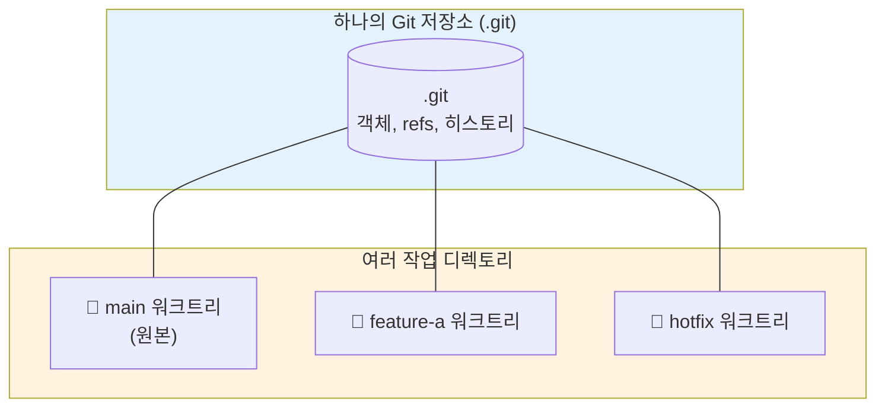

기능 개발 중에 갑자기 핫픽스 요청이 들어오거나, AI 에이전트에게 작업을 시켜놓고 다른 브랜치에서 다른 일을 하고 싶을 때가 있습니다.
저는 평소에는 `git stash`로 작업 중인 변경사항을 임시 저장한 뒤 브랜치를 옮겨다녔는데요.
그러다 보니 stash가 쌓이거나, 브랜치를 옮길 때마다 빌드 캐시와 `node_modules`가 꼬여서 다시 의존성을 설치해야 하는 일이 잦았습니다.

이런 불편함을 줄여주는 Git 기능이 바로 `git worktree`입니다.
이번 글에서는 worktree가 어떤 문제를 해결해주는지, 그리고 실제 작업에서 어떻게 활용하면 좋은지 정리해보려고 합니다.

## 기존 브랜치 전환의 문제점

`git switch`나 `git checkout`으로 브랜치를 옮기면 작업 디렉토리 전체가 해당 브랜치의 상태로 바뀝니다.
이 방식은 깔끔하지만 몇 가지 불편한 점이 있습니다.

- 작업 중인 변경사항이 있으면 stash하거나 커밋해야 합니다.
- 브랜치마다 의존성이 다르면 `pnpm install`을 다시 돌려야 합니다.
- Vite, Next.js 같은 도구의 빌드 캐시가 무효화되어 다시 빌드해야 합니다.
- IDE에서 열어둔 파일이 바뀌어버려 컨텍스트가 끊깁니다.

특히 모노레포처럼 빌드 시간이 긴 프로젝트라면 이 비용이 꽤 크게 느껴집니다.

## git worktree란?

`git worktree`는 하나의 Git 저장소에 **여러 개의 작업 디렉토리**를 연결할 수 있는 기능입니다.
`.git` 디렉토리는 그대로 공유하면서 브랜치별로 별도의 폴더를 만들어 동시에 작업할 수 있게 해줍니다.



각 워크트리는 독립된 파일 시스템을 가지므로 `node_modules`, 빌드 산출물, 환경 변수 파일 등을 따로 관리할 수 있습니다.
브랜치를 전환하는 게 아니라 **다른 폴더로 이동**하는 개념이기 때문에 작업 중인 변경사항을 건드릴 필요가 없습니다.

## 기본 명령어

### 워크트리 추가

```bash
# 새 브랜치를 만들면서 워크트리 생성
git worktree add ../my-project-feature -b feature/new-ui

# 기존 브랜치를 다른 폴더에 체크아웃
git worktree add ../my-project-hotfix hotfix/login-bug
```

위 명령어를 실행하면 원본 저장소 옆에 `my-project-feature` 폴더가 생기고, 해당 폴더는 `feature/new-ui` 브랜치를 가리킵니다.
원본 저장소는 그대로 두고, 새 폴더에서 작업하면 됩니다.

### 워크트리 목록 확인

```bash
git worktree list
```

```bash
/Users/me/dev/my-project              abc1234 [main]
/Users/me/dev/my-project-feature      def5678 [feature/new-ui]
/Users/me/dev/my-project-hotfix       ghi9012 [hotfix/login-bug]
```

### 워크트리 제거

```bash
# 작업이 끝난 워크트리 제거
git worktree remove ../my-project-feature

# 폴더를 수동으로 지웠다면 정리
git worktree prune
```

브랜치 자체는 남아있고 작업 디렉토리만 정리됩니다. 브랜치를 같이 지우려면 `git branch -d feature/new-ui`를 별도로 실행해야 합니다.

## 실제 활용 사례

### 1. 핫픽스와 기능 개발 병행

기능 개발을 하던 중에 운영 환경 버그가 보고됐다고 가정해봅시다.
기존 방식이라면 stash → 브랜치 전환 → 핫픽스 → 다시 브랜치 전환 → stash pop 순서를 거쳐야 했지만, worktree를 쓰면 그냥 새 폴더를 열면 됩니다.

```bash
# 현재 feature 브랜치에서 작업 중인 상태 그대로 둠
git worktree add ../my-project-hotfix -b hotfix/urgent main

cd ../my-project-hotfix
# 핫픽스 작업 후 PR 생성
```

원래 작업하던 폴더는 IDE에 그대로 열려 있고, 새 IDE 창을 열어 핫픽스 폴더를 띄우면 두 작업을 컨텍스트 손실 없이 병행할 수 있습니다.

### 2. AI 에이전트와의 병렬 작업

요즘 Claude Code 같은 AI 에이전트로 작업을 위임하고 그 사이에 다른 일을 하는 경우가 많아졌습니다.
하지만 같은 폴더에서 에이전트가 파일을 수정하는 동안 내가 같은 파일을 건드리면 충돌이 생깁니다.

worktree를 활용하면 에이전트는 `../my-project-agent` 폴더에서 작업하고, 나는 원본 폴더에서 다른 브랜치를 작업할 수 있습니다.
실제로 Claude Code의 백그라운드 잡 기능도 내부적으로 worktree를 활용해 격리된 환경을 만들어줍니다.

### 3. 코드 리뷰

다른 사람의 PR을 로컬에서 확인할 때도 유용합니다.
내 작업 브랜치를 그대로 둔 채 리뷰용 워크트리를 만들면, 의존성 설치만 한 번 해두면 이후로는 빠르게 PR을 확인할 수 있습니다.

```bash
git worktree add ../my-project-review pr-branch
cd ../my-project-review
pnpm install
pnpm dev
```

## 사용할 때 주의할 점

### 같은 브랜치는 두 워크트리에서 열 수 없다

Git은 데이터 무결성을 위해 동일한 브랜치를 여러 워크트리에서 동시에 체크아웃하는 것을 금지합니다.
만약 같은 브랜치를 다른 폴더에서도 보고 싶다면 detach 옵션을 사용해야 합니다.

```bash
git worktree add --detach ../my-project-readonly main
```

### node_modules는 워크트리마다 따로 설치된다

`node_modules`는 추적되지 않는 파일이므로 워크트리마다 독립적으로 설치해야 합니다.
처음에는 디스크 공간이 아깝게 느껴질 수 있지만, pnpm을 쓰고 있다면 글로벌 스토어를 공유하기 때문에 실제 디스크 사용량은 크지 않습니다.

```bash
cd ../my-project-feature
pnpm install
```

### 환경 변수 파일은 복사가 필요할 수 있다

`.env` 파일은 보통 `.gitignore`에 포함되어 있어 새 워크트리에는 존재하지 않습니다.
필요하다면 원본에서 복사해야 합니다.

```bash
cp ../my-project/.env ./.env
```

## 추천 폴더 구조

저는 원본 저장소와 워크트리를 한 부모 폴더 아래에 모아두는 방식을 선호합니다.

```
~/dev/
└── my-project/
    ├── main/              # 원본 (clone한 위치)
    ├── feature-auth/      # 워크트리
    ├── hotfix-login/      # 워크트리
    └── review-pr-123/     # 워크트리
```

이렇게 두면 워크트리들이 한곳에 모여있어 관리가 쉽고, 어떤 작업이 진행 중인지 한눈에 볼 수 있습니다.

## 정리

| 상황                              | 기존 방식                      | worktree 방식            |
| --------------------------------- | ------------------------------ | ------------------------ |
| 작업 중 다른 브랜치로 잠깐 이동   | stash → switch → stash pop     | 새 폴더에서 작업         |
| AI 에이전트와 동시에 작업         | 충돌 위험으로 어려움           | 격리된 폴더에서 병렬     |
| 다른 사람 PR 빠르게 확인          | 빌드 캐시/의존성 재설치        | 리뷰용 워크트리에서 확인 |
| 핫픽스                            | 컨텍스트 스위칭 비용 큼        | 새 폴더에서 즉시 대응    |

`git worktree`는 한 번 익숙해지면 브랜치 전환 비용을 크게 줄여주는 도구입니다.
특히 AI 에이전트를 적극적으로 사용하거나, 모노레포처럼 빌드/의존성 비용이 큰 프로젝트라면 도입해볼 가치가 충분하다고 생각합니다.

다음에는 worktree를 셸 alias나 스크립트로 더 편하게 쓰는 방법, 그리고 Claude Code의 `EnterWorktree` 기능과 연계해서 활용하는 방법도 정리해보려고 합니다.
