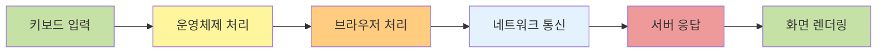
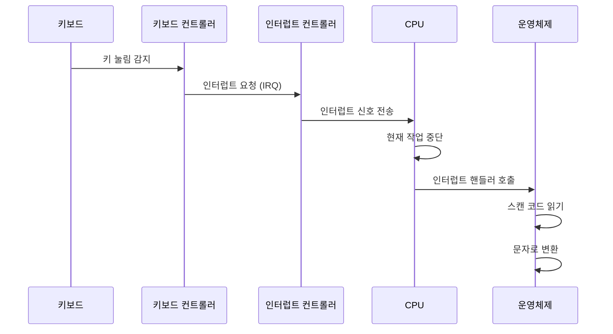
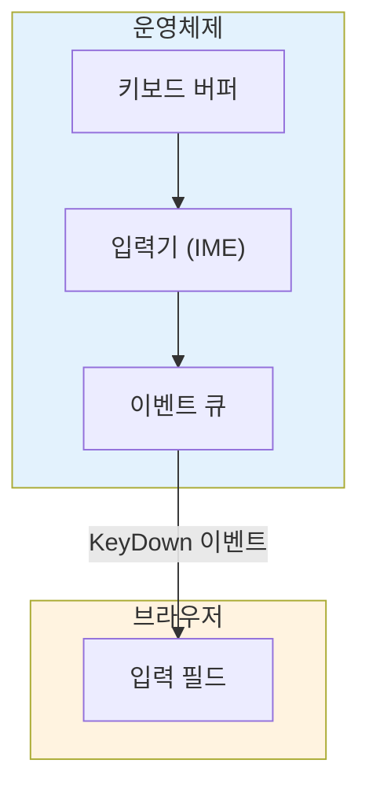
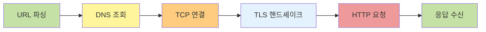
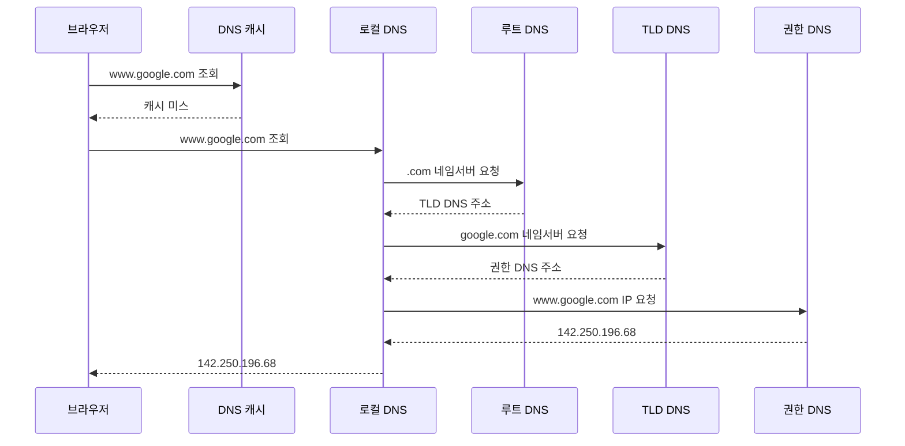
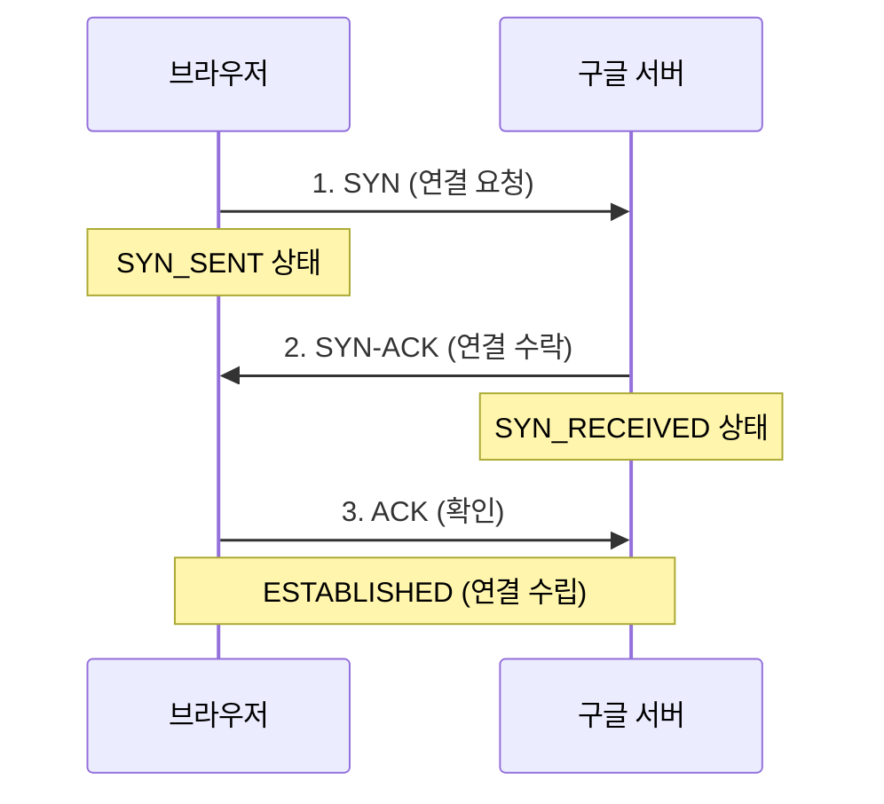
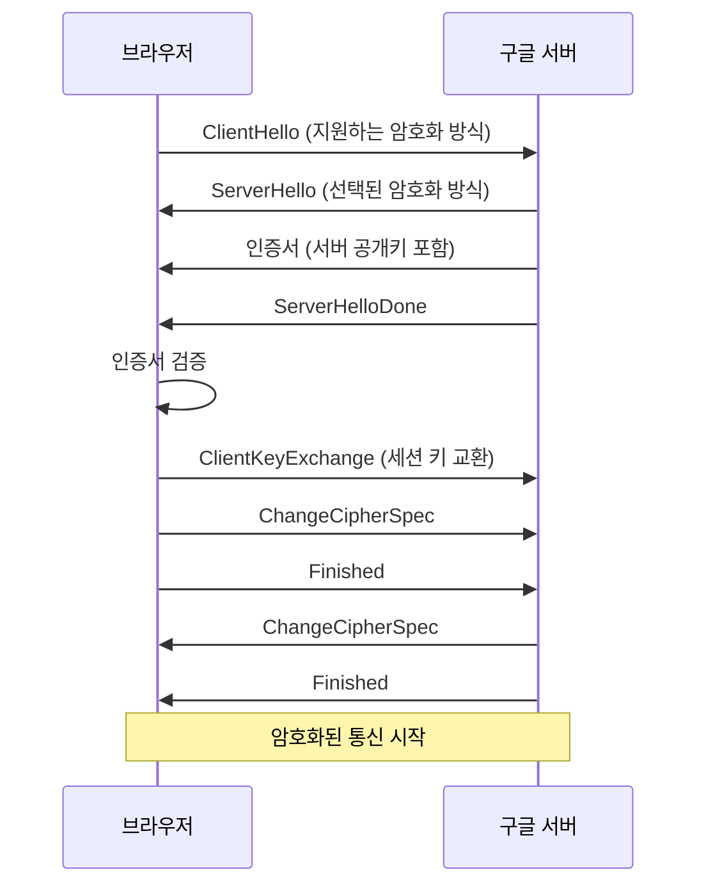
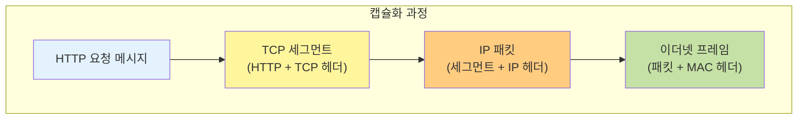
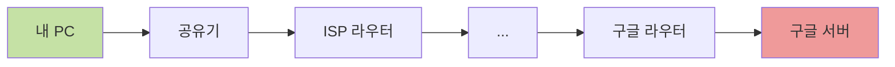

이번 글에서는 구글 검색창에 검색어를 입력했을 때 운영체제와 네트워크 관점에서 어떠한 일이 일어나는 지 알아보겠습니다.

## 전체 흐름 살펴보기

구글 검색창에 "맛집"이라고 입력하고 검색 버튼을 누르면, 눈 깜짝할 사이에 검색 결과가 나타납니다.
하지만 이 짧은 순간에도 컴퓨터 내부에서는 수많은 일들이 일어나고 있습니다.



## 운영체제 관점

### 키보드를 누르면 어떤 일이 일어날까?

키보드의 'ㅁ' 키를 누르는 순간, 키보드 내부의 스위치가 눌리면서 전기 신호가 발생합니다.
이 신호는 USB 케이블이나 무선 통신을 통해 컴퓨터로 전달됩니다.



### 인터럽트와 스캔 코드

키보드 입력이 발생하면, 키보드 컨트롤러는 CPU에게 **인터럽트**를 발생시킵니다.
CPU는 현재 하고 있던 작업을 잠시 멈추고, 키보드 입력을 처리하는 인터럽트 서비스 루틴(ISR)을 실행합니다.

키보드는 각 키마다 고유한 **스캔 코드**를 가지고 있습니다.
예를 들어 'A' 키의 스캔 코드는 0x1E입니다.
운영체제는 이 스캔 코드를 받아서 실제 문자로 변환합니다.
한글 입력의 경우에는 운영체제의 입력기(IME)가 자음과 모음을 조합하여 하나의 글자로 만들어줍니다.

### 키보드 버퍼와 이벤트 큐

변환된 문자는 운영체제의 **키보드 버퍼**에 저장됩니다.
그리고 운영체제는 이 입력을 **이벤트**로 만들어 현재 포커스를 가진 애플리케이션(브라우저)에게 전달합니다.



### 프로세스 간 통신

브라우저는 하나의 **프로세스**입니다. 운영체제가 키보드 이벤트를 브라우저에게 전달하는 것은 일종의 프로세스 간 통신(IPC)입니다.
운영체제는 메시지 큐를 통해 키보드 이벤트를 브라우저 프로세스에게 전달합니다.

브라우저는 이벤트 루프를 통해 이러한 이벤트들을 처리합니다.
JavaScript의 `keydown`, `keyup`, `input` 이벤트가 발생하는 것도 이 과정에서 일어납니다.

## 네트워크 관점

### 검색 버튼을 누르면 어떤 일이 일어날까?

검색어를 다 입력하고 검색 버튼을 누르면, 이제 네트워크 통신이 시작됩니다.
브라우저는 구글 서버에 검색 요청을 보내야 합니다.



### URL 파싱

브라우저는 먼저 요청할 URL을 분석합니다. 구글 검색의 경우 `https://www.google.com/search?q=맛집`과 같은 형태의 URL이 됩니다.

```
https://www.google.com/search?q=맛집
  │        │            │      │
프로토콜   호스트명      경로   쿼리 파라미터
```

### DNS 조회

브라우저는 `www.google.com`이라는 도메인 이름을 실제 서버의 IP 주소로 변환해야 합니다.
이 과정을 **DNS 조회**라고 합니다.



1. 먼저 브라우저 캐시와 운영체제 캐시를 확인합니다.
2. 캐시에 없으면 로컬 DNS 서버(보통 ISP가 제공)에 질의합니다.
3. 로컬 DNS는 루트 DNS → TLD DNS → 권한 DNS 순으로 재귀적 질의를 수행합니다.
4. 최종적으로 IP 주소를 받아서 브라우저에게 전달합니다.

### TCP 연결

IP 주소를 알았으니, 이제 서버와 연결을 수립해야 합니다.
이 과정에서 TCP의 **3-Way Handshake**를 통해 연결을 수립합니다.



### TLS 핸드셰이크

구글은 HTTPS를 사용하므로, TCP 연결 후 **TLS 핸드셰이크**가 추가로 일어납니다.
이 과정에서 암호화 방식을 협상하고, 인증서를 검증하며, 세션 키를 교환합니다.



### HTTP 요청 전송

연결이 수립되면, 브라우저는 HTTP GET 요청을 보냅니다.

```http
GET /search?q=%EB%A7%9B%EC%A7%91 HTTP/2
Host: www.google.com
User-Agent: Mozilla/5.0 ...
Accept: text/html,application/xhtml+xml...
Accept-Language: ko-KR,ko;q=0.9
Cookie: ...
```

### 네트워크 계층별 처리

HTTP 요청은 네트워크 계층을 거치면서 캡슐화됩니다.



- **응용 계층**: HTTP 요청 메시지 생성
- **전송 계층**: TCP 헤더 추가 (출발지/목적지 포트)
- **네트워크 계층**: IP 헤더 추가 (출발지/목적지 IP)
- **데이터링크 계층**: MAC 헤더 추가 (출발지/목적지 MAC)

### 라우팅

패킷은 여러 라우터를 거쳐 구글 서버까지 도달합니다.
이때 각 라우터는 목적지 IP 주소를 보고 다음 홉(hop)을 결정합니다.



### 서버 응답 수신

구글 서버는 검색 요청을 처리하고 HTML 응답을 보냅니다.
응답은 동일한 경로를 역순으로 거쳐 브라우저에게 도달합니다.

```http
HTTP/2 200 OK
Content-Type: text/html; charset=UTF-8
Content-Length: 150234
...

<!DOCTYPE html>
<html>
<head>
    <title>맛집 - Google 검색</title>
    ...
</html>
```

브라우저는 받은 HTML을 파싱하고, 필요한 CSS, JavaScript, 이미지 등의 리소스를 추가로 요청합니다.
그 후, 최종적으로 화면에 검색 결과가 렌더링됩니다.

## 정리

| 단계      | 관점     | 주요 작업                                  |
| --------- | -------- | ------------------------------------------ |
| 키 입력   | 운영체제 | 인터럽트 발생, 스캔 코드 변환, 이벤트 전달 |
| URL 파싱  | 브라우저 | 프로토콜, 호스트, 경로 분석                |
| DNS 조회  | 네트워크 | 도메인 → IP 주소 변환                      |
| TCP 연결  | 네트워크 | 3-Way Handshake                            |
| TLS 연결  | 네트워크 | 암호화 협상, 인증서 검증                   |
| HTTP 요청 | 네트워크 | 요청 전송, 응답 수신                       |
| 렌더링    | 브라우저 | HTML 파싱, 화면 표시                       |

## 마치며

단순해 보이는 검색어 입력 하나에도 운영체제의 인터럽트 처리, 프로세스 간 통신, DNS 조회, TCP/TLS 연결, HTTP 통신 등 수많은 과정이 있다는 것을 알게되었습니다.

## 참고 자료

- [MDN Web Docs - How the Web works](https://developer.mozilla.org/en-US/docs/Learn/Getting_started_with_the_web/How_the_Web_works)
- [What happens when you type a URL in the browser](https://aws.amazon.com/blogs/mobile/what-happens-when-you-type-a-url-into-your-browser/)
- [Operating System Concepts](https://www.os-book.com/OS10/) - Abraham Silberschatz
- [Computer Networking: A Top-Down Approach](https://gaia.cs.umass.edu/kurose_ross/online_lectures.htm) - Kurose & Ross
