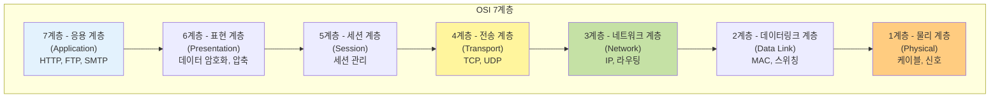
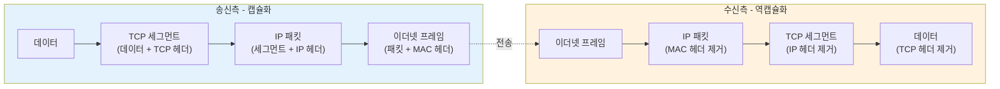
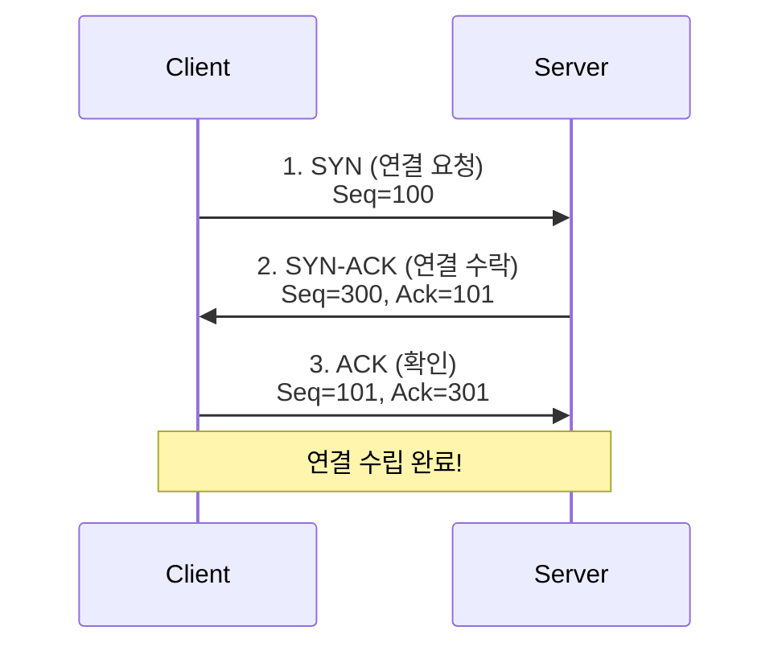
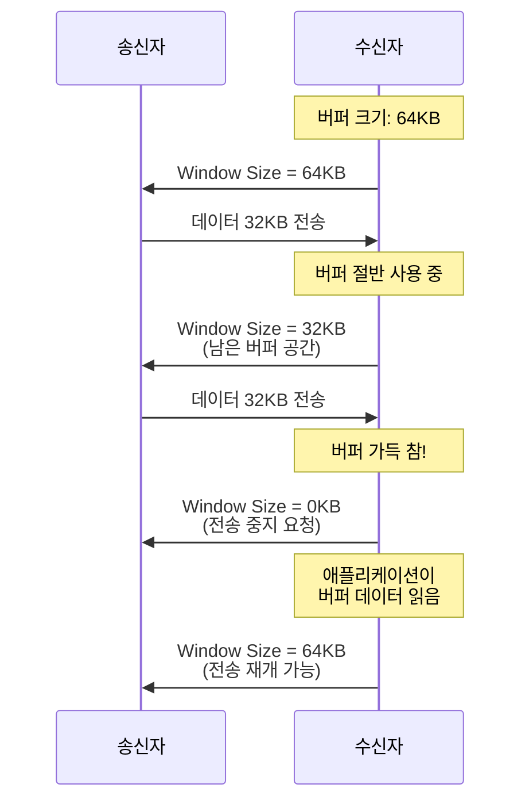
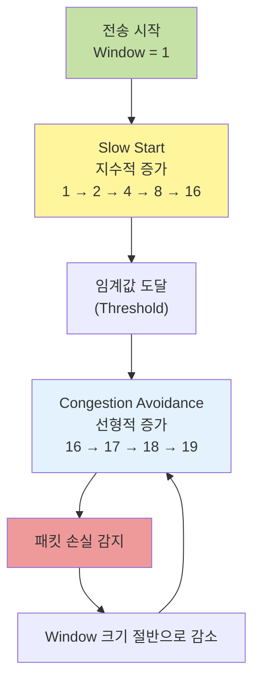
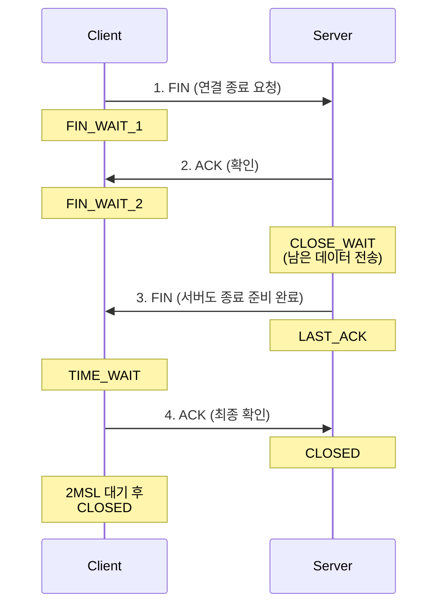
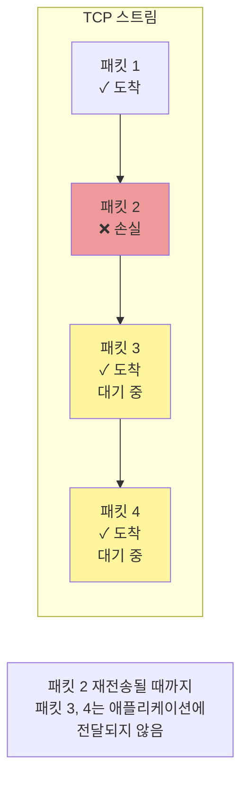
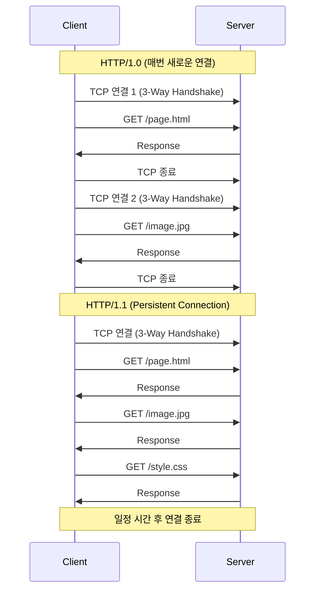
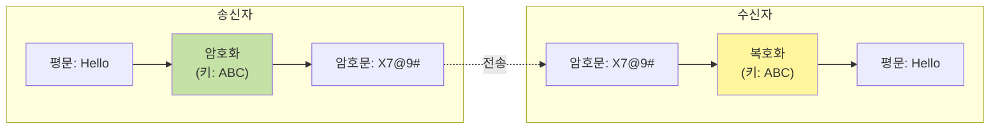

이번 글에서는 컴퓨터들이 어떻게 통신하는지, 왜 여러 계층으로 나뉘어져 있는지, 그리고 각 프로토콜이 어떤 문제를 해결하기 위해 등장했는지 살펴보겠습니다.

## OSI 7계층은 왜 나왔을까?

초기 컴퓨터 네트워크는 각 제조사가 독자적인 프로토콜을 사용했습니다. IBM의 컴퓨터와 DEC의 컴퓨터는 서로 통신할 수 없었죠.
이러한 호환성 문제를 해결하기 위해 ISO는 1984년 OSI(Open Systems Interconnection) 7계층 모델을 제안했습니다.

### 왜 계층을 나누었을까?

> 왜 7개의 계층으로 나누었을까요?

이렇게 7개의 계층으로 나눈 이유는 모듈화를 통한 복잡성 관리에 있습니다.
각각의 계층이 독립적인 역할을 담당하므로, 한 계층의 변경이 다른 계층에 영향을 주지 않습니다.
예를 들어, 물리적 전송 매체를 유선에서 무선으로 바꾸더라도 상위 계층의 애플리케이션은 수정할 필요가 없습니다.
즉, 특정 부분에 이상이 생기면 그 단계만 수정하면 됩니다.



## 웹 페이지 요청이 어떻게 이루어질까?

브라우저에서 `https://google.com`을 입력했을 때 어떤 일이 일어나는지 OSI 7계층 관점에서 살펴보겠습니다.

```mermaid
sequenceDiagram
    participant User as 사용자
    participant App as 응용 계층<br/>(HTTP)
    participant Trans as 전송 계층<br/>(TCP)
    participant Net as 네트워크 계층<br/>(IP)
    participant Link as 데이터링크 계층<br/>(MAC)
    participant Phy as 물리 계층<br/>(신호)

    User->>App: example.com 요청
    App->>Trans: HTTP GET 메시지 생성
    Trans->>Net: TCP 세그먼트 생성<br/>(포트 80 또는 443)
    Net->>Link: IP 패킷 생성<br/>(목적지 IP 주소)
    Link->>Phy: 프레임 생성<br/>(목적지 MAC 주소)
    Phy->>Phy: 전기 신호로 변환하여 전송
```

### 각 계층의 역할

**7계층 (응용 계층)**: 사용자가 "https://google.com을 보여줘"라고 요청하면, HTTP 프로토콜이 `GET / HTTP/1.1` 메시지를 생성합니다.

**4계층 (전송 계층)**: TCP가 HTTP 메시지를 받아 세그먼트로 나누고, 출발지 포트와 목적지 포트 정보를 추가합니다. 웹 서버는 일반적으로 80번(HTTP) 또는 443번(HTTPS) 포트를 사용합니다.

**3계층 (네트워크 계층)**: IP가 목적지 IP 주소를 헤더에 추가하여 패킷을 생성합니다. 라우터들은 이 IP 주소를 보고 패킷을 어디로 전달할지 결정합니다.

**2계층 (데이터링크 계층)**: 이더넷이 출발지와 목적지 MAC 주소를 추가하여 프레임을 생성합니다. 같은 네트워크 내에서 실제 기기를 식별하는 데 사용됩니다.

**1계층 (물리 계층)**: 프레임을 전기 신호 또는 빛 신호로 변환하여 케이블이나 무선으로 전송합니다.

### 캡슐화와 역캡슐화

데이터가 각 계층을 거치면서 헤더가 추가되는 과정을 캡슐화라고 합니다.
수신측에서는 반대로 각 계층에서 헤더를 제거하는 역캡슐화가 일어납니다.



## TCP와 UDP는 왜 나왔을까?

IP 프로토콜은 패킷을 목적지까지 전달하는 역할을 합니다. 하지만 IP만으로는 몇 가지 문제가 있습니다.

패킷이 다른 경로로 전송되어 순서가 뒤바뀔 수도 있고, 패킷이 중간에 손실되어도 알 수 없습니다.
또, 같은 IP에서 실행되는 여러 프로그램을 구분할 수 없습니다.

이러한 문제를 해결하기 위해 전송 계층의 프로토콜인 TCP와 UDP가 등장했습니다.

### TCP (Transmission Control Protocol)

TCP는 신뢰성 있는 연결 지향적 통신을 제공합니다.
데이터가 손실되거나 순서가 바뀌지 않도록 보장하는 역할을 합니다.

#### TCP는 어떻게 동작할까?

#### 3-Way Handshake (연결 수립)

> TCP는 통신을 시작하기 전에 3-Way Handshake를 통해 연결을 수립합니다.



- **SYN (Synchronize)**: 클라이언트가 "연결하고 싶어요, 내 시퀀스 번호는 100이에요"라고 말합니다.
- **SYN-ACK**: 서버가 "좋아요, 연결할게요. 내 시퀀스 번호는 300이고, 당신의 101부터 받을게요"라고 응답합니다.
- **ACK (Acknowledge)**: 클라이언트가 "알겠습니다, 당신의 301부터 받을게요"라고 확인합니다.

이러한 과정을 통해 양쪽 모두 통신할 준비가 되었음을 확인할 수 있습니다.

#### 데이터 전송 및 흐름 제어

> TCP는 수신자가 처리할 수 있는 속도만큼만 데이터를 전송합니다. ( 이를 흐름 제어라고 합니다. )



수신자는 Window Size를 통해 "지금 내가 받을 수 있는 데이터 크기"를 송신자에게 알려줍니다.
이때, 송신자는 이 크기를 넘지 않도록 데이터를 전송합니다.

#### 혼잡 제어 (Congestion Control)

혼잡제어란 네트워크 혼잡도에 따라 전송 속도를 조절하는 것을 말합니다.
대표적인 알고리즘으로 Slow Start와 Congestion Avoidance가 있습니다.



위의 예시와 같이 처음에는 조심스럽게 시작(Slow Start)하여 빠르게 증가시키다가, 임계값에 도달하면 천천히 증가시킵니다.
이때 패킷 손실이 감지되면 혼잡이 발생한 것으로 판단하여 전송 속도를 줄입니다.

#### 4-Way Handshake (연결 종료)

> TCP 연결을 종료할 때는 4-Way Handshake를 거칩니다.



- **1단계 (FIN)**: 클라이언트가 "더 이상 보낼 데이터가 없어요, 연결을 종료하고 싶어요"라고 FIN 패킷을 보냅니다.
- **2단계 (ACK)**: 서버가 "FIN 받았어요. 잠시만요, 아직 보낼 데이터가 남아있을 수 있어요"라고 ACK를 보냅니다.
- **3단계 (FIN)**: 서버가 남은 데이터를 모두 전송한 후 "이제 저도 종료할게요"라고 FIN 패킷을 보냅니다.
- **4단계 (ACK)**: 클라이언트가 "서버의 FIN도 받았어요"라고 최종 ACK를 보냅니다.

### 연결 해제시에는 연결수립과는 달리 왜 4-Way일지일까?

이에 대한 답변을 찾아보니, 연결 수립할 때는 SYN과 ACK를 하나의 패킷(SYN-ACK)으로 합칠 수 있었지만, 종료할 때는 서버가 아직 전송할 데이터가 남아있을 수 있어서 ACK와 FIN을 따로 보내야 하기 때문이라고 합니다.

#### TIME_WAIT과 CLOSE_WAIT은 무엇일까?

**TIME_WAIT** 은 클라이언트가 마지막 ACK를 보낸 후 일정 시간(2MSL, 보통 1-4분) 동안 대기하는 상태를 말합니다.
이렇게 바로 종료하지 않고 기다리는 이유는 만약 마지막 ACK가 손실되면 서버는 FIN을 재전송할 것이고, 클라이언트가 이미 종료되었다면 이를 받을 수 없기 때문입니다.
즉 TIME_WAIT 상태에서 대기함으로써 재전송된 FIN에 응답할 수 있습니다.

**CLOSE_WAIT** 은 서버가 클라이언트의 FIN을 받고 ACK를 보낸 후의 상태입니다. 이때 서버는 아직 클라이언트에게 전송해야 할 데이터가 남아있을 수 있기 때문에, 바로 FIN을 보내지 못하고 CLOSE_WAIT 상태에서 대기하게 됩니다.

여기서 중요한 점은, 서버가 남은 데이터를 모두 전송한 후 반드시 `close()`를 호출해야 한다는 것입니다.
`close()`를 호출하면 FIN 패킷이 전송되며 연결이 정상적으로 종료됩니다.
하지만 만약 서버 애플리케이션에 버그가 있어 `close()`를 제대로 호출하지 않으면 어떻게 될까요?
이 경우 CLOSE_WAIT 상태가 계속 유지되어 소켓 리소스가 해제되지 않는 문제가 발생합니다.
실제로 CLOSE_WAIT 상태의 소켓이 쌓이면 새로운 연결을 받을 수 없게 되어 서비스 장애로 이어질 수 있습니다.

> 출처: [IBM Documentation - TCP/IP Tutorial](https://www.ibm.com/docs/en/aix/7.2?topic=protocol-tcp-states)

### TCP의 단점은 무엇일까?

우선 데이터를 주고받기 전에 반드시 3-Way Handshake를 거쳐야 하기 때문에 연결 수립에 시간이 소요됩니다. 즉, 실제 데이터를 전송하기도 전에 이미 상당한 지연이 발생하는 것이죠.

또한 TCP는 순서를 보장하기 위해 Head-of-Line Blocking 문제를 겪습니다. 만약 중간에 하나의 패킷이 손실되면, 그 뒤에 오는 모든 패킷들이 이미 도착했더라도 손실된 패킷이 재전송될 때까지 애플리케이션에 전달되지 못하고 대기해야 합니다.
예를 들어 아래와 같이 패킷 1, 2, 3, 4가 순서대로 전송되는데 패킷 2만 중간에 손실되었다고 가정해봅시다. 이 경우 패킷 3과 4는 이미 수신측에 도착했지만, TCP는 순서를 보장해야 하므로 패킷 2가 재전송되어 올 때까지 패킷 3과 4를 애플리케이션에 전달하지 않고 버퍼에 보관만 하게 됩니다.



이러한 대기 시간은 실시간 스트리밍이나 온라인 게임처럼 빠른 응답이 중요한 서비스에서는 치명적일 수 있습니다.

### TCP의 단점을 어떻게 극복했을까?

앞서 살펴본 TCP의 단점들, 특히 연결 수립 시간과 Head-of-Line Blocking 문제는 웹이 발전하면서 점점 더 심각한 성능 저하로 이어졌습니다.
이를 해결하기 위해 HTTP 프로토콜은 어떻게 진화해왔을까요?

## HTTP/1.0

HTTP/1.0은 하나의 요청과 응답이 끝나면 TCP 연결을 끊고, 다음 요청을 위해 다시 새로운 연결을 수립해야 했습니다.
웹 페이지 하나를 로드하려면 HTML, CSS, JavaScript, 이미지 등 수십 개의 리소스가 필요한데, 각각의 리소스마다 3-Way Handshake를 거쳐야 했죠. 이는 매우 비효율적이었고, 페이지 로딩 속도가 느려지는 주요 원인이 되었습니다.

## HTTP/1.1

HTTP/1.1에서는 이러한 문제를 해결하기 위해 Persistent Connection(Keep-Alive) 을 기본값으로 도입했습니다.
즉 이제 하나의 TCP 연결로 여러 개의 HTTP 요청과 응답을 처리할 수 있게 된 것이죠.
예를 들어 5초 동안 연결을 유지하도록 설정하면, 그 시간 안에 발생하는 모든 요청은 이미 수립된 연결을 재사용할 수 있습니다.



또한 HTTP/1.1은 **Pipelining** 기능도 도입했습니다. 기존에는 하나의 요청에 대한 응답을 받은 후에야 다음 요청을 보낼 수 있었지만, 파이프라이닝을 사용하면 첫 번째 요청의 응답을 기다리지 않고 두 번째, 세 번째 요청을 연속으로 보낼 수 있게 되었습니다.

하지만 여기에도 문제가 있었습니다. 바로 **Head-of-Line Blocking**입니다.
응답은 요청한 순서대로만 받을 수 있기 때문에, 만약 첫 번째 요청의 처리가 10초가 걸리고 두 번째 요청은 1초면 끝난다고 해도, 두 번째 응답은 첫 번째 응답이 올 때까지 기다려야 했습니다.
또한 HTTP/1.1은 헤더를 매번 반복해서 전송해야 했기 때문에, 헤더가 중복되어 불필요하게 데이터가 커지는 문제도 있었습니다.

## HTTP/2.0

HTTP/2.0의 가장 큰 변화는 바이너리 프레이밍 레이어의 도입입니다.
HTTP/1.x는 헤더와 바디를 텍스트로 전송했는데, 이 방식은 파싱 과정에서 문제가 있었습니다.
헤더의 끝을 찾기 위해 개행 문자(`\r\n\r\n`)를 찾아야 하고, 헤더 필드 구분을 위해 콜론(`:`)과 공백을 파싱해야 했죠.
이 과정에서 공백 처리나 대소문자 구분, 특수문자 이스케이프 등의 애매한 케이스가 발생하면 구현마다 다르게 해석할 수 있어 오류가 발생하기 쉬었습니다.
반면 HTTP/2.0은 메시지를 고정된 형식의 **바이너리 프레임** 단위로 분할하여 전송하고 각 프레임은 길이, 타입, 플래그, 스트림 ID 등이 정해진 바이트 위치에 명확하게 정의되어 있기 때문에, 파싱 로직이 단순해지고 모호함이 사라져 구현 오류가 줄어들었습니다.
또한 이진 데이터는 텍스트 파싱보다 CPU 처리 속도가 빠르기 때문에 전체적인 성능도 향상되었습니다.

이러한 바이너리 프레이밍을 기반으로 HTTP/2.0은 멀티플렉싱을 구현하였습니다.
앞서 HTTP/1.1의 Pipelining에서 살펴본 것처럼, 순차적으로만 응답을 받아야 하는 구조는 Head-of-Line Blocking 문제를 야기했습니다.
반면, HTTP/2.0은 이를 해결하기 위해 각 바이너리 프레임을 스트림에 소속시켜 처리하였습니다.

이를 통해 하나의 TCP 커넥션 내에 여러 개의 스트림이 존재할 수 있었으며, 각 스트림은 고유한 ID를 가지고 독립적으로 요청과 응답을 주고받습니다.
즉 이전 HTTP/1.1에서는 10초가 걸리는 요청 1이 완료될 때까지 1초만 걸리는 요청 2가 기다려야 했기 때문에 총 11초가 소요되었다면 HTTP/2.0에서는 두 요청을 각각 다른 스트림에 할당하여 동시에 처리할 수 있게되었습니다.
이를 통해 하나의 커넥션 안에서도 여러 요청과 응답이 동시에 병렬 처리될 수 있어, 메시지 간 간섭 없이 빠르고 효율적인 전송이 가능해졌습니다.

또한 HTTP/2.0은 스트림 우선순위(Stream Prioritization) 기능을 제공합니다.
여러 요청이 동시에 전송될 때, 각 스트림에 우선순위와 가중치를 부여하여 중요한 리소스를 먼저 처리할 수 있도록 제어할 수 있습니다.
( 사용자 입장에서 생각해보면 HTML 문서나 핵심 스크립트는 높은 우선순위를 부여해 먼저 전송하고, 이미지나 광고 같은 리소스는 낮은 우선순위를 부여하여 나중에 처리하게 함으로써 사용자 체감 성능을 향상시킬 수 있을 것 같습니다. )

## HTTP/3.0

HTTP/2.0이 애플리케이션 레벨에서의 HOLB는 해결했지만, 여전히 TCP 전송 계층에서의 HOLB 문제는 남아있었습니다.
앞서 살펴본 것처럼 TCP는 패킷 하나가 손실되면 뒤의 모든 패킷이 대기해야 하는 구조이기 때문입니다.

HTTP/3.0은 이 문제를 근본적으로 해결하기 위해 TCP 대신 UDP 기반의 QUIC 프로토콜을 사용했습니다.
QUIC은 UDP 위에 TCP의 신뢰성(재전송, 순서 보장)과 TLS의 보안을 결합한 차세대 전송 계층 프로토콜입니다.

QUIC의 가장 큰 장점은 **스트림별 독립적인 전송**입니다. 하나의 QUIC 연결 안에서 여러 스트림이 독립적으로 동작하기 때문에, 한 스트림에서 패킷 손실이 발생해도 다른 스트림에는 전혀 영향을 주지 않습니다. 이를 통해 전송 계층에서의 HOLB 문제까지 완전히 해결할 수 있게 되었습니다.
또한 TCP는 3-Way Handshake로 연결을 수립하고, HTTPS를 사용하려면 추가로 TLS Handshake까지 거쳐야 하는데, QUIC은 이 두 과정을 하나로 통합하여 단 한 번의 왕복(1-RTT)만으로 보안 연결을 수립할 수 있다는 특징이 있습니다.
결국 QUIC은 기존 HTTP/2의 장점(멀티플렉싱, 헤더 압축, 서버 푸시 등)을 포함하면서 동시에 전송 계층의 HOLB 문제, 연결 지연, IP 변경 문제까지 모두 해결하여 더 빠르고 안정적인 웹 통신을 실현했습니다.

> 출처
>
> - [토스페이먼츠 개발자센터 - HTTP 프로토콜](https://docs.tosspayments.com/resources/glossary/http-protocol)
> - [토스페이먼츠 개발자센터 - TCP](https://docs.tosspayments.com/resources/glossary/tcp)
> - [MDN Web Docs - HTTP](https://developer.mozilla.org/en-US/docs/Web/HTTP)
> - [HTTP/3 explained](https://http3-explained.haxx.se/)

### UDP (User Datagram Protocol)

앞서 TCP의 여러 기능들(3-Way Handshake, 재전송, 흐름 제어, 혼잡 제어)을 살펴봤습니다. 이러한 기능들은 신뢰성을 보장하지만, 동시에 오버헤드를 발생시킵니다는 특징이 있습니다.
그렇다면 신뢰성보다는 속도가 더 중요한 경우에는 어떻게 해야 할까요? 바로 이럴 때 UDP를 사용합니다.
UDP는 TCP와는 달리 연결을 수립하지 않고, 재전송도 하지 않으며, 순서도 보장하지 않습니다. 단지 데이터를 보내고 받을 뿐이죠.

#### UDP는 왜 사용할까?

그렇다면 신뢰성도 보장하지 않는 UDP를 왜 사용할까요?

바로 **속도와 효율성** 때문입니다.

영상 통화나 온라인 게임에서 만약 TCP를 사용한다면 하나의 패킷이 손실될 때마다 재전송을 기다려야 합니다.
그 사이에 새로운 영상 프레임이나 게임 데이터는 계속 쌓이게 되고, 결국 전체적인 지연이 발생하게 됩니다.
즉, 실시간 영상 통화에서 0.1초 전의 영상 프레임이 손실되었다면, 그것을 재전송받는 것보다는 그냥 건너뛰고 최신 프레임을 빠르게 보여주는 게 낫습니다.
사용자는 약간의 화질 저하나 끊김은 감수할 수 있지만, 지연으로 인한 대화의 어색함은 견디기 어렵기 때문이죠.

> 출처: [UDP - Wikipedia](https://en.wikipedia.org/wiki/User_Datagram_Protocol)

## 대칭키와 공개키

웹 통신에서 보안이 중요해지면서 암호화 기술이 필수가 되었습니다.
암호화 방식에는 크게 대칭키와 공개키 두 가지가 있습니다.

### 대칭키 암호화

대칭키는 암호화와 복호화에 **같은 키**를 사용하는 방식입니다.



대칭키는 암호화/복호화 속도가 빠르지만, **키 교환 문제**가 있습니다.
송신자와 수신자가 안전하게 같은 키를 공유하려면 어떻게 해야 할까요?

### 공개키 암호화는 왜 나왔을까?

공개키 암호화는 대칭키의 키 교환 문제를 해결하기 위해 Diffie-Hellman에 의해 제안된 방식입니다.

공개키 방식은 공개키(Public Key)와 개인키(Private Key) 한 쌍을 사용합니다.

공개키로 암호화한 데이터는 개인키로만 복호화가 가능하며 개인키로 암호화한 데이터는 공개키로만 복호화가 가능합니다.

이러한 공개키 방식의 장점은 공개키를 안전하지 않은 채널로 전송해도 괜찮다는 것입니다. 공개키로 암호화된 데이터는 개인키가 없으면 복호화할 수 없기 때문입니다.
하지만 공개키 암호화는 대칭키보다 매우 느리다는 단점도 존재합니다. 따라서 실제로는 두 방식을 혼합하여 사용합니다.

출처: [Diffie-Hellman Key Exchange](https://en.wikipedia.org/wiki/Diffie%E2%80%93Hellman_key_exchange)

## HTTP와 HTTPS

### HTTP의 특징

HTTP는 Stateless 프로토콜입니다. 각 요청은 독립적이며, 서버는 이전 요청을 기억하지 않습니다.
Stateless는 서버가 클라이언트 상태를 저장하지 않아 확장성이 좋다는 장점도 있지만 로그인 상태를 유지하는 것처럼 상태가 필요한 경우 문제가 됩니다.

#### Stateless 문제를 어떻게 해결할까?

먼저, 쿠키를 통해 서버가 클라이언트에 데이터를 저장하도록 요청할 수 있습니다.
또는 세션을 통해 서버가 상태 정보를 저장하고, 클라이언트는 세션 ID만 전송하는 식으로도 해결할 수 있습니다.
또, JWT(JSON Web Token) 같은 토큰을 사용하여 인증 정보를 클라이언트가 보관하게 할 수도 있습니다.

### HTTPS는 왜 나왔을까?

HTTP는 평문으로 데이터를 전송하기 때문에, 중간에 누군가 데이터를 가로채면 내용을 그대로 볼 수 있습니다.
이에 대한 단점을 보완하고자 나온 HTTPS는 HTTP에 **TLS/SSL** 암호화를 추가한 프로토콜입니다.

## 마치며

이번 글에서는 네트워크의 기초부터 실제 웹 통신까지 다양한 개념들을 살펴보았습니다.
OSI 7계층이 왜 나왔는지, 각 계층이 어떤 문제를 해결하는지 이해하면서 네트워크가 복잡성을 어떻게 관리하는지 알 수 있었습니다.
또, HTTP/1.1의 Keep-Alive, HTTP/2의 멀티플렉싱, HTTP/3의 QUIC까지, 각 버전마다 이전 버전의 한계를 극복하기 위한 노력도 알 수 있었습니다.

## 참고 자료

- [OSI 모델 - Wikipedia](https://en.wikipedia.org/wiki/OSI_model)
- [TCP/IP Tutorial - IBM Documentation](https://www.ibm.com/docs/en/aix/7.2?topic=protocol-tcp-states)
- [HTTP의 진화 - MDN](https://developer.mozilla.org/ko/docs/Web/HTTP/Basics_of_HTTP/Evolution_of_HTTP)
- [HTTP/3 explained](https://http3-explained.haxx.se/)
- [Transport Layer Security - Wikipedia](https://en.wikipedia.org/wiki/Transport_Layer_Security)
- [Diffie-Hellman Key Exchange](https://en.wikipedia.org/wiki/Diffie%E2%80%93Hellman_key_exchange)
- [What is Load Balancing? - NGINX](https://www.nginx.com/resources/glossary/load-balancing/)
- [Node.js - Blocking vs Non-Blocking](https://nodejs.org/en/docs/guides/blocking-vs-non-blocking/)
- [Transmission Control Protocol - RFC 793](https://www.rfc-editor.org/rfc/rfc793)
- [User Datagram Protocol - RFC 768](https://www.rfc-editor.org/rfc/rfc768)
