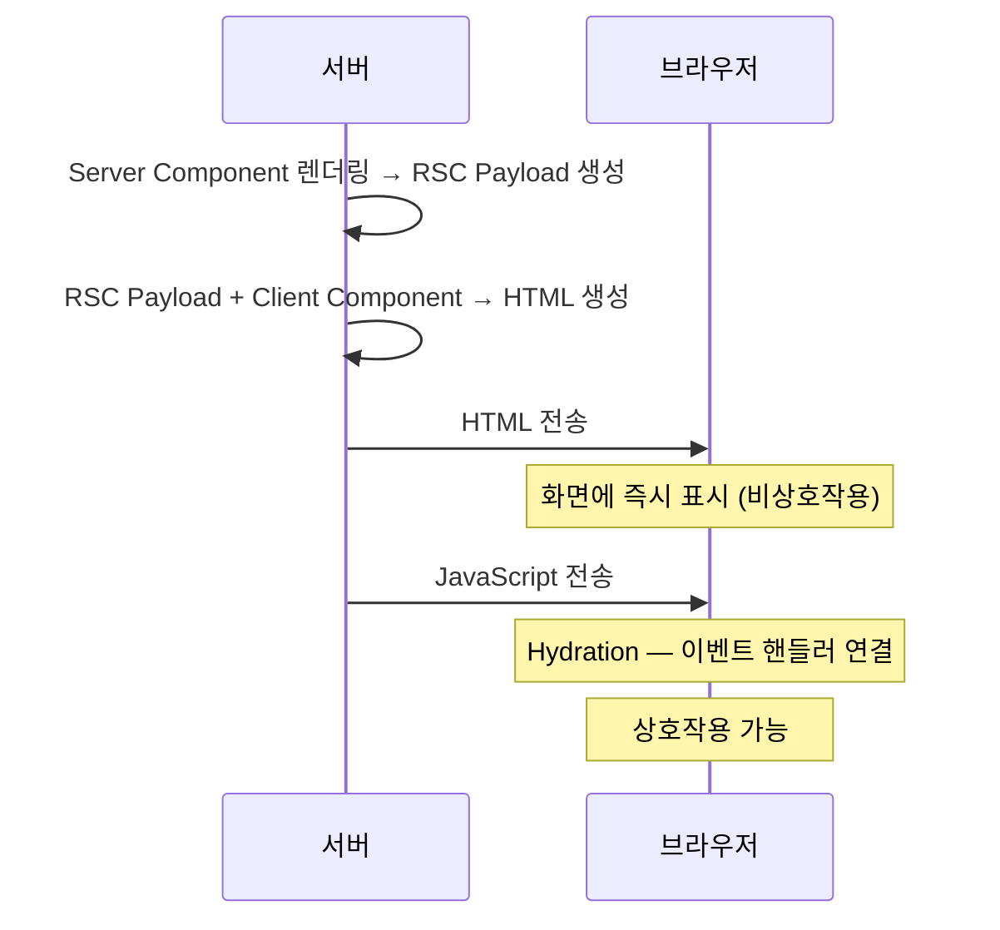

Next.js를 처음 접하면 공식문서 상단에 `App Router`와 `Pages Router`라는 두 개의 탭이 있는 것을 볼 수 있습니다.
이번 글에서는 이 두 라우터가 각각 어떤 것이고, 어떤 차이가 있는지 정리해보려고 합니다.

## Pages Router

Pages Router는 Next.js 초기부터 사용되어 온 라우팅 시스템입니다.
파일 시스템 기반으로, `pages` 디렉토리에 파일을 추가하면 해당 파일이 자동으로 라우트가 됩니다.
예를 들어 `pages/about.js` 파일을 만들면 `/about` 경로로 접근할 수 있습니다.

```
pages/
├── index.js          → /
├── about.js          → /about
├── blog/
│   ├── index.js      → /blog
│   └── [id].js       → /blog/1, /blog/2 ...
└── _app.js           → 전체 앱을 감싸는 컴포넌트
```

파일 경로가 곧 URL 경로이기 때문에, 파일 구조만 보면 어떤 페이지들이 있는지 바로 파악할 수 있습니다.

### 데이터 페칭

Pages Router에서는 데이터를 가져오기 위해 Next.js가 제공하는 전용 함수를 사용합니다.

`getStaticProps`는 빌드 시점에 데이터를 가져와서 정적 페이지를 생성합니다.
블로그 글 목록처럼 빌드 이후 자주 변하지 않는 데이터에 적합합니다.

```javascript
// pages/blog.js
export async function getStaticProps() {
  const res = await fetch('https://api/posts');
  const posts = await res.json();

  return {
    props: { posts },
  };
}

export default function Blog({ posts }) {
  return (
    <ul>
      {posts.map((post) => (
        <li key={post.id}>{post.title}</li>
      ))}
    </ul>
  );
}
```

`getServerSideProps`는 매 요청마다 서버에서 데이터를 가져옵니다.
사용자별로 다른 데이터를 보여줘야 하거나, 항상 최신 데이터가 필요한 경우에 사용합니다.

```javascript
// pages/dashboard.js
export async function getServerSideProps(context) {
  const res = await fetch('https://api/user', {
    headers: { cookie: context.req.headers.cookie },
  });
  const user = await res.json();

  return {
    props: { user },
  };
}

export default function Dashboard({ user }) {
  return <h1>{user.name}님의 대시보드</h1>;
}
```

이 두 함수는 **페이지 컴포넌트에서만** export할 수 있다는 제약이 있습니다.
일반 컴포넌트에서는 사용할 수 없기 때문에, 데이터 페칭 로직이 페이지 단위로 묶이게 됩니다.

### 레이아웃

Pages Router에서 레이아웃을 구현하려면 `_app.js`에서 전체 앱을 감싸는 방식을 사용합니다.

```javascript
// pages/_app.js
export default function App({ Component, pageProps }) {
  return (
    <Layout>
      <Component {...pageProps} />
    </Layout>
  );
}
```

만약 페이지마다 다른 레이아웃을 적용하고 싶다면, 각 페이지에 `getLayout` 함수를 정의하는 패턴을 사용해야 합니다.

```javascript
// pages/dashboard.js
Dashboard.getLayout = function getLayout(page) {
  return <DashboardLayout>{page}</DashboardLayout>;
};
```

이 방식은 [공식문서](https://nextjs.org/docs/pages/building-your-application/routing/pages-and-layouts#per-page-layouts)에 소개되어 있지만, App Router의 `layout.tsx`처럼 자동으로 동작하는 것이 아니라 `_app.js`에서 직접 연결해야 하는 구조입니다.

### 렌더링 방식

Pages Router에서는 모든 컴포넌트의 JavaScript가 클라이언트에 전송됩니다.
서버에서 HTML을 미리 렌더링(SSR 또는 SSG)하더라도, 이후 클라이언트에서 동일한 컴포넌트의 JavaScript를 다시 로드하여 Hydration을 수행해야 합니다.

즉, 페이지의 모든 컴포넌트가 Hydration 대상이 되기 때문에 페이지가 복잡해질수록 클라이언트에 전송되는 JavaScript 양도 함께 증가합니다.

## App Router

App Router는 Next.js 13에서 도입된 라우팅 시스템입니다.
`app` 디렉토리를 사용하며, React Server Components를 기반으로 설계되었습니다.

```
app/
├── layout.tsx        → 루트 레이아웃 (필수)
├── page.tsx          → / 페이지
├── blog/
│   ├── layout.tsx    → /blog 전용 레이아웃
│   ├── page.tsx      → /blog 페이지
│   ├── loading.tsx   → 로딩 UI
│   └── [slug]/
│       └── page.tsx  → /blog/hello-world 등
└── error.tsx         → 에러 UI
```

Pages Router와 마찬가지로 파일 시스템 기반이지만, 폴더가 라우트 세그먼트를 정의하고 `page.tsx` 파일이 해당 경로의 UI를 담당합니다.

### Server Component와 Client Component

App Router에서 가장 크게 달라진 부분은 React Server Components를 기본으로 사용한다는 점입니다.

`app` 디렉토리 안의 모든 컴포넌트는 기본적으로 Server Component입니다.
Server Component는 서버에서만 실행되는 컴포넌트로, 컴포넌트의 JavaScript 코드가 클라이언트 번들에 포함되지 않습니다.

클라이언트 번들에 포함되지 않는다는 것은 브라우저가 다운로드하고 실행해야 할 JavaScript 양이 줄어든다는 의미입니다.
따라서 페이지 로딩 속도가 빨라지고, 상호작용이 가능한 상태가 되기까지의 시간도 단축됩니다.
또한 마크다운 파싱이나 구문 강조 같은 무거운 라이브러리를 Server Component 안에서 사용하더라도, 이들의 코드가 클라이언트에 전송되지 않기 때문에 번들 크기에 영향을 주지 않습니다.

이 외에도 `async/await`를 사용하여 컴포넌트 안에서 직접 데이터를 가져올 수 있고, API 키 같은 민감한 정보도 클라이언트에 노출되지 않습니다.

```tsx
// app/blog/page.tsx — Server Component (기본값)
export default async function BlogPage() {
  const res = await fetch('https://api.example.com/posts');
  const posts = await res.json();

  return (
    <ul>
      {posts.map((post) => (
        <li key={post.id}>{post.title}</li>
      ))}
    </ul>
  );
}
```

앞서 살펴본 것처럼 Pages Router에서는 데이터 페칭이 페이지 단위로 묶여 있었기 때문에, 하위 컴포넌트에 필요한 데이터도 페이지에서 한꺼번에 가져와 props로 전달해야 했습니다.

```javascript
// Pages Router — 페이지에서 데이터를 가져와 하위 컴포넌트로 전달
export async function getServerSideProps() {
  const posts = await fetchPosts();
  const categories = await fetchCategories();
  return { props: { posts, categories } };
}

export default function BlogPage({ posts, categories }) {
  return (
    <div>
      <CategoryFilter categories={categories} />
      <PostList posts={posts} />
    </div>
  );
}
```

App Router에서는 각 컴포넌트가 자신에게 필요한 데이터를 직접 가져올 수 있습니다.

```tsx
// App Router — 각 컴포넌트가 필요한 데이터를 직접 가져옴
export default function BlogPage() {
  return (
    <div>
      <CategoryFilter />
      <PostList />
    </div>
  );
}

async function CategoryFilter() {
  const categories = await fetchCategories();
  return <nav>{/* 카테고리 렌더링 */}</nav>;
}

async function PostList() {
  const posts = await fetchPosts();
  return <ul>{/* 포스트 렌더링 */}</ul>;
}
```

컴포넌트와 데이터가 함께 위치하기 때문에 코드의 응집도가 높아지고, 컴포넌트를 다른 곳에서 재사용하기도 쉬워집니다.

다만 Server Component는 서버에서 실행되기 때문에 `useState`나 `onClick` 같은 브라우저 기반의 기능은 사용할 수 없습니다.

상호작용이 필요한 경우에는 파일 상단에 `"use client"` 지시어를 추가하여 Client Component로 만들 수 있습니다.

```tsx
'use client';

import { useState } from 'react';

export default function LikeButton() {
  const [liked, setLiked] = useState(false);

  return (
    <button onClick={() => setLiked(!liked)}>
      {liked ? '좋아요 취소' : '좋아요'}
    </button>
  );
}
```

여기서 주의할 점은, `"use client"`를 선언한 파일의 모든 import와 하위 컴포넌트가 클라이언트 번들에 포함된다는 것입니다.
따라서 `"use client"`는 상호작용이 필요한 최소한의 컴포넌트에만 선언하는 것이 좋습니다.

예를 들어, 블로그 글 페이지 전체를 Client Component로 만드는 것보다 좋아요 버튼만 Client Component로 분리하는 것이 클라이언트로 전송되는 JavaScript 양을 줄일 수 있습니다.

```tsx
// app/blog/[slug]/page.tsx — Server Component
import LikeButton from './LikeButton';

export default async function BlogPost({ params }) {
  const post = await fetchPost(params.slug);

  return (
    <article>
      <h1>{post.title}</h1>
      <p>{post.content}</p>
      {/* LikeButton만 Client Component */}
      <LikeButton postId={post.id} />
    </article>
  );
}
```

[공식문서](https://nextjs.org/docs/app/getting-started/server-and-client-components)에서는 이 두 컴포넌트의 사용 기준을 다음과 같이 설명하고 있습니다.

**Server Component**는 데이터베이스나 API에서 데이터를 가져오거나, API 키 같은 민감한 정보를 사용하거나, 클라이언트로 보내는 JavaScript 양을 줄이고 싶을 때 사용합니다.

**Client Component**는 상태(`useState`)나 이벤트 핸들러(`onClick` 등), 라이프사이클(`useEffect`), 브라우저 API(`localStorage`, `window` 등)가 필요할 때 사용합니다.

### 레이아웃

App Router에서는 레이아웃이 프레임워크 차원에서 지원됩니다.

`layout.tsx` 파일을 만들면 해당 경로와 하위 경로의 페이지들이 자동으로 그 레이아웃 안에 감싸집니다.

```tsx
// app/layout.tsx — 루트 레이아웃 (필수)
export default function RootLayout({
  children,
}: {
  children: React.ReactNode;
}) {
  return (
    <html lang="ko">
      <body>{children}</body>
    </html>
  );
}
```

```tsx
// app/blog/layout.tsx — /blog 전용 레이아웃
export default function BlogLayout({
  children,
}: {
  children: React.ReactNode;
}) {
  return (
    <div>
      <nav>블로그 네비게이션</nav>
      <main>{children}</main>
    </div>
  );
}
```

이 레이아웃들은 자동으로 중첩됩니다. `/blog` 경로에 접근하면 루트 레이아웃 안에 블로그 레이아웃이 감싸지고, 그 안에 페이지가 렌더링됩니다.
또한 페이지 간 이동 시 레이아웃은 리렌더링되지 않고 상태가 유지됩니다.

Pages Router에서 `getLayout` 패턴으로 구현했던 것이 프레임워크 차원에서 지원되는 것입니다.

### 특수 파일들

App Router에서는 특정 역할을 가진 파일 컨벤션이 존재합니다.

`loading.tsx`를 만들면 페이지가 로딩되는 동안 자동으로 로딩 UI를 보여줍니다.
내부적으로 React의 `<Suspense>` 경계로 페이지를 감싸는 방식입니다.

```tsx
// app/blog/loading.tsx
export default function Loading() {
  return <p>로딩 중...</p>;
}
```

`error.tsx`를 만들면 해당 경로에서 에러가 발생했을 때 보여줄 UI를 정의할 수 있습니다.

Pages Router에서는 이런 처리를 위해 별도의 상태 관리나 Error Boundary를 직접 구성해야 했지만, App Router에서는 파일 하나로 해결할 수 있습니다.

## Hydration

앞서 Pages Router의 렌더링 방식에서 Hydration을 언급했는데, 이 과정을 조금 더 자세히 살펴보겠습니다.

사용자가 페이지에 처음 접속하면 다음과 같은 과정이 일어납니다.



먼저 서버에서 Server Component가 렌더링되어 RSC Payload라는 특수한 데이터 형식으로 변환됩니다.
그리고 이 RSC Payload와 Client Component 정보를 조합하여 HTML을 생성한 뒤, 브라우저로 전송합니다.

브라우저는 이 HTML을 받아 화면에 즉시 표시합니다.
하지만 이 시점의 화면은 단순한 HTML일 뿐, 버튼을 클릭하거나 입력 필드에 타이핑하는 등의 상호작용은 아직 동작하지 않습니다.

이후 JavaScript가 로드되면 React가 이 정적인 HTML에 이벤트 핸들러를 연결하여 상호작용이 가능한 상태로 만듭니다. [공식문서](https://nextjs.org/docs/app/getting-started/server-and-client-components#on-the-client-first-load)에서는 이 과정을 `Hydration`이라고 설명하고 있습니다.

> Hydration is React's process for attaching event handlers to the DOM, to make the static HTML interactive.
>
> (Hydration은 정적 HTML을 상호작용 가능하게 만들기 위해, React가 DOM에 이벤트 핸들러를 연결하는 과정입니다.)

여기서 중요한 점은 Server Component는 서버에서만 실행되기 때문에 Hydration이 필요하지 않다는 것입니다.
서버에서 렌더링된 결과(HTML)가 그대로 사용되므로, 클라이언트에서 이벤트 핸들러를 연결할 JavaScript가 필요 없습니다.
( Hydration은 상호작용이 필요한 Client Component에서만 일어납니다. )

반면 Page Router에서는 Server/Client Component 구분이 없기 때문에 모든 컴포넌트가 Hydration 대상이 됩니다.
그에 반해 App Router는 Server Component를 기본으로 사용하므로, 가능한 한 많은 컴포넌트를 서버에서 처리하여 Hydration 비용을 최소화할 수 있습니다.

## 주요 차이점 정리

둘의 차이를 간단히 정리하면 다음과 같습니다.

|             | Pages Router                           | App Router                          |
| ----------- | -------------------------------------- | ----------------------------------- |
| 디렉토리    | `pages/`                               | `app/`                              |
| 라우트 정의 | 파일이 곧 라우트                       | 폴더가 라우트, `page.tsx`가 UI      |
| 컴포넌트    | 모든 컴포넌트가 클라이언트에 전송      | Server / Client Component 구분      |
| 데이터 페칭 | `getStaticProps`, `getServerSideProps` | `async/await`로 컴포넌트에서 직접   |
| 레이아웃    | `_app.js` + `getLayout` 패턴           | `layout.tsx` 파일 (프레임워크 지원) |
| 로딩 UI     | 직접 구현                              | `loading.tsx`                       |
| 에러 처리   | `_error.js` 또는 직접 구현             | `error.tsx`                         |
| 스트리밍    | 제한적                                 | `<Suspense>` 기반 스트리밍          |

## 렌더링 방식의 변화

Page Router에서는 하나의 페이지에서 SSG 또는 SSR 중 하나만 선택할 수 있었습니다.

App Router에서는 하나의 페이지 안에서 정적 콘텐츠와 동적 콘텐츠를 함께 사용할 수 있습니다.
Server Component는 기본적으로 정적으로 렌더링되고, 동적 데이터가 필요한 부분만 `<Suspense>`로 감싸서 스트리밍할 수 있습니다.

```tsx
export default function ProductPage() {
  return (
    <div>
      {/* 정적으로 렌더링 */}
      <ProductInfo />

      {/* 동적으로 스트리밍 */}
      <Suspense fallback={<p>로딩 중...</p>}>
        <RecommendedProducts />
      </Suspense>
    </div>
  );
}
```

Pages Router에서 `getServerSideProps`를 사용하면 모든 데이터가 준비되어야 HTML이 전송되지만, App Router에서는 준비된 부분부터 사용자에게 보여줄 수 있어 체감 로딩 속도를 개선할 수 있습니다.

## 참고 자료

- [Next.js 공식 문서 - App Router](https://nextjs.org/docs/app)
- [Next.js 공식 문서 - Pages Router](https://nextjs.org/docs/pages)
- [Next.js 공식 문서 - Server and Client Components](https://nextjs.org/docs/app/getting-started/server-and-client-components)
