이번 글에서는 운영체제의 핵심 개념들을 정리해보겠습니다. 프로그램이 실행되는 과정부터 프로세스와 스레드, CPU 스케줄링, 메모리 관리까지 운영체제가 어떻게 컴퓨터 자원을 효율적으로 관리하는지 살펴보겠습니다.

## 프로그램이 실행된다는 것의 의미는 뭘까요?

프로그램이 실행된다는 것은 디스크에 저장된 실행 파일이 메모리에 적재되어 CPU가 명령어를 순차적으로 실행하는 과정을 의미합니다.

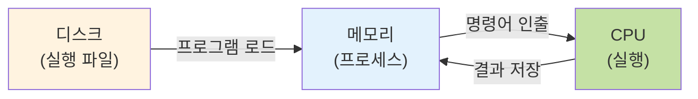

사용자가 프로그램을 실행하면 운영체제는 디스크에 저장된 실행 파일을 메모리로 읽어들입니다. 이때 프로그램은 코드 영역, 데이터 영역, 힙 영역, 스택 영역이라는 메모리 구조로 배치됩니다.

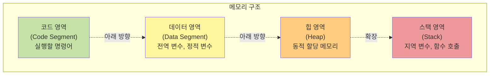

### CPU 실행

이후 메모리에 적재된 프로그램은 이제 프로세스가 되며, CPU는 프로그램 카운터(PC)가 가리키는 메모리 주소의 명령어를 하나씩 가져와 실행합니다.
이때 CPU는 인출-해석-실행 사이클을 반복하며 프로그램을 실행합니다.

### 메모리와 CPU의 상호작용

CPU는 메모리에서 데이터를 읽어오거나, 계산 결과를 메모리에 저장하면서 작업을 수행합니다.
( 이 과정에서 레지스터가 임시 저장소 역할을 하며, 캐시 메모리가 CPU와 메모리 간의 속도 차이를 완화하는 역할을 합니다. )

## 프로세스와 스레드

### 프로세스란 무엇인가?

프로세스는 **실행 중인 프로그램**을 의미합니다. 디스크에 저장된 프로그램 파일이 메모리에 적재되어 실행되면 프로세스가 됩니다.
각 프로세스는 독립적인 메모리 공간을 가지며, 운영체제로부터 CPU 시간, 메모리, 파일 등의 자원을 할당받습니다.
프로세스는 최소 하나 이상의 스레드를 포함하며, 운영체제는 PCB(Process Control Block)를 통해 프로세스를 관리합니다.

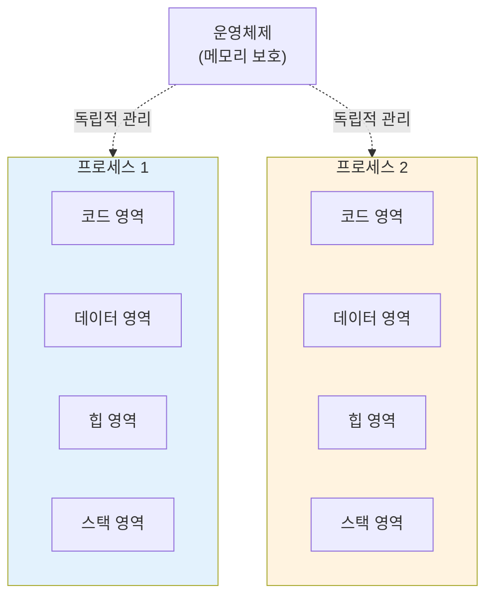

### 스레드란 무엇인가?

스레드는 **프로세스 내에서 실행되는 작업의 단위**입니다.
하나의 프로세스는 여러 개의 스레드를 가질 수 있으며, 같은 프로세스 내의 스레드들은 코드, 데이터, 힙 영역을 공유하지만 스택은 각자 독립적으로 가집니다.

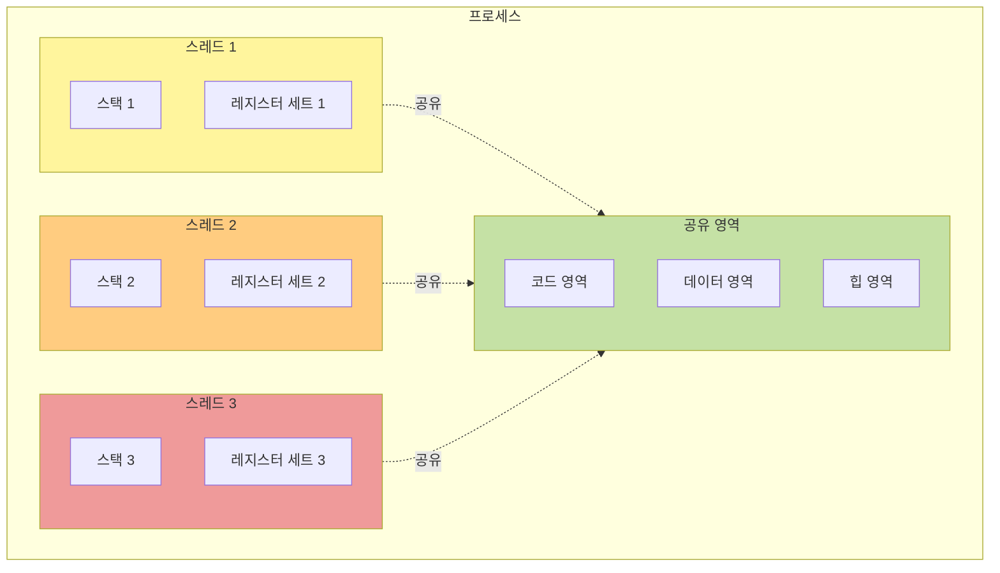

### 프로세스와 스레드의 차이점

> 프로세스와 스레드는 어떻게 다른걸까요?

메모리 구조 차이에서 프로세스와 스레드를 바라보면,

프로세스는 독립적인 메모리 공간을 가지므로, 다른 프로세스의 메모리에 접근할 수 없습니다.
이는 안정성을 제공하지만, 프로세스 간 데이터 공유가 어렵다는 특징이 있습니다.

반면 스레드는 같은 프로세스 내에서 코드, 데이터, 힙 영역을 공유하므로 데이터 공유가 쉽습니다.
하지만 한 스레드의 오류가 전체 프로세스에 영향을 줄 수 있습니다.

> 생성 비용에도 차이가 있습니다.

프로세스 생성은 새로운 메모리 공간을 할당하고, 프로그램을 적재해야 하므로 비용이 큽니다.
반면 스레드 생성은 스택만 새로 할당하면 되므로 훨씬 가볍습니다.

| 구분              | 프로세스           | 스레드                   |
| ----------------- | ------------------ | ------------------------ |
| 메모리            | 독립적 메모리 공간 | 스택만 독립, 나머지 공유 |
| 생성 비용         | 크다 (무겁다)      | 작다 (가볍다)            |
| 통신              | IPC 필요 (복잡)    | 메모리 공유 (간단)       |
| 안정성            | 높음 (격리됨)      | 낮음 (영향을 줌)         |
| Context Switching | 느림               | 빠름                     |

### 멀티프로세스와 멀티스레드

멀티프로세스 (Multi-Process)는 여러 개의 프로세스를 동시에 실행하는 방식을 말합니다.

여러 프로세스가 존재한다는 의미는 독립적인 여러 공간이 존재한다고 할 수 있고 독립적인 여러 공간이 존재하므로 안정적이며
한 프로세스의 오류가 다른 프로세스에 영향을 주지 않는 장점이 있습니다.
반면, 위에서 살펴보았듯이 프로세스 생성 및 Context Switching 비용이 크고 프로세스 간 통신(IPC)이 복잡하고 느리다는 단점이 존재합니다.

이러한 멀티프로세스의 단점을 보완하기 위해서는 공유 메모리를 활용하거나 프로세스 개수를 적절하게 설정하여 Context Switching을 최소화 할 수 있을 것 같습니다.

멀티스레드 (Multi-Thread)는 하나의 프로세스 내에서 여러 개의 스레드를 실행하는 방식입니다.
스레드간의 메모리를 공유하여 효율적이고 스레드 생성 및 Context Switching 비용이 작다는 특징이 있습니다.
반면, 한 스레드의 오류가 전체 프로세스를 중단시킬 수 있는 동기화 문제가 발생할 수 있습니다.

이러한 멀티스레드의 단점을 보완하기 위해서는 뮤텍스(Mutex), 세마포어(Semaphore)를 사용한 동기화가 있습니다.
( 해당 내용은 아래에서 더 자세하게 다루겠습니다. )

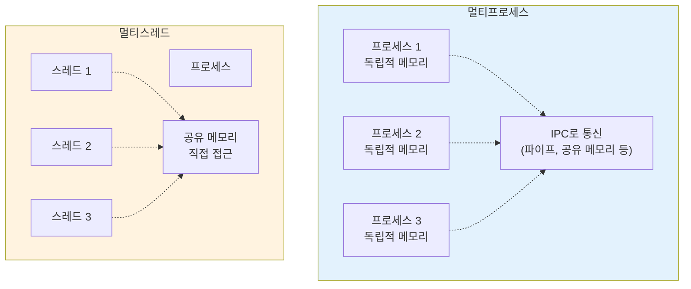

### IPC (Inter-Process Communication)

프로세스는 독립적인 메모리 공간을 가지므로, 프로세스 간 데이터를 공유하려면 운영체제가 제공하는 IPC 메커니즘을 사용해야 합니다.

**스레드 간 데이터 공유**

같은 프로세스 내의 스레드들은 힙 영역을 공유하므로, 변수를 통해 직접 데이터를 주고받을 수 있습니다.

```c
// 스레드 간 데이터 공유 예시
int shared_data = 0;  // 힙 또는 데이터 영역에 위치

void* thread1_function(void* arg) {
    shared_data = 100;  // 직접 접근
    return NULL;
}

void* thread2_function(void* arg) {
    printf("%d\n", shared_data);  // 직접 접근
    return NULL;
}
```

**프로세스 간 데이터 공유**

프로세스는 독립적인 메모리 공간을 가지므로, 운영체제가 제공하는 IPC 메커니즘을 사용해야 합니다.
ICP 메커니즘의 예로는 다음과 같은 것들이 있습니다.

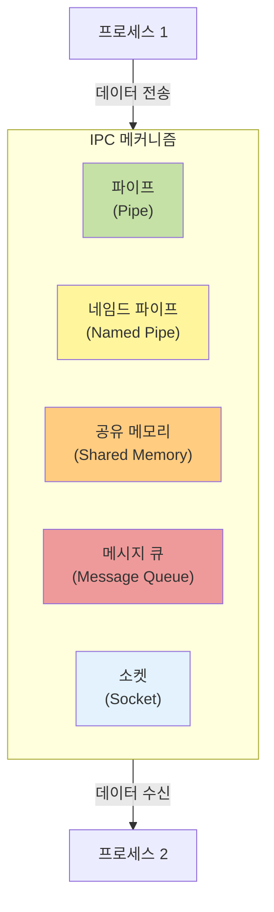

**1. 익명 파이프 (Anonymous Pipe)**

부모-자식 프로세스 간 단방향 통신에 사용됩니다. 파이프는 한쪽 끝에서 데이터를 쓰고, 다른 쪽 끝에서 데이터를 읽는 구조입니다.

```c
int pipe_fd[2];
pipe(pipe_fd);  // pipe_fd[0]: 읽기, pipe_fd[1]: 쓰기

if (fork() == 0) {
    // 자식 프로세스
    close(pipe_fd[1]);  // 쓰기 종료
    char buffer[100];
    read(pipe_fd[0], buffer, sizeof(buffer));
} else {
    // 부모 프로세스
    close(pipe_fd[0]);  // 읽기 종료
    write(pipe_fd[1], "Hello", 5);
}
```

**2. 네임드 파이프 (Named Pipe, FIFO)**

파일 시스템에 이름을 가진 파이프를 생성하여, 관계없는 프로세스 간에도 통신할 수 있습니다.

```c
// 프로세스 1: 네임드 파이프 생성 및 쓰기
mkfifo("/tmp/myfifo", 0666);
int fd = open("/tmp/myfifo", O_WRONLY);
write(fd, "Hello", 5);
close(fd);

// 프로세스 2: 네임드 파이프 읽기
int fd = open("/tmp/myfifo", O_RDONLY);
char buffer[100];
read(fd, buffer, sizeof(buffer));
close(fd);
```

**3. 공유 메모리 (Shared Memory)**

가장 빠른 IPC 방식으로, 여러 프로세스가 같은 메모리 영역을 직접 접근할 수 있습니다. 하지만 동기화가 필요합니다.

```c
// 프로세스 1: 공유 메모리 생성 및 쓰기
int shm_id = shmget(IPC_PRIVATE, 1024, IPC_CREAT | 0666);
char* shm_ptr = (char*)shmat(shm_id, NULL, 0);
strcpy(shm_ptr, "Hello");
shmdt(shm_ptr);

// 프로세스 2: 공유 메모리 읽기
char* shm_ptr = (char*)shmat(shm_id, NULL, 0);
printf("%s\n", shm_ptr);
shmdt(shm_ptr);
```

### IPC에서 발생할 수 있는 문제

여러 프로세스나 스레드가 동시에 공유 자원에 접근할 때, 동기화 문제가 발생할 수 있습니다.
즉, 두 개 이상의 프로세스가 공유 자원에 동시에 접근하여 실행 순서에 따라 결과가 달라지는 상황이 발생할 수 있습니다. (Race Condition)

```c
// 두 스레드가 동시에 실행
int count = 0;  // 공유 변수

// 스레드 1
count = count + 1;  // count를 읽고, 1을 더하고, 저장

// 스레드 2
count = count + 1;  // count를 읽고, 1을 더하고, 저장

// 기대값: count = 2
// 실제값: count = 1 또는 2 (실행 순서에 따라 다름)
```

이러한 문제를 해결하기 위해 임계 영역(Critical Section)을 보호하는 동기화 메커니즘이 필요합니다.

### 세마포어와 뮤텍스

**뮤텍스 (Mutex, Mutual Exclusion)**

뮤텍스는 **상호 배제**를 위한 동기화 메커니즘으로, 한 번에 하나의 스레드만 임계 영역에 접근할 수 있도록 보장합니다.

```c
pthread_mutex_t mutex = PTHREAD_MUTEX_INITIALIZER;
int count = 0;

void* increment(void* arg) {
    pthread_mutex_lock(&mutex);    // 잠금
    count = count + 1;              // 임계 영역
    pthread_mutex_unlock(&mutex);  // 잠금 해제
    return NULL;
}
```

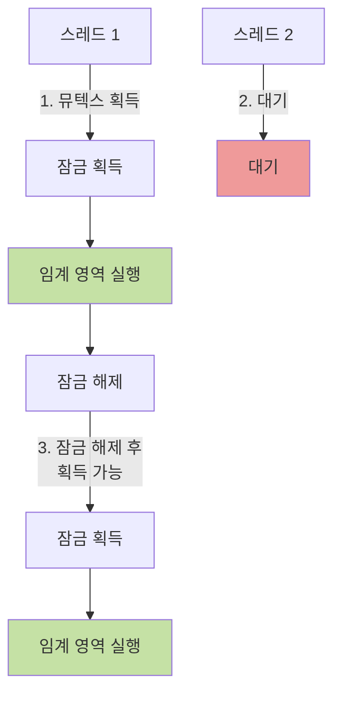

**세마포어 (Semaphore)**

세마포어는 **정수 값**을 사용하여 여러 개의 스레드가 제한된 자원에 접근할 수 있도록 제어합니다.

```c
sem_t semaphore;
sem_init(&semaphore, 0, 3);  // 최대 3개의 스레드 허용

void* worker(void* arg) {
    sem_wait(&semaphore);   // 세마포어 감소 (대기)
    // 임계 영역 (최대 3개 스레드 동시 실행 가능)
    sem_post(&semaphore);   // 세마포어 증가 (해제)
    return NULL;
}
```

**세마포어와 뮤텍스의 차이점**

| 구분   | 뮤텍스                           | 세마포어            |
| ------ | -------------------------------- | ------------------- |
| 목적   | 상호 배제 (Mutual Exclusion)     | 동기화 및 자원 제어 |
| 값     | 0 또는 1 (이진)                  | 0 이상의 정수       |
| 소유권 | 잠금을 획득한 스레드만 해제 가능 | 소유권 개념 없음    |
| 사용   | 임계 영역 보호                   | 제한된 자원 관리    |

**왜 뮤텍스와 세마포어가 나왔을까?**

초기 운영체제에서는 동기화 문제를 해결하기 위해 Busy Waiting 방식을 사용했습니다. 이는 CPU를 계속 점유하면서 조건을 확인하는 비효율적인 방법이었습니다.

```c
// Busy Waiting 예시
while (lock == 1) {
    // CPU를 낭비하며 대기
}
lock = 1;  // 잠금 획득
```

이러한 문제를 해결하기 위해 운영체제는 뮤텍스와 세마포어를 도입하여, 대기 중인 스레드를 슬립(Sleep) 상태로 만들고 자원이 사용 가능해지면 깨우는 방식으로 CPU를 효율적으로 사용할 수 있게 되었습니다.

### 인터럽트란 무엇인가?

인터럽트는 CPU가 현재 수행 중인 작업을 중단하고, 긴급한 작업을 먼저 처리한 후 다시 원래 작업으로 돌아가는 메커니즘입니다.
컴퓨터 시스템은 여러 장치들이 동시에 동작하며, 예상치 못한 상황이 발생할 수 있습니다. 예를 들어 키보드 입력, 마우스 클릭, 네트워크 데이터 수신, 디스크 I/O 완료 등이 있습니다.
만약 CPU가 이러한 이벤트를 주기적으로 확인(폴링)한다면, CPU 시간이 낭비됩니다.
반면, 인터럽트는 이벤트가 발생했을 때 CPU에게 즉시 알려주어 효율적으로 처리할 수 있게 합니다.

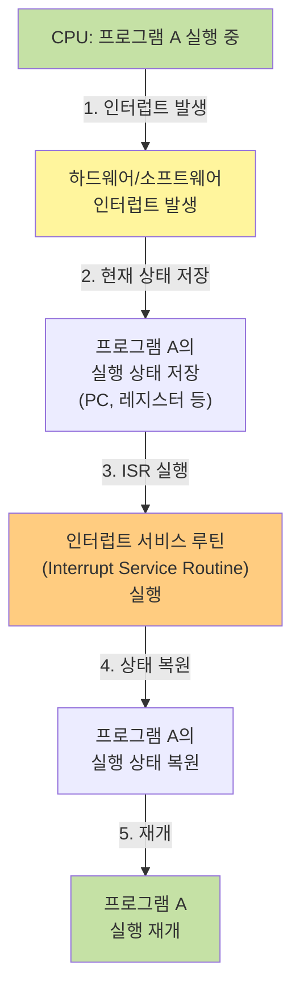

### 인터럽트의 종류

**1. 하드웨어 인터럽트 (External Interrupt)**

외부 하드웨어 장치에 의해 발생하는 인터럽트로 아래와 같은 인터럽트가 존재합니다.

- **I/O 인터럽트**: 입출력 작업 완료 시 (디스크 읽기 완료, 네트워크 패킷 도착 등)
- **타이머 인터럽트**: 일정 시간 간격으로 발생 (멀티태스킹을 위한 프로세스 전환)
- **전원 인터럽트**: 전원 이상 감지 시

**2. 소프트웨어 인터럽트 (Internal Interrupt)**

프로그램 실행 중 소프트웨어적으로 발생하는 인터럽트로 아래와 같은 인터럽트가 존재합니다.

- **시스템 콜**: 프로그램이 운영체제 서비스를 요청할 때
- **예외(Exception)**: 프로그램 오류 발생 시 (0으로 나누기, 잘못된 메모리 접근 등)

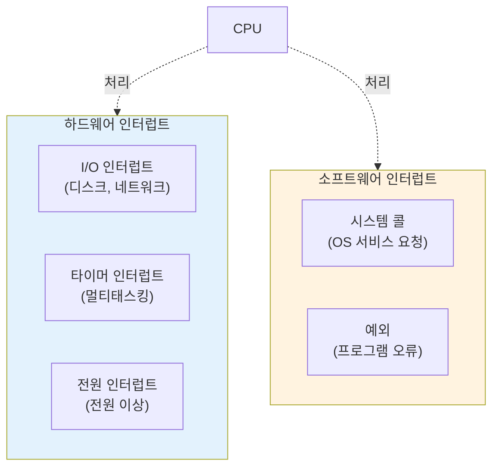

### 시스템 콜은 무엇인가?

시스템 콜은 사용자 프로그램이 운영체제의 서비스를 요청하는 인터페이스입니다.
일반 프로그램(사용자 모드)은 하드웨어 자원에 직접 접근할 수 없습니다.
파일 읽기/쓰기, 네트워크 통신, 메모리 할당 등의 작업은 운영체제(커널 모드)를 통해서만 가능합니다.
여기서 시스템 콜은 사용자 프로그램이 운영체제에게 "이 작업을 대신 해주세요"라고 요청하는 수단입니다.

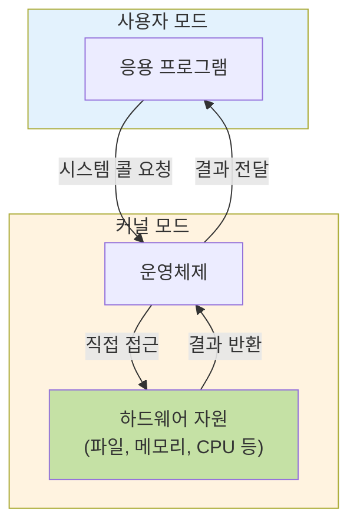

### 시스템 콜은 왜 필요한가?

사용자 프로그램이 하드웨어에 직접 접근하면, 악의적이거나 잘못된 프로그램이 시스템 전체를 망가뜨릴 수 있습니다.
따라서 시스템 콜을 통해 운영체제가 모든 접근을 제어하게 할 수 있습니다.

### fork, exec, wait의 의미

**fork() 시스템 콜**

fork를 통해 현재 프로세스의 복사본을 만듭니다.
부모 프로세스와 자식 프로세스가 동일한 코드를 실행하지만, 독립적인 메모리 공간을 가집니다.

```c
pid_t pid = fork();

if (pid == 0) {
    // 자식 프로세스
    printf("Child process: PID = %d\n", getpid());
} else if (pid > 0) {
    // 부모 프로세스
    printf("Parent process: PID = %d, Child PID = %d\n", getpid(), pid);
} else {
    // fork 실패
    perror("fork failed");
}
```

**exec() 시스템 콜**

exec은 현재 프로세스의 메모리를 새로운 프로그램으로 대체하는 시스템 콜입니다.
이때 기존 프로세스는 사라지고, 새로운 프로그램이 실행됩니다.

```c
pid_t pid = fork();

if (pid == 0) {
    // 자식 프로세스에서 새 프로그램 실행
    execl("/bin/ls", "ls", "-l", NULL);
    // exec가 성공하면 이 줄은 실행되지 않음
    perror("exec failed");
} else {
    // 부모 프로세스는 계속 실행
    wait(NULL);
}
```

**wait() 시스템 콜**

부모 프로세스가 자식 프로세스의 종료를 기다립니다. 이때 자식이 종료되면 자원을 회수합니다.

```c
pid_t pid = fork();

if (pid == 0) {
    // 자식 프로세스
    printf("Child running\n");
    sleep(2);
    printf("Child done\n");
    exit(0);
} else {
    // 부모 프로세스
    printf("Parent waiting\n");
    wait(NULL);  // 자식이 종료될 때까지 대기
    printf("Parent done\n");
}
```

### 좀비 프로세스와 고아 프로세스

**좀비 프로세스 (Zombie Process)**

자식 프로세스가 종료되었지만, 부모 프로세스가 `wait()`를 호출하지 않아 프로세스 테이블에 남아있는 상태입니다.

```c
pid_t pid = fork();

if (pid == 0) {
    // 자식 프로세스
    exit(0);  // 자식 종료
} else {
    // 부모 프로세스
    // wait()를 호출하지 않음!
    sleep(100);  // 자식은 좀비 상태로 남음
}
```

좀비 프로세스는 메모리를 차지하지는 않지만, 프로세스 테이블 항목을 점유하여 새로운 프로세스 생성을 방해할 수 있습니다.

**고아 프로세스 (Orphan Process)**

부모 프로세스가 자식보다 먼저 종료되어, 자식 프로세스가 부모 없이 남겨진 상태입니다.

```c
pid_t pid = fork();

if (pid == 0) {
    // 자식 프로세스
    sleep(10);  // 부모보다 늦게 종료
    printf("Child done\n");
} else {
    // 부모 프로세스
    printf("Parent done\n");
    exit(0);  // 부모가 먼저 종료 → 자식은 고아가 됨
}
```

운영체제는 고아 프로세스를 `init` 프로세스(PID 1)의 자식으로 재할당하여 관리합니다.

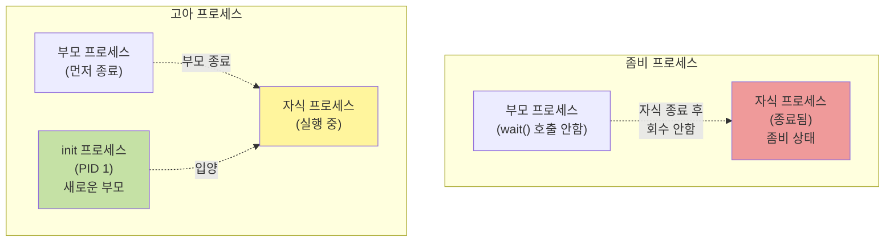

### Context Switching이란 무엇인가?

Context Switching은 CPU가 현재 실행 중인 프로세스를 중단하고, 다른 프로세스로 전환하는 과정입니다.
CPU는 한 번에 하나의 프로세스만 실행할 수 있습니다. 하지만 멀티태스킹 환경에서는 여러 프로세스가 동시에 실행되는 것처럼 보여야 합니다.
이를 위해 운영체제는 각 프로세스를 매우 짧은 시간동안 실행하고, 빠르게 다른 프로세스로 전환하는데 이 전환 과정을 Context Switching이라고 합니다.

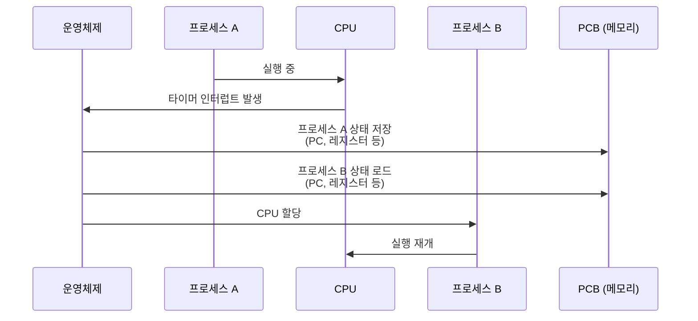

### Context Switching은 어디에 어떻게 사용되는가?

**1. 멀티태스킹**

여러 프로그램이 동시에 실행되는 것처럼 보이게 합니다.

```
시간 0-10ms: 프로세스 A 실행
시간 10-20ms: 프로세스 B 실행 (Context Switch)
시간 20-30ms: 프로세스 C 실행 (Context Switch)
시간 30-40ms: 프로세스 A 실행 (Context Switch)
...
```

**2. 인터럽트 처리**

하드웨어 인터럽트 발생 시, 현재 프로세스를 중단하고 인터럽트를 처리한 후 다시 원래 프로세스로 돌아갑니다.

**3. I/O 대기**

프로세스가 I/O 작업을 기다리는 동안, CPU를 다른 프로세스에게 넘겨 효율을 높입니다.

### PCB (Process Control Block)

PCB는 운영체제가 프로세스를 관리하기 위해 필요한 모든 정보를 담고 있는 자료구조입니다.

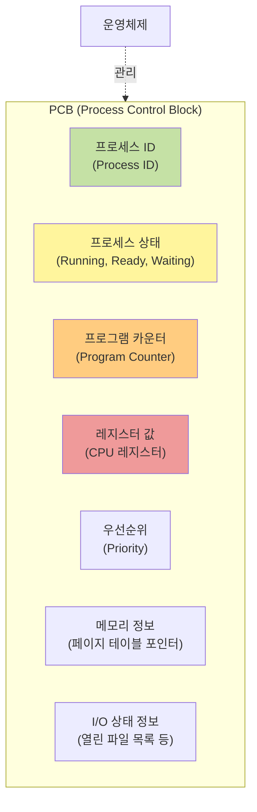

**PCB에 저장되는 정보**

- **프로세스 ID (PID)**: 각 프로세스를 식별하는 고유 번호
- **프로세스 상태**: New, Ready, Running, Waiting, Terminated
- **프로그램 카운터**: 다음에 실행할 명령어의 주소
- **CPU 레지스터**: 모든 레지스터의 값
- **CPU 스케줄링 정보**: 우선순위, 스케줄링 큐 포인터
- **메모리 관리 정보**: 페이지 테이블, 세그먼트 테이블 포인터
- **I/O 상태 정보**: 열린 파일 목록, I/O 장치 할당 정보

### Context Switching 과정 (PCB 포함)

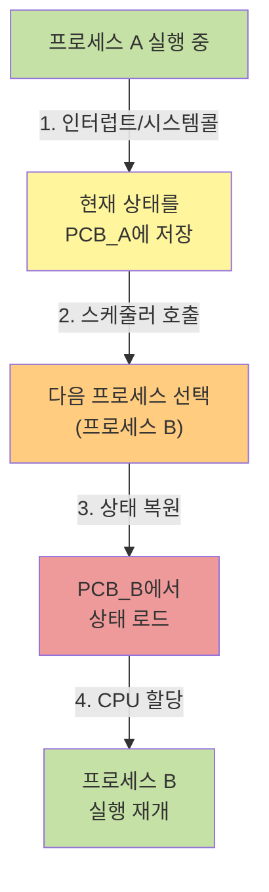

**1. 프로세스 A 실행 중**

CPU가 프로세스 A의 명령어를 실행하고 있습니다.

**2. 인터럽트 발생 또는 시스템 콜**

타이머 인터럽트, I/O 요청, 또는 다른 이유로 프로세스 전환이 필요합니다.

**3. 프로세스 A의 상태를 PCB_A에 저장**

- 프로그램 카운터 (PC)
- 모든 CPU 레지스터 값
- 프로세스 상태를 Running에서 Ready 또는 Waiting으로 변경

**4. 스케줄러가 다음 프로세스 선택**

CPU 스케줄링 알고리즘에 따라 다음에 실행할 프로세스 B를 선택합니다.

**5. 프로세스 B의 상태를 PCB_B에서 로드**

- 저장되어 있던 프로그램 카운터 값을 CPU에 로드
- 저장되어 있던 레지스터 값들을 복원
- 프로세스 상태를 Ready에서 Running으로 변경

**6. 프로세스 B 실행 재개**

CPU가 프로세스 B의 명령어를 실행합니다.

### Context Switching의 오버헤드

Context Switching은 유용하지만, 비용이 발생합니다.

**오버헤드가 발생하는 이유**

- 현재 프로세스의 상태를 저장하는 시간
- 다음 프로세스의 상태를 로드하는 시간
- 캐시 메모리가 무효화됨 (새로운 프로세스의 데이터로 채워져야 함)
- TLB (Translation Lookaside Buffer) 초기화

일반적으로 Context Switching에는 1~1000 마이크로초가 소요되며, 이 시간 동안 CPU는 실제 작업을 하지 못합니다.
따라서 운영체제는 Context Switching 횟수를 최소화하면서도, 모든 프로세스에게 공평하게 CPU 시간을 배분하는 균형을 맞춰야 합니다.

## CPU 스케줄링

CPU 스케줄링은 여러 프로세스 중 어떤 프로세스에게 CPU를 할당할지 결정하는 과정입니다.
멀티프로그래밍 환경에서 여러 프로세스가 동시에 실행 대기 중일 때, CPU는 한 번에 하나의 프로세스만 실행할 수 있습니다.
이때 운영체제는 효율적이고 공평하게 CPU를 배분하기 위해 스케줄링 알고리즘을 사용합니다.

### 선점 스케줄링과 비선점 스케줄링

**비선점 스케줄링 (Non-preemptive Scheduling)**

프로세스가 CPU를 할당받으면, 스스로 반납할 때까지 계속 실행됩니다. 프로세스 종료 또는 I/O 등의 이벤트가 발생할 때까지 실행이 보장됩니다.
Context Switching 오버헤드가 적고, 구현이 간단하지만 긴 프로세스가 CPU를 독점할 수 있어 응답시간이 길어질 수 있습니다.

**선점 스케줄링 (Preemptive Scheduling)**

운영체제가 실행 중인 프로세스를 강제로 중단시키고, 다른 프로세스에게 CPU를 할당할 수 있는 것을 말합니다.
높은 우선순위 프로세스가 빠르게 응답받을 수 있지만 Context Switching 오버헤드가 많아지고 동기화 문제가 발생할 수 있습니다.

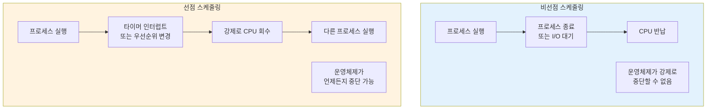

### 비선점 스케줄링 알고리즘

비선점 스케줄링 알고리즘으로는 FCFS (First-Come, First-Served), SJF (Shortest Job First), HRN (Highest Response Ratio Next)이 존재하며
선점 스케줄링 알고리즘으로는 Round Robin (RR), SRT (Shortest Remaining Time), Priority Scheduling (우선순위) 등이 존재합니다.

### 프로세스의 상태 전이

프로세스는 생명 주기 동안 여러 상태를 거칩니다.

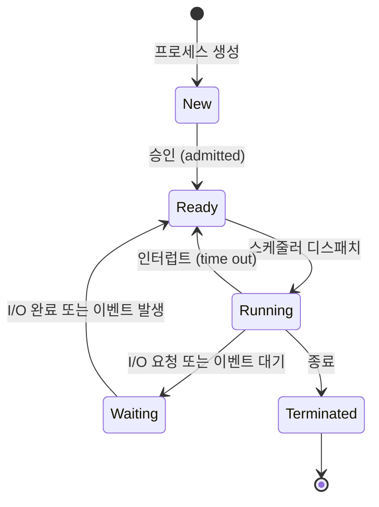

**1. New (생성)**

프로세스가 생성되어 메모리에 적재되기를 기다리는 상태입니다.

**2. Ready (준비)**

프로세스가 CPU를 할당받기를 기다리는 상태입니다. 모든 준비가 완료되어 CPU만 있으면 실행 가능합니다.

**3. Running (실행)**

프로세스가 CPU를 할당받아 실행 중인 상태입니다.

**4. Waiting (대기)**

프로세스가 I/O 완료나 특정 이벤트를 기다리는 상태입니다. I/O 작업이 완료되면 Ready 상태로 전환됩니다.

**5. Terminated (종료)**

프로세스 실행이 완료되어 종료된 상태입니다. PCB와 할당된 자원이 회수됩니다.

**상태 전이 설명**

- **Ready → Running**: CPU 스케줄러가 Ready Queue에서 프로세스를 선택하여 CPU를 할당합니다.
- **Running → Ready**: 선점 스케줄링에서 타이머 인터럽트 발생 시, 또는 우선순위가 더 높은 프로세스가 도착했을 때 발생합니다.
- **Running → Waiting**: 프로세스가 I/O 요청, 자식 프로세스 종료 대기 등의 이벤트를 기다릴 때 발생합니다.
- **Waiting → Ready**: I/O 작업이 완료되거나 기다리던 이벤트가 발생하면 Ready 상태로 전환됩니다.

### 데드락(Deadlock)이란 무엇인가?

데드락은 두 개 이상의 프로세스가 서로가 가진 자원을 기다리며 무한정 대기하는 상황입니다.

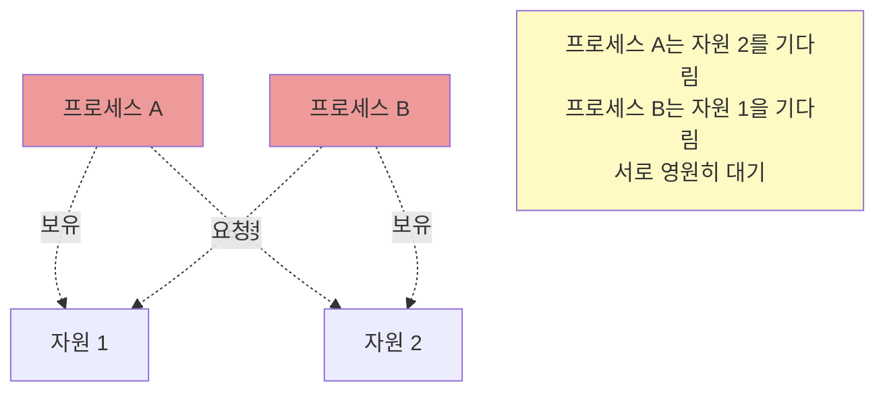

실생활 예시로 생각해보면, 좁은 다리에서 양쪽에서 차가 마주보고 있고 둘 다 비키지 않는 상황과 유사합니다.

### 데드락 발생 조건

데드락이 발생하려면 다음 **4가지 조건**이 **모두** 만족되어야 합니다.

**1. 상호 배제 (Mutual Exclusion)**

자원은 한 번에 하나의 프로세스만 사용할 수 있습니다.

**2. 점유와 대기 (Hold and Wait)**

프로세스가 최소한 하나의 자원을 보유한 상태에서, 다른 프로세스가 가진 자원을 추가로 기다립니다.

**3. 비선점 (No Preemption)**

다른 프로세스가 사용 중인 자원을 강제로 빼앗을 수 없습니다.

**4. 순환 대기 (Circular Wait)**

프로세스들이 순환 형태로 서로의 자원을 기다립니다.

```c
// 데드락 예시 코드
// 스레드 1
pthread_mutex_lock(&mutex1);
sleep(1);  // 타이밍 문제 발생 가능
pthread_mutex_lock(&mutex2);
// 임계 영역
pthread_mutex_unlock(&mutex2);
pthread_mutex_unlock(&mutex1);

// 스레드 2
pthread_mutex_lock(&mutex2);
sleep(1);  // 타이밍 문제 발생 가능
pthread_mutex_lock(&mutex1);
// 임계 영역
pthread_mutex_unlock(&mutex1);
pthread_mutex_unlock(&mutex2);
```

위 코드에서 스레드 1이 mutex1을 보유하고 mutex2를 기다리는 동시에, 스레드 2가 mutex2를 보유하고 mutex1을 기다리면 데드락이 발생합니다.

### 데드락 처리 방법

**1. 예방 (Prevention)**

데드락 발생 조건 4가지 중 하나라도 만족하지 않도록 설계합니다.

- **상호 배제 부정**: 불가능 (프린터 같은 자원은 반드시 상호 배제 필요)
- **점유와 대기 부정**: 프로세스가 실행되기 전에 필요한 모든 자원을 한꺼번에 요청
- **비선점 부정**: 자원을 강제로 빼앗을 수 있게 허용
- **순환 대기 부정**: 자원에 순서를 부여하고, 순서대로만 요청하도록 강제

```c
// 순환 대기 방지 예시 (자원 순서 정하기)
// 항상 mutex1을 먼저, mutex2를 나중에 획득
pthread_mutex_lock(&mutex1);
pthread_mutex_lock(&mutex2);
// 임계 영역
pthread_mutex_unlock(&mutex2);
pthread_mutex_unlock(&mutex1);
```

**2. 회피 (Avoidance)**

프로세스가 자원을 요청할 때, 시스템이 안전한 상태를 유지할 수 있는지 검사합니다. 대표적으로 **은행원 알고리즘(Banker's Algorithm)**이 있습니다.

안전 상태(Safe State)란, 모든 프로세스가 자원을 할당받아 정상적으로 종료할 수 있는 순서가 존재하는 상태를 말합니다.

```
프로세스 P1: 최대 10개 필요, 현재 5개 보유
프로세스 P2: 최대 4개 필요, 현재 2개 보유
프로세스 P3: 최대 9개 필요, 현재 2개 보유
시스템 여유 자원: 3개

→ 안전 순서 존재: P2 종료 → P1 종료 → P3 종료 (안전 상태)
```

### 식사하는 철학자 문제

데드락과 기아 상태를 설명하는 유명한 문제입니다.

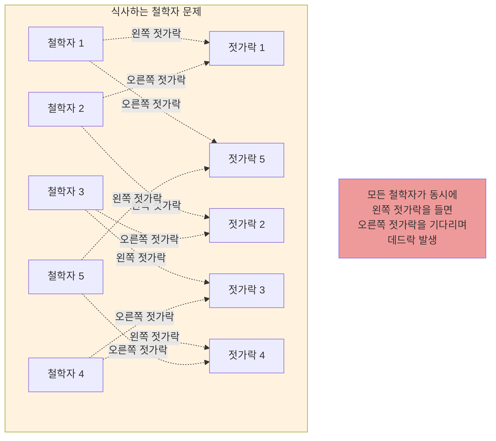

**문제 상황**

5명의 철학자가 원형 테이블에 앉아 있고, 각 철학자 사이에 젓가락이 하나씩 있습니다. 철학자는 생각하거나 식사를 하며, 식사하려면 양쪽 젓가락을 모두 들어야 합니다.

만약 모든 철학자가 동시에 왼쪽 젓가락을 들면, 오른쪽 젓가락을 기다리며 데드락이 발생합니다.

**해결 방법**

1. **자원 개수 제한**: 최대 4명만 동시에 식사하도록 제한
2. **비대칭 접근**: 홀수 번호 철학자는 왼쪽 먼저, 짝수 번호는 오른쪽 먼저
3. **모두 확인 후 획득**: 양쪽 젓가락을 모두 사용 가능한 경우에만 들기

## 페이징과 세그먼테이션

메모리 관리 기법은 프로세스에게 메모리를 효율적으로 할당하고, 메모리 단편화 문제를 해결하기 위해 발전해왔습니다.

메모리 관리 기법의 종류로는 메모리를 고정된 크기로 나누어 프로세스에 할당하는 고정 분할 (Fixed Partitioning)과
프로세스 크기에 맞춰 메모리를 동적으로 할당하는 가변 분할 (Dynamic Partitioning)이 있습니다.

고정 분할의 경우 할당된 메모리가 프로세스보다 크면 남은 공간이 낭비되는 내부 단편화 문제가 발생할 수 있으며,
가변 분할의 경우 프로세스가 종료되면서 생긴 작은 빈 공간들이 흩어져, 충분한 메모리가 있어도 연속된 공간이 없어 할당하지 못하는 외부 단편화가 발생할 수 있습니다.

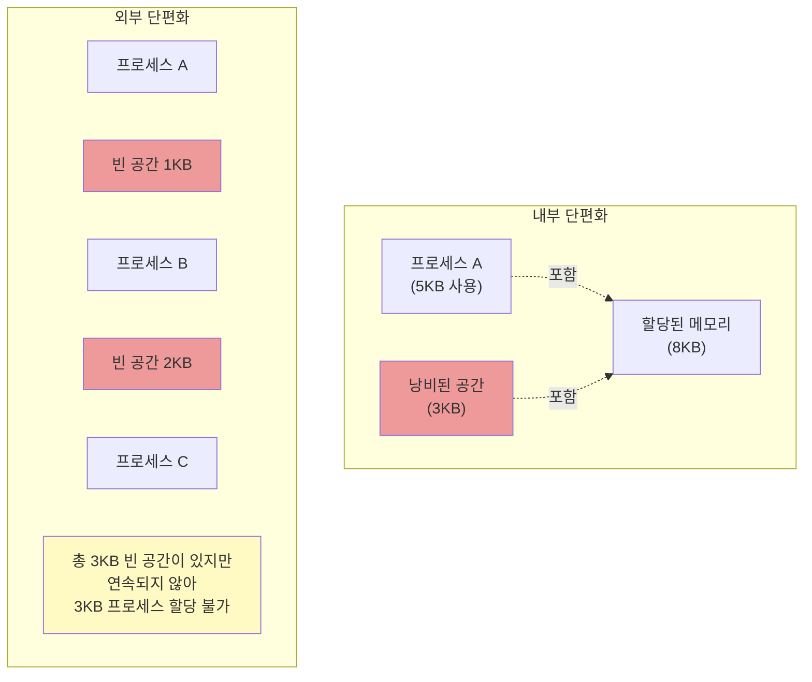

### 페이징 (Paging)

페이징은 물리 메모리를 **프레임(Frame)**이라는 고정 크기 블록으로 나누고, 논리 메모리를 같은 크기의 **페이지(Page)**로 나누어 관리하는 기법입니다.

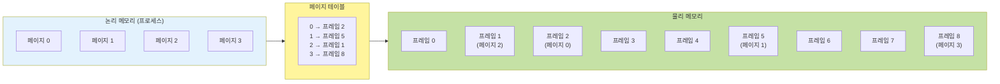

페이징의 경우 페이지 크기가 고정되어 있어, 어떤 빈 프레임에도 페이지를 할당할 수 있기에 외부 단편화 문제가 발생할 가능성이 적고
물리 메모리를 효율적으로 사용할 수 있습니다. 하지만 마지막 페이지가 프레임을 완전히 채우지 못하면 남은 공간이 낭비됩니다. (평균적으로 페이지 크기의 절반)
또, 페이지 테이블을 위한 추가 메모리 필요하다는 단점이 있습니다.

### 세그먼테이션 (Segmentation)

세그먼테이션은 프로그램을 논리적 단위인 **세그먼트(Segment)**로 나누어 관리하는 기법입니다.

```mermaid
graph LR
    subgraph Logical["논리 메모리 (프로세스)"]
        S0["세그먼트 0<br/>(코드)<br/>1KB"]
        S1["세그먼트 1<br/>(데이터)<br/>2KB"]
        S2["세그먼트 2<br/>(스택)<br/>3KB"]
    end

    subgraph SegTable["세그먼트 테이블"]
        ST["0 → 베이스 1000, 크기 1KB<br/>1 → 베이스 3000, 크기 2KB<br/>2 → 베이스 6000, 크기 3KB"]
    end

    subgraph Physical["물리 메모리"]
        M1["주소 1000<br/>(코드)"]
        M2["주소 3000<br/>(데이터)"]
        M3["주소 6000<br/>(스택)"]
    end

    Logical --> SegTable
    SegTable --> Physical

    style Logical fill:#e3f2fd
    style SegTable fill:#fff59d
    style Physical fill:#c5e1a5
```

세그먼테이션의 경우 논리적 단위로 나누어 관리하므로, 코드 공유와 보호가 쉽다는 특징이있고 세그먼트 크기가 가변적이기에 내부 단편화가 없다는 특징이 있습니다.
하지만, 세그먼트 크기가 다르므로, 빈 공간이 흩어질 수 있기에 외부 단편화가 발생하고 세그먼트 테이블을 위한 추가 메모리가 필요한 단점이 있습니다.

### 페이징과 세그먼테이션 비교

| 구분        | 페이징                         | 세그먼테이션                  |
| ----------- | ------------------------------ | ----------------------------- |
| 메모리 분할 | 고정 크기 (페이지)             | 가변 크기 (세그먼트)          |
| 논리적 단위 | 무관 (고정 크기로 자름)        | 논리적 단위 (코드, 데이터 등) |
| 내부 단편화 | 발생 (평균 페이지 크기의 절반) | 없음                          |
| 외부 단편화 | 없음                           | 발생 가능                     |
| 테이블 크기 | 페이지 테이블 (큼)             | 세그먼트 테이블 (작음)        |

### 페이징과 세그먼테이션의 결합

현대 운영체제는 두 기법을 결합하여 장점을 모두 활용합니다. 세그먼트를 페이지로 나누어 관리합니다.

```mermaid
graph LR
    subgraph Program["프로그램"]
        P["코드 세그먼트<br/>데이터 세그먼트<br/>스택 세그먼트"]
    end

    subgraph Seg["세그먼트 테이블"]
        S["각 세그먼트의<br/>페이지 테이블 위치"]
    end

    subgraph Page["페이지 테이블"]
        PT["각 페이지의<br/>프레임 번호"]
    end

    subgraph Physical["물리 메모리"]
        F["프레임"]
    end

    Program --> Seg
    Seg --> Page
    Page --> Physical

    style Program fill:#e3f2fd
    style Seg fill:#fff59d
    style Page fill:#ffcc80
    style Physical fill:#c5e1a5
```

이를 통해 논리적 단위로 관리하면서도, 외부 단편화를 방지할 수 있습니다.

## 페이지 교체 알고리즘

물리 메모리가 가득 찬 상태에서 새로운 페이지를 적재해야 할 때, 어떤 페이지를 제거할지 결정하는 알고리즘입니다.

## 페이지 교체 알고리즘 종류

### FIFO (First-In, First-Out)

가장 먼저 들어온 페이지를 교체합니다.

```
페이지 참조열: 1 2 3 4 1 2 5 1 2 3 4 5
프레임 개수: 3

시간 1: [1] - - → 페이지 폴트
시간 2: [1][2] - → 페이지 폴트
시간 3: [1][2][3] → 페이지 폴트
시간 4: [4][2][3] → 페이지 폴트 (1 교체)
시간 5: [4][2][3] → 1은 메모리에 없음, 페이지 폴트
...
```

단점으로는 **Belady의 모순** ( 프레임 수를 늘렸는데 페이지 폴트가 더 많이 발생하는 현상 ) 이 있습니다.

### 최적 (Optimal) 알고리즘

앞으로 가장 오랫동안 사용되지 않을 페이지를 교체합니다. 이론적으로 가장 좋지만, 미래를 알 수 없으므로 실제 구현 불가능합니다.

```
페이지 참조열: 1 2 3 4 1 2 5 1 2 3 4 5
프레임 개수: 3

시간 1: [1] - - → 페이지 폴트
시간 2: [1][2] - → 페이지 폴트
시간 3: [1][2][3] → 페이지 폴트
시간 4: [4][2][3] → 페이지 폴트 (1 교체, 다음에 가장 늦게 사용됨)
시간 5: [4][2][3] → 4가 이미 메모리에 있음
...
```

다른 알고리즘의 성능을 평가하는 기준으로 사용됩니다.

### LRU (Least Recently Used)

가장 오랫동안 사용되지 않은 페이지를 교체합니다. 과거 사용 패턴을 기반으로 미래를 예측합니다.

```
페이지 참조열: 1 2 3 4 1 2 5 1 2 3 4 5
프레임 개수: 3

시간 1: [1] - - → 페이지 폴트
시간 2: [1][2] - → 페이지 폴트
시간 3: [1][2][3] → 페이지 폴트
시간 4: [4][2][3] → 페이지 폴트 (1 교체, 가장 오래전 사용)
시간 5: [4][1][3] → 페이지 폴트 (2 교체)
...
```

## 가상 메모리란 무엇인가?

가상 메모리는 물리 메모리보다 큰 프로그램을 실행할 수 있게 해주는 메모리 관리 기법입니다.
프로세스는 자신만의 연속된 메모리 공간을 가진 것처럼 보이지만, 실제로는 물리 메모리의 여러 곳에 흩어져 있거나 디스크에 저장되어 있습니다.

이러한 가상메모리를 통해 메모리 부족 문제를 해결할 수 있습니다.
가상 메모리를 사용하면, 프로그램의 일부만 물리 메모리에 적재하고 나머지는 디스크에 두어 큰 프로그램을 실행할 수 있습니다.

## 마치며

이번 글에서는 운영체제의 핵심 개념들을 정리해보았습니다. 학습 과정에서 스레드는 같은 프로세스 내에서 메모리를 공유하므로, 프로세스보다 생성 비용이 적고 Context Switching이 빠르다는 것을 알게 되었습니다.
하지만 동시에 Race Condition이나 Deadlock 같은 동기화 문제를 조심해야 한다는 것도 배웠습니다.
또한 가상 메모리 덕분에 물리 메모리보다 큰 프로그램을 실행할 수 있다는 점도 알게 되었습니다.

## 참고 자료

- [Operating System Concepts (10th Edition)](https://www.os-book.com/OS10/) - Abraham Silberschatz, Peter B. Galvin, Greg Gagne (Wiley, 2018)
- [Oracle - Programming with Synchronization Objects](https://docs.oracle.com/cd/E19253-01/816-5137/6mba5vpsn/index.html)
- [Computer Systems Fundamentals - Deadlock](https://w3.cs.jmu.edu/kirkpams/OpenCSF/Books/csf/html/Deadlock.html) - James Madison University
- [Memory Management](https://www.cs.cornell.edu/courses/cs4410/2018su/lectures/lec11-mmu.html) - Cornell University CS 4410
- [Virtual Memory](https://student.cs.uwaterloo.ca/~cs350/F19/notes/virtualmemory-1up.pdf) - University of Waterloo CS 350
- [Memory Management Unit (MMU)](<https://wiki.cs.manchester.ac.uk/COMP15212/index.php/Memory_Management_Unit_(MMU)>) - University of Manchester
- [Segmentation and Paging](https://www.cs.columbia.edu/~junfeng/12sp-w4118/lectures/l05-mem.pdf) - Columbia University W4118
- [Comparison of CPU Scheduling Algorithms](https://www.researchgate.net/publication/385737810) - ResearchGate, 2024
- [Performance Assessment of CPU Scheduling Algorithms](https://thescipub.com/abstract/jcssp.2024.972.985) - Hajjar, O., et al. Journal of Computer Science, 2024
- [A Survey of Variants of Round Robin CPU Scheduling](https://www.researchgate.net/publication/348363640) - FUDMA Journal of Sciences, 2020
- [Study and Evaluation of CPU Scheduling Algorithms](https://pmc.ncbi.nlm.nih.gov/articles/PMC11066403/) - PubMed Central
- [gyoogle.dev - Memory](https://gyoogle.dev/blog/computer-science/operating-system/Memory.html)
