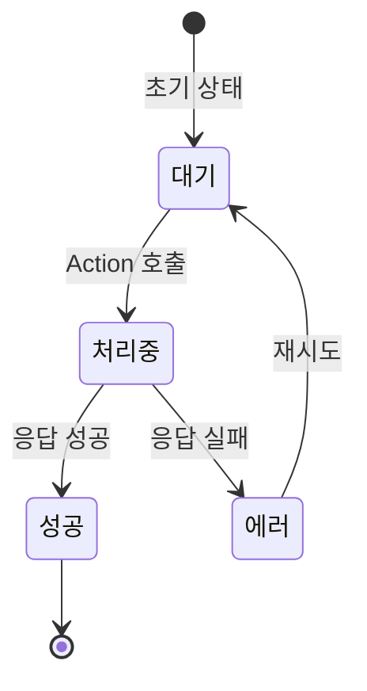
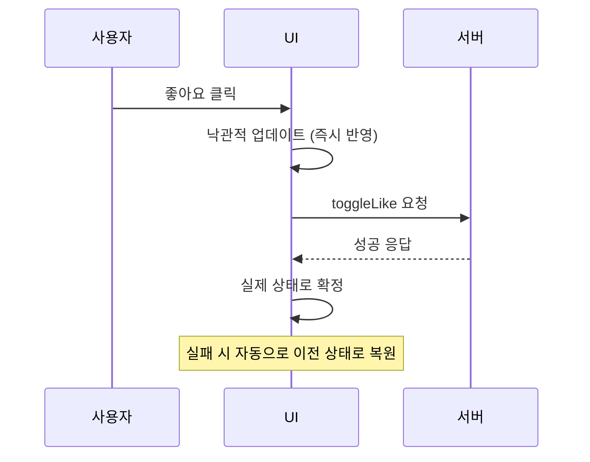

React 18에서 폼을 다룰 때, 아래 코드와 같은 패턴을 반복적으로 작성하고 계시지 않으셨나요?

```javascript
function UpdateName() {
  const [name, setName] = useState('');
  const [isPending, setIsPending] = useState(false);
  const [error, setError] = useState(null);

  const handleSubmit = async () => {
    setIsPending(true);
    try {
      const error = await updateName(name);
      if (error) {
        setError(error);
        return;
      }
      redirect('/profile');
    } catch (e) {
      setError(e);
    } finally {
      setIsPending(false);
    }
  };

  return (
    <div>
      <input value={name} onChange={(e) => setName(e.target.value)} />
      <button onClick={handleSubmit} disabled={isPending}>
        {isPending ? '저장 중...' : '저장'}
      </button>
      {error && <p>{error}</p>}
    </div>
  );
}
```

`isPending`을 통해 로딩 상태를 직접 관리하고, `try-catch`로 에러를 잡고, `finally`에서 로딩 상태를 되돌리고,
어떻게 보면 이러한 과정비동기 처리를 할 때마다 매번 반복되는 보일러플레이트였어요.

React 19는 이런 반복적인 패턴들을 프레임워크 레벨에서 지원하기 시작했습니다.

이번 글에서는 React 19에서 새롭게 추가되거나 개선된 기능들을 정리해보려고 해요.

## useTransition - 비동기 transition의 확장

### 기본 개념

`useTransition`은 UI를 차단하지 않으면서 상태를 업데이트할 수 있게 해주는 훅이에요.

```javascript
const [isPending, startTransition] = useTransition();
```

- `isPending`: transition이 진행 중인지를 나타내는 boolean 값
- `startTransition`: 상태 업데이트를 transition으로 표시하는 함수

React 18에서도 `useTransition`은 존재했지만, `startTransition`에 **동기 함수만** 전달할 수 있었어요.
React 19부터는 **async 함수**를 전달할 수 있게 되었습니다.
async transition이 진행되는 동안 React가 `isPending`을 `true`로 유지해주기 때문에, 로딩 상태를 직접 관리할 필요가 없어졌어요.

앞서 본 보일러플레이트를 `useTransition`으로 개선하면 이렇게 바뀝니다.

```javascript
// React 19 - useTransition으로 비동기 처리
function UpdateName() {
  const [name, setName] = useState('');
  const [error, setError] = useState(null);
  const [isPending, startTransition] = useTransition();

  const handleSubmit = () => {
    startTransition(async () => {
      const error = await updateName(name);
      if (error) {
        setError(error);
        return;
      }
      redirect('/profile');
    });
  };

  return (
    <div>
      <input value={name} onChange={(e) => setName(e.target.value)} />
      <button onClick={handleSubmit} disabled={isPending}>
        {isPending ? '저장 중...' : '저장'}
      </button>
      {error && <p>{error}</p>}
    </div>
  );
}
```

`useState`로 `isPending`을 직접 관리하던 코드가 사라지고, `useTransition`이 제공하는 `isPending`으로 대체된 것을 확인할 수 있어요.

### startTransition (독립 함수)

`useTransition`의 `startTransition`과 별도로, React에서 직접 import할 수 있는 **독립 함수 `startTransition`**도 있어요.

```javascript
import { startTransition } from 'react';

// 컴포넌트 외부에서도 사용 가능
startTransition(async () => {
  await saveData(data);
});
```

두 가지의 핵심 차이는 다음과 같아요.

|                   | `useTransition`            | `startTransition`            |
| ----------------- | -------------------------- | ---------------------------- |
| pending 상태 추적 | `isPending` 제공           | 제공하지 않음                |
| 사용 위치         | 컴포넌트 내부 (훅)         | 어디서든 가능                |
| 주요 용도         | 로딩 UI 표시가 필요한 경우 | pending 상태가 불필요한 경우 |

로딩 인디케이터를 보여줘야 한다면 `useTransition`을, pending 상태 추적 없이 transition만 시작하면 된다면 독립 함수 `startTransition`을 사용하면 됩니다.

## Actions - 비동기 처리의 통합 패턴

이렇게 `startTransition`이 async 함수를 지원하게 되면서, React 19에서는 이를 **Actions**라는 개념으로 정의하고 있어요.
( async 함수를 사용하는 transition을 "Action"이라고 부릅니다. )

Action의 상태 흐름을 다이어그램으로 표현하면 다음과 같아요.



Actions는 단순히 pending 상태 관리를 넘어서, 에러 처리, 낙관적 업데이트, 폼 자동 리셋까지 포함하는 통합된 패턴이에요.
이후에 소개할 `useActionState`, `useFormStatus`, `useOptimistic` 모두 이 Actions 개념 위에서 동작합니다.

## useActionState - 폼 상태를 한 번에 관리하기

### 기본 사용법

`useActionState`는 Action의 결과와 pending 상태를 한 번에 관리할 수 있는 훅이에요.

```javascript
const [state, formAction, isPending] = useActionState(actionFn, initialState);
```

- `actionFn`: `(previousState, formData) => newState` 형태의 함수
- `initialState`: 초기 상태 값
- `state`: Action의 마지막 반환 값
- `formAction`: `<form>`의 `action`에 전달할 수 있는 래핑된 함수
- `isPending`: 현재 Action이 실행 중인지 여부

장바구니에 상품을 추가하는 폼을 예시로 살펴볼게요.

```javascript
import { useActionState } from 'react';

function AddToCartForm({ itemId, itemTitle }) {
  const [message, formAction, isPending] = useActionState(
    async (previousState, formData) => {
      const error = await addToCart(itemId);
      if (error) {
        return `${itemTitle} 추가 실패: ${error}`;
      }
      return `${itemTitle}이(가) 장바구니에 추가되었습니다.`;
    },
    null,
  );

  return (
    <form action={formAction}>
      <h2>{itemTitle}</h2>
      <button type="submit" disabled={isPending}>
        {isPending ? '추가 중...' : '장바구니에 담기'}
      </button>
      {message && <p>{message}</p>}
    </form>
  );
}
```

`useState`로 에러 상태, 성공 메시지, 로딩 상태를 각각 관리하던 것이 `useActionState` 하나로 깔끔하게 정리되었어요.
또한 `<form>`의 `action` prop에 직접 전달할 수 있어서, 폼 제출 시 자동으로 리셋되는 것도 장점이에요.

### 서버 액션과의 연동

`useActionState`은 Next.js의 Server Actions와 함께 사용할 때 더욱 편리하게 사용할 수 있어요.

```javascript
// actions.ts
'use server';

export async function createTodo(previousState, formData) {
  const title = formData.get('title');

  if (!title || title.toString().trim() === '') {
    return { error: '할 일을 입력해주세요.' };
  }

  await db.todos.create({ data: { title: title.toString() } });
  return { error: null };
}
```

```javascript
// TodoForm.tsx
'use client';

import { useActionState } from 'react';
import { createTodo } from './actions';

function TodoForm() {
  const [state, formAction, isPending] = useActionState(createTodo, {
    error: null,
  });

  return (
    <form action={formAction}>
      <input type="text" name="title" placeholder="할 일을 입력하세요" />
      <button type="submit" disabled={isPending}>
        {isPending ? '추가 중...' : '추가'}
      </button>
      {state.error && <p style={{ color: 'red' }}>{state.error}</p>}
    </form>
  );
}
```

위의 예시처럼 클라이언트 코드에서 별도의 API 호출 로직 없이, 서버 액션이 자연스럽게 폼과 연결되는 것을 확인할 수 있어요.

## useFormStatus - Props Drilling 없이 폼 상태 읽기

`useFormStatus`는 부모 `<form>`의 제출 상태를 Context처럼 읽을 수 있는 훅이에요.

```javascript
import { useFormStatus } from 'react-dom';

function SubmitButton() {
  const { pending } = useFormStatus();

  return (
    <button type="submit" disabled={pending}>
      {pending ? '제출 중...' : '제출'}
    </button>
  );
}
```

이 훅의 핵심은 **부모 `<form>`의 상태를 prop으로 전달받을 필요가 없다는 점**이에요.

```javascript
function ContactForm() {
  const [state, formAction] = useActionState(submitContact, null);

  return (
    <form action={formAction}>
      <input type="text" name="name" placeholder="이름" />
      <input type="email" name="email" placeholder="이메일" />
      <textarea name="message" placeholder="메시지" />
      {/* isPending을 prop으로 넘기지 않아도 됩니다 */}
      <SubmitButton />
      {state?.error && <p>{state.error}</p>}
    </form>
  );
}
```

한 가지 주의할 점은, `useFormStatus`는 **반드시 `<form>` 내부에 렌더링되는 컴포넌트**에서 호출해야 한다는 거예요.
같은 컴포넌트 내의 `<form>`이 아니라, 부모의 `<form>`을 바라보고 있어요.

```javascript
// 올바른 사용 - form 내부의 자식 컴포넌트에서 호출
function Form() {
  return (
    <form action={someAction}>
      <SubmitButton /> {/* 이 안에서 useFormStatus를 호출해야 함 */}
    </form>
  );
}

// 잘못된 사용 - form과 같은 레벨에서 호출
function Form() {
  const { pending } = useFormStatus(); // 부모 form이 없으므로 동작하지 않음
  return <form action={someAction}>...</form>;
}
```

## useOptimistic - 낙관적 업데이트 간소화

### 낙관적 업데이트란?

SNS에서 좋아요 버튼을 누르는 상황을 생각해볼게요.

이때, 서버에 요청을 보내고 응답이 올 때까지 기다린 후에야 하트가 채워진다면 사용자 입장에서는 답답하게 느껴질 수 있어요.

낙관적 업데이트는 서버 응답을 기다리지 않고, **요청이 성공할 것이라고 가정하고 UI를 먼저 업데이트**하는 패턴이에요.
만약 요청이 실패하면 이전 상태로 되돌아가요.

### useOptimistic 사용법

React 19에서는 `useOptimistic` 훅으로 이 패턴을 간단하게 구현할 수 있어요.

```javascript
import { useOptimistic, useState, startTransition } from 'react';

function LikeButton({ postId, initialLiked, initialCount }) {
  const [{ liked, count }, setLikeState] = useState({
    liked: initialLiked,
    count: initialCount,
  });

  // reducer 형태: (현재 상태, 액션) => 다음 낙관적 상태
  const [optimistic, setOptimistic] = useOptimistic(
    { liked, count },
    (current, newLiked) => ({
      liked: newLiked,
      count: current.count + (newLiked ? 1 : -1),
    }),
  );

  const handleLike = () => {
    // setOptimistic은 반드시 startTransition 또는 Action 내부에서 호출해야 합니다
    startTransition(async () => {
      // UI를 먼저 업데이트
      setOptimistic(!optimistic.liked);

      // 서버에 요청
      const result = await toggleLike(postId);
      setLikeState({ liked: result.liked, count: result.count });
    });
  };

  return (
    <button onClick={handleLike}>
      {optimistic.liked ? '❤️' : '🤍'} {optimistic.count}
    </button>
  );
}
```

여기서 주의할 점은, `setOptimistic`은 **반드시 `startTransition` 또는 Action 내부에서 호출**해야 한다는 거예요.
일반 이벤트 핸들러에서 직접 호출하면 낙관적 상태가 유지되지 않아요.

또한 `useOptimistic`의 두 번째 인자로 **reducer 함수**를 전달하면, 여러 값을 하나의 상태로 묶어서 관리할 수 있어요.
reducer는 `(현재 상태, 액션)` 형태로, Action 진행 중 부모 상태가 변경되더라도 최신 값을 기반으로 낙관적 상태를 재계산해줘요.

이 흐름을 시퀀스 다이어그램으로 표현해보면 다음과 같아요.



즉, `useOptimistic` 는 **async Action이 진행되는 동안에만** 낙관적 값을 보여주고, Action이 완료되면 자동으로 실제 값(`liked`, `count`)으로 돌아가는 것이에요.
따라서 서버 요청이 실패해도 별도의 롤백 코드를 작성할 필요가 없어요.

## use() - 조건부로 Promise와 Context 읽기

### Promise를 컴포넌트에서 직접 읽기

`use`는 React 19에서 새롭게 추가된 API예요. 기존의 훅들과 달리, **조건문이나 반복문 안에서도 호출할 수 있다는 것**이 가장 큰 차별점이에요.

Suspense와 함께 사용하면, 컴포넌트에서 Promise를 직접 읽을 수 있어요.

```javascript
import { use, Suspense } from 'react';

function Comments({ commentsPromise }) {
  // Promise가 resolve될 때까지 Suspense fallback이 표시됩니다
  const comments = use(commentsPromise);

  return (
    <ul>
      {comments.map((comment) => (
        <li key={comment.id}>{comment.text}</li>
      ))}
    </ul>
  );
}

function PostPage({ postId }) {
  // Promise를 생성하지만 await하지 않습니다
  const commentsPromise = fetchComments(postId);

  return (
    <article>
      <h1>게시글</h1>
      <Suspense fallback={<p>댓글 로딩 중...</p>}>
        <Comments commentsPromise={commentsPromise} />
      </Suspense>
    </article>
  );
}
```

여기서 중요한 점은 `commentsPromise`를 **부모 컴포넌트에서 생성**하고, 자식 컴포넌트에서 `use()`로 읽는다는 거예요.
부모에서 Promise를 생성하기 때문에 자식이 렌더링되기 전에 데이터 fetching이 시작되어, 불필요한 워터폴을 방지할 수 있어요.

### Context를 use()로 읽기

`use`는 Context도 읽을 수 있어요.
다만, `useContext`와의 핵심 차이는 **조건문 내에서 호출이 가능**하다는 점이에요.

```javascript
import { use, createContext } from 'react';

const ThemeContext = createContext('light');

function Heading({ children }) {
  if (children == null) {
    return null;
  }

  // useContext와 달리, 조건부 반환 이후에도 호출할 수 있어요
  const theme = use(ThemeContext);

  return (
    <h1 style={{ color: theme === 'dark' ? '#fff' : '#000' }}>{children}</h1>
  );
}
```

`useContext`는 훅의 규칙에 따라 컴포넌트 최상위에서만 호출할 수 있었지만, `use()`는 early return 이후에도 호출할 수 있어서 더 유연한 코드를 작성할 수 있어요.

## 더 간결해진 API들

React 19에서는 기존 API들도 더 간결하게 개선되었어요.

### ref를 prop으로 직접 전달하기

React 19부터는 함수 컴포넌트에서 `ref`를 일반 prop처럼 받을 수 있어요. 더 이상 `forwardRef`로 감싸지 않아도 됩니다.

```javascript
// Before - forwardRef 필요
const MyInput = forwardRef(({ placeholder }, ref) => {
  return <input placeholder={placeholder} ref={ref} />;
});

// After - ref를 prop으로 직접 전달
function MyInput({ placeholder, ref }) {
  return <input placeholder={placeholder} ref={ref} />;
}
```

`forwardRef`는 향후 deprecated 될 예정이에요.

### ref 콜백의 클린업 함수

ref 콜백에서 클린업 함수를 반환할 수 있게 되었어요. DOM 노드가 제거될 때 자동으로 호출됩니다.

```javascript
function MeasuredComponent() {
  return (
    <div
      ref={(node) => {
        if (!node) return;

        const observer = new ResizeObserver((entries) => {
          for (const entry of entries) {
            console.log('크기 변경:', entry.contentRect);
          }
        });

        observer.observe(node);

        // 클린업 함수 - 컴포넌트 언마운트 시 호출
        return () => {
          observer.disconnect();
        };
      }}
    >
      크기가 변하는 요소
    </div>
  );
}
```

기존에는 `ref` 콜백에서 `node`가 `null`인지 확인하여 정리 로직을 작성해야 했는데, 이제는 클린업 함수로 명확하게 분리할 수 있게 되었어요.

### Context를 Provider로 바로 사용하기

`<Context.Provider>` 대신 `<Context>`를 직접 Provider로 사용할 수 있어요.

```javascript
const ThemeContext = createContext('light');

// Before
function App({ children }) {
  return <ThemeContext.Provider value="dark">{children}</ThemeContext.Provider>;
}

// After
function App({ children }) {
  return <ThemeContext value="dark">{children}</ThemeContext>;
}
```

`Context.Provider`는 향후 deprecated 될 예정이에요.

### useDeferredValue - 무거운 UI 업데이트 지연시키기

`useDeferredValue`는 UI의 일부 업데이트를 지연시켜, 나머지 UI가 먼저 반응할 수 있도록 해줘요.

```javascript
const deferredValue = useDeferredValue(value, initialValue?);
```

#### 언제, 왜 사용할까?

검색 입력창에 타이핑할 때마다 수천 개의 아이템을 필터링하는 리스트가 있다고 해볼게요.
타이핑할 때마다 리스트가 다시 렌더링되면, 입력이 버벅거리는 현상이 발생할 수 있어요.

이럴 때 `useDeferredValue`를 사용하면, **입력 필드는 즉시 업데이트**하면서 **무거운 리스트의 리렌더링은 뒤로 미룰 수 있어요.**

```javascript
import { useState, useDeferredValue, memo } from 'react';

function App() {
  const [text, setText] = useState('');
  const deferredText = useDeferredValue(text);

  return (
    <>
      <input value={text} onChange={(e) => setText(e.target.value)} />
      <SlowList text={deferredText} />
    </>
  );
}

// memo로 감싸야 useDeferredValue의 효과를 볼 수 있어요
const SlowList = memo(function SlowList({ text }) {
  const items = [];
  for (let i = 0; i < 250; i++) {
    items.push(<li key={i}>Text: {text}</li>);
  }
  return <ul>{items}</ul>;
});
```

`text`가 바뀌면 React는 먼저 이전 `deferredText` 값으로 리렌더링을 완료한 뒤, 백그라운드에서 새로운 값으로 리렌더링을 시도해요.
이 과정에서 타이핑 같은 긴급한 업데이트가 들어오면, 백그라운드 리렌더링을 중단하고 긴급한 업데이트를 먼저 처리해요.

여기서 한 가지 중요한 점은 `SlowList`를 `memo`로 감싸야 한다는 거예요.
`memo`가 없으면 `deferredText`가 같더라도 부모가 리렌더링될 때 `SlowList`도 함께 리렌더링되기 때문에, 지연 효과를 제대로 볼 수 없어요.

#### Suspense와 함께 사용하기

데이터 fetching과 함께 사용할 때는 Suspense와 결합하면 더욱 자연스러운 UX를 만들 수 있어요.
새로운 데이터를 불러오는 동안 Suspense fallback 대신 **이전 결과를 흐리게 표시**하는 패턴이에요.

```javascript
import { Suspense, useState, useDeferredValue } from 'react';
import SearchResults from './SearchResults';

export default function App() {
  const [query, setQuery] = useState('');
  const deferredQuery = useDeferredValue(query);
  const isStale = query !== deferredQuery;

  return (
    <>
      <label>
        앨범 검색:
        <input value={query} onChange={(e) => setQuery(e.target.value)} />
      </label>
      <Suspense fallback={<h2>로딩 중...</h2>}>
        <div
          style={{
            opacity: isStale ? 0.5 : 1,
            transition: isStale
              ? 'opacity 0.2s 0.2s linear'
              : 'opacity 0s 0s linear',
          }}
        >
          <SearchResults query={deferredQuery} />
        </div>
      </Suspense>
    </>
  );
}
```

`query !== deferredQuery`를 비교하면 현재 보여주는 결과가 오래된 것인지 알 수 있어요.
이를 활용해 오래된 결과에 opacity를 낮춰주면, 사용자에게 "새 결과를 불러오는 중"이라는 시각적 피드백을 줄 수 있어요.

#### React 19에서 추가된 initialValue

React 19에서는 `useDeferredValue`에 `initialValue` 옵션이 추가되었어요.
초기 렌더링에서는 `initialValue`를 반환하고, 백그라운드에서 실제 값으로 리렌더링을 예약해요.

```javascript
function Search({ deferredValue }) {
  // 초기 렌더링에서는 빈 문자열, 이후 deferredValue로 업데이트
  const value = useDeferredValue(deferredValue, '');

  return <Results query={value} />;
}
```

`initialValue`를 생략하면 초기 렌더링에서 지연 없이 바로 원래 값을 사용해요.
하지만 `initialValue`를 지정하면 초기 렌더링을 빠르게 완료한 뒤, 무거운 컴포넌트의 렌더링을 백그라운드로 미룰 수 있어요.

## 문서 메타데이터와 리소스 관리

### 컴포넌트 안에서 메타데이터 선언하기

React 19부터는 `<title>`, `<meta>`, `<link>` 태그를 컴포넌트 내부에서 직접 렌더링할 수 있어요. React가 자동으로 `<head>`로 호이스팅해줍니다.

```javascript
function BlogPost({ post }) {
  return (
    <article>
      <title>{post.title}</title>
      <meta name="author" content={post.author} />
      <meta name="keywords" content={post.keywords} />
      <h1>{post.title}</h1>
      <p>{post.content}</p>
    </article>
  );
}
```

기존에는 `react-helmet` 같은 서드파티 라이브러리가 필요했지만, 이제 React만으로 가능해졌어요.

### 리소스 프리로딩 API

`react-dom`에서 리소스 프리로딩을 위한 새로운 API들이 추가되었어요.

| API           | 역할                            | 사용 예시                 |
| ------------- | ------------------------------- | ------------------------- |
| `prefetchDNS` | DNS 조회만 미리 수행            | 곧 방문할 외부 도메인     |
| `preconnect`  | DNS + TCP + TLS 연결 수립       | API 서버에 대한 사전 연결 |
| `preload`     | 리소스를 미리 다운로드          | 폰트, 이미지, 스타일시트  |
| `preinit`     | 리소스를 다운로드하고 즉시 실행 | 스크립트, 스타일시트      |

```javascript
import { prefetchDNS, preconnect, preload, preinit } from 'react-dom';

function App() {
  // 외부 API 도메인에 미리 연결
  preconnect('https://api.example.com');

  // 중요 폰트 미리 다운로드
  preload('https://example.com/font.woff2', { as: 'font' });

  // 핵심 스크립트 미리 로드 및 실행
  preinit('https://example.com/analytics.js', { as: 'script' });

  return <div>...</div>;
}
```

이 API들을 활용하면 페이지 초기 로드 성능과 클라이언트 사이드 네비게이션 성능을 개선할 수 있어요.

## 참고 자료

- [React 19 공식 블로그](https://react.dev/blog/2024/12/05/react-19)
- [React 공식 문서 - useTransition](https://react.dev/reference/react/useTransition)
- [React 공식 문서 - startTransition](https://react.dev/reference/react/startTransition)
- [React 공식 문서 - useActionState](https://react.dev/reference/react/useActionState)
- [React 공식 문서 - useFormStatus](https://react.dev/reference/react-dom/hooks/useFormStatus)
- [React 공식 문서 - useOptimistic](https://react.dev/reference/react/useOptimistic)
- [React 공식 문서 - use](https://react.dev/reference/react/use)
- [React 공식 문서 - useDeferredValue](https://react.dev/reference/react/useDeferredValue)
