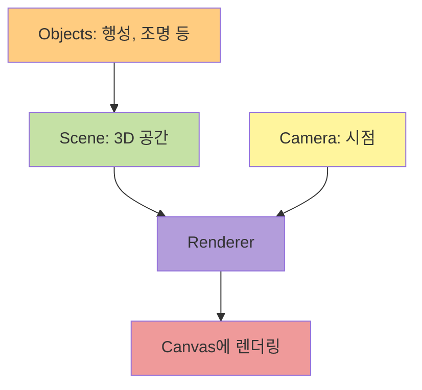

이번 글에서는 React Three Fiber로 3D 행성 씬을 구현한 경험을 공유해보려고 합니다.

저는 사이드 프로젝트의 홈화면에 3D 행성들이 궤도를 따라 배치된 씬을 만들고 싶었습니다.
행성들은 궤도를 따라 돌도록 하고, 사용자는 마우스로 궤도를 자유롭게 회전시킬 수 있도록 만드는 것이 목표였습니다.

Three.js는 처음이었지만, 이전부터 사용해보고 싶었기도 했고 마침 React 생태계에 React Three Fiber라는 좋은 도구가 있다는 것을 알게 되어 도전해보기로 했습니다.

## 3D 그래픽의 기본 개념 이해하기

먼저 3D 웹 그래픽을 구현하기 위해서는 Three.js의 핵심 개념을 이해해야 했습니다.
그래서 [Three.js 공식 문서](https://threejs.org/docs/)를 읽으며 3D 그래픽의 기본 요소들을 공부했습니다.

문서를 읽어보니 Three.js의 애플리케이션은 씬, 카메라, 렌더러의 세 가지 요소로 구성된다는 것을 알게 되었습니다.

**1. Scene (씬)**

씬은 모든 3D 객체들이 배치되는 공간입니다.
여기에 행성, 조명, 궤도 링 같은 모든 객체들이 추가되는 구조입니다.

**2. Camera (카메라)**

카메라는 3D 공간을 어떤 시점에서 바라볼지 결정하는 요소입니다.
Three.js에는 여러 종류의 카메라가 있었는데, 원근감을 표현하는 `PerspectiveCamera`가 구현하고자 하는 기능에 가장 자연스럽다고 판단했습니다.
아래와 같이 카메라의 위치와 시야각을 설정할 수 있습니다.

```tsx
// FOV(시야각)가 70도인 원근 카메라
// 위치는 (x: 0, y: 8, z: 40)
<PerspectiveCamera makeDefault position={[0, 8, 40]} fov={70} />
```

시야각에 해당하는 FOV 값이 클수록 넓은 범위를 볼 수 있지만 왜곡이 생기고, 작을수록 망원렌즈처럼 좁은 범위를 확대해서 보게 됩니다.
여러 값을 직접 테스트해본 결과 70도가 행성들을 가장 자연스럽게 보여주는 값이어서 해당 값으로 설정하였습니다.

**3. Renderer (렌더러)**

렌더러는 씬과 카메라를 받아서 실제 화면에 그려주는 역할을 합니다. 이 과정에서 WebGL을 사용하여 GPU 가속을 받아 렌더링을 부드럽게 수행합니다.



### Three.js 코드

개발 과정에서 Three.js를 직접 사용하면서 다음과 같이 명령형 코드를 작성해야 한다는 것을 알았습니다.

```javascript
// 일반 Three.js 코드
const scene = new THREE.Scene();
const camera = new THREE.PerspectiveCamera(75, width / height, 0.1, 1000);
const renderer = new THREE.WebGLRenderer();

const geometry = new THREE.SphereGeometry(1, 64, 64);
const material = new THREE.MeshPhysicalMaterial({ color: 0xe8f4ff });
const sphere = new THREE.Mesh(geometry, material);

scene.add(sphere);
camera.position.z = 40;

function animate() {
  requestAnimationFrame(animate);
  sphere.rotation.y += 0.004;
  renderer.render(scene, camera);
}
animate();
```

하지만 이런 명령형 방식은 React의 선언적 패러다임과 맞지 않아 어색했습니다.
또, 상태가 변경될 때 3D 객체를 어떻게 업데이트해야 할지, 컴포넌트가 언마운트될 때 메모리 정리는 어떻게 해야 할지 고민이 많았습니다.
이에 대해 고민하고 찾아본 결과 React Three Fiber가 있다는 것을 알게 되었습니다.

## React Three Fiber로 선언적 3D 프로그래밍하기

[React Three Fiber](https://docs.pmnd.rs/react-three-fiber/getting-started/introduction)는 Three.js를 React 컴포넌트처럼 사용할 수 있게 만든 렌더러입니다.
React Three Fiber를 사용하면 위의 예시와 같은 코드를 아래와 같이 작성할 수 있습니다.

```tsx
// React Three Fiber
function App() {
  return (
    <Canvas>
      <PerspectiveCamera makeDefault position={[0, 8, 40]} fov={75} />
      <mesh>
        <sphereGeometry args={[1, 64, 64]} />
        <meshPhysicalMaterial color="#e8f4ff" />
      </mesh>
    </Canvas>
  );
}
```

위에 있는 `Canvas` 컴포넌트가 Scene, Renderer, 렌더링 루프를 자동으로 설정해주었습니다.
또, Three.js의 클래스 이름을 camelCase로 바꾸면 컴포넌트로 사용할 수 있다는 것이 직관적이라고 생각했습니다.
( `THREE.SphereGeometry`는 `<sphereGeometry />`로, `THREE.MeshPhysicalMaterial`는 `<meshPhysicalMaterial />`로 사용할 수 있었습니다. )

### React Three Fiber의 작동 원리

React Three Fiber는 React의 reconciliation 알고리즘을 활용합니다.
React는 가상 DOM 트리를 비교하여 변경사항을 찾아내고, 실제 DOM에 효율적으로 반영하는데
React Three Fiber는 이 과정에서 DOM 대신 Three.js 씬 그래프를 타겟으로 사용한다는 특징이 있습니다.

```tsx
// React Three Fiber의 내부 동작 (개념적 표현)
<mesh position={[0, 0, 0]}>
  <sphereGeometry args={[1, 64, 64]} />
</mesh>;

// 위 코드가 실제로 하는 일
const mesh = new THREE.Mesh();
mesh.position.set(0, 0, 0);
const geometry = new THREE.SphereGeometry(1, 64, 64);
mesh.geometry = geometry;
scene.add(mesh);

// Props가 변경되면
// React가 변경을 감지하고 Three.js 객체의 속성을 업데이트
mesh.position.set(newX, newY, newZ);
```

이러한 구조 덕분에 React의 모든 기능을 그대로 사용할 수 있었습니다.
사용해본 결과 useState로 상태를 관리하고, useEffect로 사이드 이펙트를 처리하며, 컴포넌트 언마운트 시 Three.js 객체도 자동으로 정리된다는 것이 매우 편리했습니다.

### React-three/drei 란?

[@react-three/drei](https://github.com/pmndrs/drei)는 React Three Fiber를 위한 유틸리티 컴포넌트 모음입니다.
`OrbitControls`, `PerspectiveCamera`, `Sphere` 같은 자주 사용하는 패턴들이 미리 구현되어 있어 개발 속도를 크게 높일 수 있었습니다.

그 중에서도 `OrbitControls`가 정말 편리했습니다.
카메라를 마우스로 제어하는 기능을 직접 구현하려면 마우스 이벤트, 쿼터니언 계산, 카메라 위치 업데이트 등 복잡한 수학과 이벤트 처리가 필요했을 텐데,
Drei의 `OrbitControls`는 이를 간단하게 해결해주었습니다.

```tsx
// OrbitControls 없이 직접 구현하려면 수백 줄의 코드가 필요
// Drei를 사용하면
<OrbitControls enableRotate={true} autoRotate={true} />
```

## 기본 씬 구성하기

먼저 3D 씬의 기본 구조를 만들어야 했습니다.
Three.js에서는 씬(Scene), 카메라(Camera), 렌더러(Renderer)가 필수 요소인데, React Three Fiber에서는 `Canvas` 컴포넌트가 이를 자동으로 설정해주었습니다.

```tsx
import { Canvas } from '@react-three/fiber';
import { OrbitControls, PerspectiveCamera } from '@react-three/drei';

const PlanetScene = ({ currentIndex, projectsLength, onPlanetClick }) => {
  const PLANET_RADIUS = 28; // 행성 배치 반지름
  const ORBIT_RADIUS = 28; // 궤도 링 반지름
  const CAMERA_SETTINGS = { position: [0, 8, 40], fov: 70 };

  return (
    <Canvas
      style={{
        width: '100%',
        height: '100%',
        background: 'transparent',
        position: 'absolute',
        top: '0',
        left: '0',
        pointerEvents: 'auto',
      }}
    >
      <PerspectiveCamera
        makeDefault
        position={CAMERA_SETTINGS.position}
        fov={CAMERA_SETTINGS.fov}
      />

      <OrbitControls
        enableZoom={false}
        enablePan={false}
        enableRotate={true}
        autoRotate={true}
        autoRotateSpeed={0.8}
        minPolarAngle={Math.PI / 4}
        maxPolarAngle={Math.PI / 2.2}
        minDistance={30}
        maxDistance={50}
        enableDamping={true}
        dampingFactor={0.05}
      />

      {/* 조명 설정 */}
      <ambientLight intensity={0.4} />
      <directionalLight position={[15, 18, 12]} intensity={1.5} castShadow />
      <directionalLight
        position={[-8, 10, -6]}
        intensity={0.6}
        color="#8ab4f8"
      />
    </Canvas>
  );
};
```

위에서 `OrbitControls`는 사용자가 마우스로 카메라를 제어할 수 있게 해주는 컴포넌트입니다.
여기서 `enableZoom`을 false로 설정해 줌을 비활성화하고, `autoRotate`를 true로 설정해 자동 회전을 활성화했습니다.
또, `minDistance`와 `maxDistance`로 카메라가 지나치게 가까워지거나 멀어지는 것을 방지했습니다.

## 행성 컴포넌트 만들기

초기에는 행성을 만들고 궤도에 적용하여 확인해봤는데 시각적으로 심심한 느낌이 들어서 행성을 여러 레이어로 구성하여 입체감을 주도록 하면 좋을 것 같다고 생각했습니다.
이에 따라 외부 글로우, 대기권, 메인 구체, 내부 코어, 궤도 링으로 각각의 레이어를 분리했습니다.

[Three.js 공식 문서의 Material 섹션](https://threejs.org/docs/#api/en/materials/Material)에 따르면 Three.js에서 물체의 외형은 Geometry(형상)와 Material(재질)로 결정됩니다.
Geometry는 물체의 모양을, Material은 빛을 받았을 때 어떻게 보일지를 정의하는 구조였습니다.

공식문서에서는 아래와 같은 여러 종류의 Material이 존재했습니다.

- **MeshBasicMaterial** - 조명의 영향을 받지 않았습니다. 단색으로만 표현되는 가장 기본적인 재질이었습니다.
- **MeshStandardMaterial** - PBR(Physically Based Rendering) 기반으로 현실적인 재질 표현이 가능했습니다.
- **MeshPhysicalMaterial** - MeshStandardMaterial의 확장판으로, 투명도, 반사, 굴절까지 표현할 수 있었습니다.

저는 행성에 유리처럼 투명하면서도 빛나는 느낌을 주고 싶어서 `MeshPhysicalMaterial`을 선택했습니다.

```tsx
<meshPhysicalMaterial
  color="#e8f4ff" // 기본 색상
  metalness={0.3} // 금속성 (0~1, 높을수록 금속처럼)
  roughness={0.15} // 거칠기 (0~1, 낮을수록 매끈함)
  transmission={0.2} // 투과도 (0~1, 빛이 통과하는 정도)
  thickness={0.8} // 두께감
  emissive="#4a90e2" // 자체 발광 색상
  emissiveIntensity={0.6} // 발광 강도
  clearcoat={1.2} // 투명 코팅 (광택 효과)
  clearcoatRoughness={0.05} // 코팅 거칠기
  ior={1.5} // 굴절률 (Index of Refraction)
  reflectivity={0.8} // 반사도
/>
```

각 파라미터의 의미를 이해하기 위해 실제로 값을 하나씩 조정해보며 실험했습니다.
`metalness`를 1로 올리면 금속처럼 주변을 반사하고, `roughness`를 0에 가깝게 하면 거울처럼 매끈해지는 것도 볼 수 있었습니다.
또 `transmission`을 높이면 빛이 통과하면서 유리 같은 느낌이 나는 것을 확인할 수 있었습니다.

### useFrame

React Three Fiber에서 애니메이션을 구현하려면 [useFrame](https://docs.pmnd.rs/react-three-fiber/api/hooks#useframe) 훅을 이해해야 했습니다.
일반적인 웹 애니메이션은 CSS transition이나 requestAnimationFrame을 사용하는 반면, 3D 씬에서는 매 프레임마다 물체의 위치, 회전, 크기를 직접 업데이트해야 했습니다.

```tsx
useFrame((state, delta) => {
  // 이 함수는 초당 60회 실행됩니다 (60 FPS 기준)
  // state - 현재 씬의 모든 정보 (camera, scene, clock 등)
  // delta - 이전 프레임 이후 경과 시간 (초 단위)
});
```

`state.clock.elapsedTime`은 씬이 시작된 이후 총 경과 시간을 초 단위로 제공했습니다.
여기서 이 값을 `Math.sin`에 넣으면 주기적으로 반복되는 값을 얻을 수 있었습니다.

```tsx
const time = state.clock.elapsedTime; // 0, 0.016, 0.032, 0.048, ...

// Math.sin(time)은 -1에서 1 사이를 반복
// 예를 들어 time=0 → 0, time=π/2 → 1, time=π → 0, time=3π/2 → -1, time=2π → 0
const wave = Math.sin(time); // -1 ~ 1 사이 값
```

이를 활용하여 행성을 회전시키고 맥동 효과를 구현했습니다.

```tsx
const Planet3D = ({ position, isActive }) => {
  const meshRef = useRef<THREE.Mesh>(null);
  const glowRef = useRef<THREE.Mesh>(null);

  useFrame((state) => {
    const time = state.clock.elapsedTime;

    // Y축 자전 - 매 프레임마다 0.004 라디안씩 회전
    // 60 FPS 기준으로 초당 0.24 라디안, 약 26초에 1바퀴
    if (meshRef.current) {
      meshRef.current.rotation.y += 0.004;

      // X축 흔들림 - 0.08 ~ 0.08 라디안 사이를 부드럽게 반복
      // time * 0.3으로 흔들림 속도 조절
      meshRef.current.rotation.x = Math.sin(time * 0.3) * 0.08;
    }

    // 맥동 효과 - 크기를 0.88 ~ 1.12 사이로 변경 (활성 행성 기준)
    // scale 1 + Math.sin(time * 1.8) * 0.12
    // = 1 + (-1~1) * 0.12
    // = 0.88 ~ 1.12
    if (glowRef.current) {
      glowRef.current.scale.setScalar(
        1 + Math.sin(time * 1.8) * (isActive ? 0.12 : 0.05),
      );
    }
  });

  return (
    <group position={position}>
      {/* 대기권 */}
      <Sphere ref={atmosphereRef} args={[1.15, 48, 48]}>
        <meshPhysicalMaterial
          color={isActive ? '#a0d0ff' : '#8898aa'}
          transparent
          opacity={isActive ? 0.15 : 0.08}
          side={THREE.BackSide}
        />
      </Sphere>

      {/* 메인 행성 */}
      <Sphere ref={meshRef} args={[1, 64, 64]}>
        <meshPhysicalMaterial
          color={isActive ? '#e8f4ff' : '#b0c4de'}
          metalness={0.3}
          roughness={0.15}
          emissive={isActive ? '#4a90e2' : '#6a7b8c'}
          emissiveIntensity={isActive ? 0.6 : 0.2}
        />
      </Sphere>
    </group>
  );
};
```

## 카메라 애니메이션

행성은 만들었지만, 화면이 너무 정적으로 느껴졌습니다.
그래서 행성만 움직이는것이 아니라 카메라도 자연스럽게 움직이면 더 멋있을 것 같았습니다.
처음에는 행성처럼 `useFrame`에서 카메라 위치를 부드럽게 변경하면 될 것 같다고 생각했습니다.

### 첫 번째 시도와 문제 발견

```tsx
// 첫 번째 시도
useFrame((state) => {
  const time = state.clock.elapsedTime;
  const camera = state.camera;

  // 기준점 - 카메라의 초기 위치 (절대 좌표)
  const basePosition = { x: 0, y: 8, z: 40 };

  // 시간에 따라 변하는 오프셋
  const offsetX = Math.sin(time * 0.3) * 3;
  const offsetY = Math.sin(time * 0.4) * 4.5;
  const offsetZ = Math.cos(time * 0.3) * 3;

  // 목표 위치 = 기준점 + 오프셋 (항상 basePosition 기준으로 계산됨)
  const targetX = basePosition.x + offsetX;
  const targetY = basePosition.y + offsetY;
  const targetZ = basePosition.z + offsetZ;

  // 현재 위치에서 목표 위치로 서서히 이동
  camera.position.x += (targetX - camera.position.x) * 0.03;
  camera.position.y += (targetY - camera.position.y) * 0.03;
  camera.position.z += (targetZ - camera.position.z) * 0.03;
});
```

위 코드를 적용하고 테스트해보니 문제가 발생했습니다.
사용자가 `OrbitControls`로 카메라를 다른 위치로 움직여도, 매 프레임마다 `basePosition`을 기준으로 계산된 `targetX/Y/Z`로 카메라를 당겨왔습니다.

즉, 사용자가 카메라를 (30, 20, 50)으로 회전시켰어도, 코드는 계속 (0, 8, 40) 근처의 위치로 카메라를 되돌리려고 했습니다.
결과적으로 마우스를 떼는 순간 카메라가 원점으로 급격히 돌아가면서 어지러운 느낌이 들었습니다.

### 문제의 원인

> 문제는 **절대 좌표 기반 접근 방식** 이었습니다.
> `basePosition`이라는 고정된 기준점을 사용했기 때문에, 사용자가 카메라를 어디로 움직이든 항상 그 고정된 위치로 돌아가는 것이었습니다.

해결하기 위해서는 카메라를 특정 위치로 이동시키는 대신, 현재 위치에서 상대적으로 얼마나 움직일지를 계산해야 했습니다.

### 이전 대비 변화량을 기반으로 한 상대 이동으로 해결

그래서 절대 위치를 계산하는 대신, 이전 프레임 대비 얼마나 변했는지를 계산하여 해결하려고 하였습니다.

```tsx
const CameraFloating = () => {
  const CAMERA_OFFSET = {
    x: 8,
    y: 6,
    z: 9,
  }; // 카메라 오프셋 범위
  const CAMERA_OFFSET_SPEED = 0.08; // 카메라 오프셋 속도
  const lastOffset = useRef(new Vector3(0, 0, 0));

  useFrame((state) => {
    const time = state.clock.elapsedTime;

    // 오프셋 계산
    const offsetX = Math.sin(time * 0.4) * CAMERA_OFFSET.x;
    const offsetY = Math.sin(time * 0.5) * CAMERA_OFFSET.y;
    const offsetZ = Math.cos(time * 0.4) * CAMERA_OFFSET.z;

    // 이전 프레임 대비 변화량 계산
    const deltaX = offsetX - lastOffset.current.x;
    const deltaY = offsetY - lastOffset.current.y;
    const deltaZ = offsetZ - lastOffset.current.z;

    // 카메라 위치 업데이트
    state.camera.position.x += deltaX * CAMERA_OFFSET_SPEED;
    state.camera.position.y += deltaY * CAMERA_OFFSET_SPEED;
    state.camera.position.z += deltaZ * CAMERA_OFFSET_SPEED;

    // 다음 프레임을 위해 오프셋 저장
    lastOffset.current.set(offsetX, offsetY, offsetZ);
  });

  return null;
};
```

위와 같이 이전 프레임의 오프셋 값을 저장하고, 현재 프레임과의 차이만큼만 카메라를 이동하도록 하였습니다.
즉, 사용자가 `OrbitControls`로 카메라를 어디로 이동시키든, 그 위치를 기준으로 상대적인 움직임만 추가되도록 하였습니다.
이후 확인해보니 카메라가 (100, 20, 50)에 있든 (0, 8, 40)에 있든, 매 프레임마다 같은 차이만큼 움직이게 되었습니다.

## 최종적으로 만든 행성 씬

최종적으로 만든 행성 씬은 아래와 같습니다.
( [www.cllaude99-labs.com](https://www.cllaude99-labs.com/)에서 확인해 볼 수 있습니다. )


## 배운 점

Three.js를 처음 다루면서 3D 그래픽에 대해서 자세하게 알아본 경험이었습니다.
또, 카메라 애니메이션을 구현하면서 절대 좌표가 아닌 상대적 변화량으로 접근해야 한다는 것도 알게되었습니다.
`OrbitControls`와 커스텀 애니메이션을 조화롭게 만드는 과정에서는 사용자 경험의 중요성을 다시 한번 느꼈습니다.
기술적으로 동작하는 것과 사용자가 편안하게 느끼는 것은 별개의 문제였습니다. 여러 번의 테스트를 통해 파라미터를 조정해야 했고, 이 과정에서 UX 감각을 키울 수 있었습니다.

## 참고 자료

- [React Three Fiber 공식 문서](https://docs.pmnd.rs/react-three-fiber/getting-started/introduction)
- [Three.js 공식 문서](https://threejs.org/docs/)
- [@react-three/drei GitHub](https://github.com/pmndrs/drei)
- [useFrame Hook 문서](https://docs.pmnd.rs/react-three-fiber/api/hooks#useframe)
- [OrbitControls 문서](https://threejs.org/docs/#examples/en/controls/OrbitControls)
